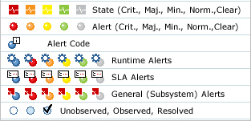

## Using Alerts Summary

Learn how to view and monitor alerts for a specific service or subsystem.

<a href="../alerts/alerts_toc.html" class="button secondary">Alerts (Home)</a> <a href="../alerts/using_alert_monitoring.html" class="button secondary">Using Alert Monitoring</a>  <a href="../alerts/using_alert_codes.html" class="button secondary">Using Alert Codes</a> <a href="../alerts/using_management_scripts.html" class="button secondary">Using Management Scripts</a> <a href="../alerts/using_snmp_hosts.html" class="button secondary">Using SNMP Hosts</a>  <a href="../alerts/using_email_groups.html" class="button secondary">Using Email Groups</a> 

<h5 class="stamp">Supported Platforms: 7.0 and greater.</h5>

### Table of Contents

* [Introduction](#introduction)
* [Service Performance Indicators](#service-performance-indicators)
* [Monitor Components](#monitor-components)
* [Alert Summary Field Descriptions](#alert-summary-field-descriptions)

## Introduction

The Alerts Summary section provides an aggregate view of the alerts that have been logged by Policy Manager including type, date, severity, and status. 

* Each line item in the summary represents **not** a single alert, but rather all of the logged alerts for a specific system or component. 
* You can also configure the system to monitor specific components using the **Monitor Components** function. 

Location: *Alerts > Alerts Summary* section of the *Policy Manager Management Console*.

<a href="#top">back to top</a>

## Service Performance Indicators

The *My Dashboard* page illustrates the service performance using **Status** icons. Icons utilize a color coding scheme to indicate severity and are categorized based on the Policy Manager entity they are associated with (Runtime, SLA, or General Subsystem).

<a href="#top">back to top</a>

## Monitor Components

Monitor one or more individual component in near-real time.

1. Go to **Alerts > Alerts Summary**.
2. Check the **Component Name** check-box for the component or components you wish to monitor.
3. Click **Monitor Components**.  
The *Monitor Components* screen is displayed.
4. Set the period at which you want the screen to automatically refresh.
  * The minimum value is five (5) seconds
  * Each time the screen refreshes, you can see any new alerts that have been logged for the displayed component(s)
5. Click **Cancel** to exit.

<a href="#top">back to top</a>

## Alert Summary Field Descriptions

The following table provides a list of field descriptions that represent all the elements that can be monitored for a selected service or subsystem.

| Column| Description        |
|:----------------------|:---------------------------|
| Component | Displays the name of the affected component
| State | Displays the aggregated state of the component
| Last Alert Date | Displays the date of the most recently logged alert
| Total | Displays the total number of alerts in the database
| Critical, Major, Minor, Normal | Displays the number of alerts that are Critical, Major, Minor, and Normal
| Open | Displays the number of unresolved (open) alerts
| Observed | Displays the number of observed alerts
| Resolved | Displays the the number of resolved alerts

<a href="#top">back to top</a>
