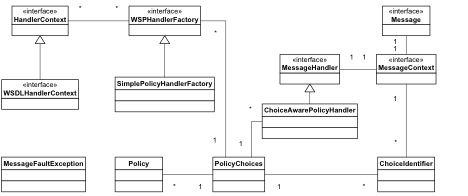
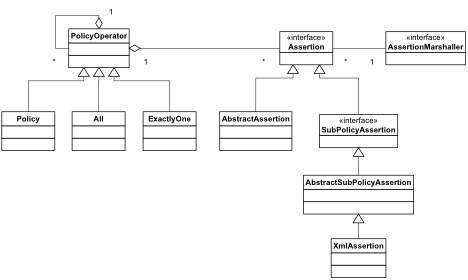
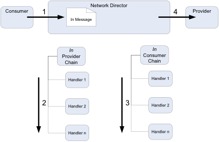
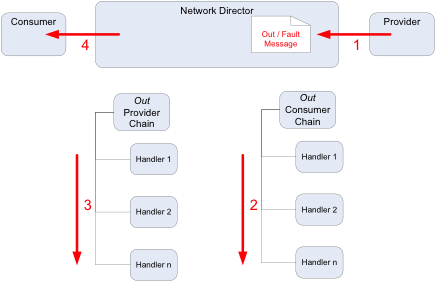

## Custom Policy Development

<h3 style="color: grey;">Table of Contents</h3>
<ol class="table_of_contents">
	<li><a href="#introduction">Overview</a></li>
	<li><a href="#handler-design">Policy Handler Design</a></li>
	<li><a href="#develop">Developing the Policy Handler</a></li>
</ol>

### <a name="introduction"></a>Overview

This document contains the information required to:

1.	Develop;
2.	Deploy; 
3.	Test;
4.	And run a custom Policy Handler with an Akana API Gateway

It will begin with the design of the Custom Policy Handler Framework, then work through the required steps to guide a customer in creating a working custom Policy.

#### <a name="data"></a>Prerequisites

* This configuration guide assumes that you’ve already installed the platform. If you need help installing the platform, please see the [install guide](http://docs.akana.com/sp/assets/SOA_Software_Platform_Install_Guide_v70.pdf). 
* If writing policy components for the API Gateway, you will have to create and configure a Policy Manager (PM) and Network Directory (ND) container. This is described in the document [Managing a Simple API](simple-api.html#Installing)
* Install and configure the Eclipse IDE as described in the document [Eclipse Workspace Setup](eclipse-setup.html)


### <a name="handler-design"></a>Policy Handler Design

All Policy Handlers utilize the Policy Handler Framework provided by Akana. The Policy Handler Framework is a specialization of the Message Handler Framework that is also provided by Akana.

The difference being that a policy handler is activated when a policy for that handler is attached to a service, whereas a message handler is activated for all services in and ND as soon as deployed.

Given that the Policy Handler Framework is a specialization of the Message Handler Framework, there are many classes reused between the two:



How a Handler determines which Policy it will act on, is determined by the associated Policy classes as shown below:



The assertion Marshaller retrieves the policies from Policy Manager then calls the Policy Handler Factory to determine if it should create a Policy handler.

The Policy Handler Factory is tied to the Assertion Marshaller by the framework via the Spring wiring in the xx-policy-osgi.xml file on your build.

**Note:** The JavaDoc for these classes can be found in the [API Gateway Reference](reference.html) section.

The Policy Handler framework works on the notion of Handler chains. These chains are associated with two criteria:

1.	The direction of the message
2.	The Actor that the Network Director is playing

The following diagram shows how handler chains on processed for the IN message (such as an HTTP request):



The following diagram shows how handler chains on processed for the OUT message (such as an HTTP response):



Keep this design and chain sequence in mind when creating the design for a Policy Handler.

### <a name="develop"></a>Developing the Policy Handler

The Policy Handler is developed as an OSGi Plug-in. Please refer to the [OSGi Plug-in Development](osgi-plugin-development.html) document which describes how to set up an Eclipse workspace and create a basic plugin project.

**Note:** Sample policy handlers can be found in the /samples directory that is distributed with the product.

A typical policy handler plug-in will also have these additional folders:

* build: will contain build.xml Ant script and related file
* META-INF/spring: will contain all Spring XML files for the bundle
* META-INF/config: will contain all OSGi ConfigAdmin files for the bundle
* META-INF/resources: will contain any bundle resource files for the bundle such as:
	 * XSD files
	 * I18N message bundle

####Create the Assertion Model

All policies are defined using an XML schema which forms the basis for the model object generation using JAXB v2. 

1.	Create the XML Schema definition file:

	```
<?xml version="1.0" encoding="UTF-8"?>
<xs:schema targetNamespace="http://soa.com/products/policymanager/examples/policy/complex" elementFormDefault="qualified" attributeFormDefault="unqualified" xmlns:xs="http://www.w3.org/2001/XMLSchema" xmlns:cp="http://soa.com/products/policymanager/examples/policy/complex">
  <xs:element name="Complex">
  	<xs:complexType>
  		<xs:sequence>
  			<xs:element name="HeaderName" type="xs:string"></xs:element>
  			<xs:element name="Optional" type="xs:boolean"></xs:element>
  		</xs:sequence>
  	</xs:complexType>
  </xs:element>
</xs:schema>
	```

2.	Use JAXB v2 to generate Java classes for the schema that will end up in a Java package such as xxx.xxx.akana.policy.xxxx.assertion.model. Example build scripts, model objects and schema can be found in the /samples/com.soa.examples.policy.handler.complex policy plug-in that is distributed with the product. 

####Spring Wiring

Several Spring beans need to be published by the policy handler by editing the /META-INF/sping/*.xml files:

* Handler Factories
* Template
* Assertion Marshaller

1.	Define the Spring bean for the Policy Handler Factory and publish the OSGi services for the Policy Handler Factory. There should be one service definition per binding per role:

	```
<!-- The WS-Policy handler factory -->
	<bean id="complex.wsphandler.factory" class="com.soa.examples.policy.complex.handler.ComplexPolicyHandlerFactory"/>
	
	<osgi:service  ref="complex.wsphandler.factory" interface="com.soa.policy.wspolicy.handler.WSPHandlerFactory">
        <osgi:service-properties>
            <entry key="name" value="com.soa.examples.complex.in.http.wsphandler.factory"/>
            <entry key="scope" value="concrete"/>
            <entry key="binding" value="http"/>
            <entry key="role" value="provider"/>
        </osgi:service-properties>
    </osgi:service>
    
	```
2. Define the Spring bean for the Policy Template that is used to describe aspects of the policy and publish the OSGi service:

	```
	<!-- Complex policy template -->
	<bean id="complex.policy.template" class="com.soa.examples.policy.complex.template.ComplexPolicyTemplate"/>
	
	<!-- publish the complex policy template. An id property needs to be included that matches the template id -->
	<osgi:service ref="complex.policy.template" interface="com.soa.policy.template.OperationalPolicyTemplate">
		<osgi:service-properties>
			<entry key="name" value="com.soa.examples.policy.complex.template"/>
			<entry key="id" value="policy.complexexample"/>
		</osgi:service-properties>
	</osgi:service>
	```
	
3.	Define the Spring Bean for the new Policy Assertion Marshaller. This will be in the xxx.policy.xml file:
 
	```
   <!-- internal complex policy jaxb assertion marshaller, not published since no sub-policies -->
    <bean id="complex.jaxb.marshaller" class="com.soa.policy.wspolicy.JaxbAssertionMarshaller"  init-method="init">
    	<property name="assertionQNames">
			<list>
				<ref bean="complex.assertion.name"/>
			</list>
		</property>
		<property name="jaxbPaths">
			<list>
				<value>com.soa.examples.policy.complex.assertion.model</value>
			</list>
		</property>
	</bean>
	
	<!-- complex master/parent policy marshaller -->
    <bean id="complex.assertion.marshaller" class="com.soa.examples.policy.complex.assertion.marshaler.ComplexAssertionMarshaller">
        <property name="jaxbMarshaller" ref="complex.jaxb.marshaller"/>
    </bean>
    
    <!-- publish the complex marshaller -->
	<osgi:service ref="complex.assertion.marshaller" interface="com.soa.policy.wspolicy.AssertionMarshaller">
		<osgi:service-properties>
			<entry key="name" value="com.soa.examples.policy.complex.assertion.marshaller"/>
		</osgi:service-properties>	
	</osgi:service>

	
	```
	
5. Specify any cross-bundle references that are used by the new Handler Factory. For example, the need for specific XPATH or XML parsers. This will be in the xxx.policy-OSGi.policy file also.

	```
<osgi:reference id=“xpath.engine" interface="com.digev.fw.xpath.XPath" />
	```
	
####Package Descriptions

There are several packages that typically make up the solution for the Policy Handler:

1. xxx.xxx.akana.policy.xxxx.handler
2. xxx.xxx.akana.policy.xxxx.assertion
4. xxx.xxx.akana.policy.xxxx.assertion.marshaller
5.	xxx.xxx.akana.policy.xxxx.assertion.model

#####xxx.xxx.akana.policy.xxxx.handler
This package contains the implementation of the Policy Handler.

* **xxxxConstants** - Container class for static variables used in the Policy Handler.

* **xxxHandlerFactory** - Implements the `com.soa.policy.wspolicy.handler.WSPHandlerFactory` interface.

	The framework instantiates a handler factory based on code and configuration found in the deployed handler bundle. When the framework requires a handler instance (essentially when an Assertion Marshaller detects a policy attached to the service and un-marshal’s that into and Assertion), it calls the handler factory’s create method. It is during the create call that the handler factory can determine whether the framework is asking for a consumer handler or a provider handler (via the HandlerRole).
	
	The hander factory can make use of the HandlerContext to learn more about the context of the creation event. The HandlerContext would typically be a WSDLHandlerContext. Casting the object to this interface will provide valuable WSDL based information about the service / operation including the entire WSDL document and the WSDL operation name.

* **xxxxPolicyHandler** - This implements the `com.soa.message.handler.MessageHandler` interface.

	This is where all the functionality of the policy is supposed is implemented, and is based on the context that is passed into it by the Factory.
A new handler is created per in, out, and fault message for a given operation. Because policy can differ based on in, out, and fault messages, the handler may behave differently based on which message type it is handling. At creation time the handler factory will be told by the container which type of message it is handling. At r

#####xxx.xxx.akana.policy.xxxx.assertion

* **xxxxAssertion** - This is an implementation of the `com.soa.policy.wspolicy.JavaAssertion` interface. 
	
	An Assertion is the un-marshalled XML policy that was attached to the Service in the PM console. It has getters and setters for the values of the elements that make up the policy directives. 

#####xxx.xxx.akana.policy.xxxx.assertion.marshaller

* **xxxxAssertionMarshaller** - This is the implementation of the `com.soa.policy.wspolicy.AssertionMarshaller` interface.

	An assertion marshaller is deployed separately from a handler. During the reading of a service’s policy by the framework, the marshaller is called upon to construct assertion Java objects from the assertions encoded in XML and WS-Policy. The constructed assertion objects are then passed down to handler factories to determine if handlers are to be created.


#####xxx.xxx.akana.policy.xxxx.assertion.model

This package contains Java model generated by the JAXB framework; typically using the JAXB xjc utility and Ant to generate these classes. 

In the com.soa.examples.policy.handler.complex policy plug-in, the build/build.xml file contains an 'assertions' target that is responsible for the generation of the model objects.

#####META-INF/config/xxx.xxx.akana.policy.xxxx.cfg

This file contains the configuration parameter definitions and the default values that are displayed in the Admin console.

###Building and Deploying the Policy Handler

####Build the Policy Handler

1.	Ensure the Java packages containing the HandlerFactory implementation (and any other classes referenced in the Spring wiring) are included in the Export-Package list in MANIFEST.MF
2.	Ensure all Java packages imported from outside the new Handler bundle are included in the Import-Package list in MANIFEST.MF
	*	Imported com.akana and com.digev packages should specify version="x.0.0" where x is the major version number of the API Gateway you have installed.
3.	Build the bundle JAR from the project
	*	Run build.xml Ant script in /build folder
	*	Be sure project’s MANIFEST.MF is included in the JAR

####Set up Felix console

This is not necessary for anytime but the first time you deploy the Policy Handler. Its function is to simply to make sure that you know what is happening. Once you are comfortable with loading the Policy Handler you can disable this console.

To start the TUI (Textual User Interface) console simply copy the lib/ext/org.apache.felix.shell.tui-x.x.x.jar file into the instances/[container name]/deploy directory. Immediately the “->” prompt should appear in your SSH session. 

####Deploy the Policy Handler Bundles

The simplest way to deploy the policy handler is to copy the jar files into the  'instances/[CONTAINER NAME]/deploy' directory.
 
To check that the new bundle is active, simply type “ps” (without the quotes) into the TUI (see previous section) and look for the new bundle at the end of the list. You can also see the installed bundles from the **Installed Features** tab in the Admin console. Select 'Bundle' from the **Filter** drop-down list.
 
####Configure the Policy Handler
 
Click on the “Configuration” tab, then the xxx.xxx.akana.policy.xxxx configuration item in the left column, and all the fields needed to configure the policy will be displayed.
 
####Test the Policy Handler

The best way to test the Policy Handler is to use the remote debug features of Eclipse and the Felix Container.

1.	Restart the container specifying the –debug option: (from  [SOA_HOME]/sm60/bin):
	
	```
	./startup.sh <ND name> –debug 7777
	```
	
	* note: 7777 does not have to be used. It can be any port value not already used.
2.	Set up a remote debug session in Eclipse and connect to the process.

####Define the WS-Policy to Policy Manager

Once deployment complete the policy handler will be loaded and invoked once a service with the correct policy attached is detected by the Network Director.
For this to happen, you must attach the policy to a service in Policy Manager. However, before this can happen, you must define the WS-Policy to Policy Manager.

1.	Log on to the Policy Manager console with administrator account
2.	In the Organization Tree, click on <your organization>->Policies->Operational Policies
3.	Click the “Add Policy” button on the bottom right of the screen.
4.	The add policy dialog will be displayed. Click the “import Policy” radio button, then the “Browse” Button and browse to where the xxxx-policy.xml file is located on your file system. This is in the XML body of you WS-Policy and should be placed in the the META-INF/resources/policy directory of the project. This file is the WS-Policy definition of the Policy, and includes the directives for your policy. Click next.
5.	Add the name in the “Policy Name” field and click the finished button.
6.	The policy will now appear in the list of Operational Policies and is ready to be attached to a service when needed.
 



