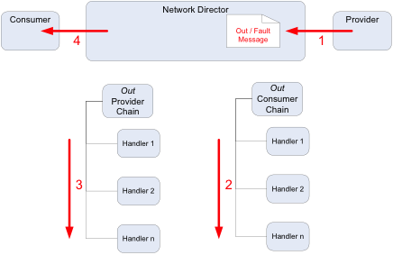

## Custom Policy Development

<h3 style="color: grey;">Table of Contents</h3>
<ol class="table_of_contents">
	<li><a href="#introduction">Overview</a></li>
	<li><a href="#handler-design">Policy Handler Design</a></li>
	<li><a href="#develop">Developing the Policy Handler</a></li>
</ol>

### <a name="introduction"></a>Overview

This document contains the information required by any advanced customer of SOA Software to be able to:

1.	Develop;
2.	Deploy; 
3.	Test;
4.	And run a custom Policy Handler with an Akana API Gateway

It will begin with the design of the Custom Policy Handler Framework, then work through the required steps to guide a customer in creating a working custom Policy.

#### <a name="data"></a>Prerequisites

* This configuration guide assumes that you’ve already installed the platform. If you need help installing the platform, please see the [install guide](http://docs.akana.com/sp/assets/SOA_Software_Platform_Install_Guide_v70.pdf). 
* If writing policy components for the API Gateway, you will have to create and configure a Policy Manager (PM) and Network Directory (ND) container. This is described in the document [Managing a Simple API](simple-api.html#Installing)
* Install and configure the Eclipse IDE as described in the document [Eclipse Workspace Setup](eclipse-setup.html)


### <a name="handler-design"></a>Policy Handler Design

All Policy Handlers utilize the Policy Handler Framework provided by Akana. The Policy Handler Framework is a specialization of the Message Handler Framework that is also provided by Akana.

The difference being that a policy handler is activated when a policy for that handler is attached to a service, whereas a message handler is activated for all services in and ND as soon as deployed.

Given that the Policy Handler Framework is a specialisation of the Message Handler Framework, there are many classes reused between the two:



How a Handler determines which Policy it will act on, is determined by the associated Policy classes as shown below:



The assertion Marshaller retrieves the WS-Policy Assertions inserted in the Services WSDL by PM then calls the Policy Handler Factory to determine if it should create a Policy handler.

The Policy Handler Factory is tied to the Assertion Marshaller by the framework via the Spring wiring in the xx-policy-osgi.xml file on your build.

JavaDoc for these classes can be downloaded as a zip file from the SOA Software Support site in the Policy Manager Documentation zip bundle.

The Policy Handler framework works on the notion of Handler chains. These chains are associated with two criteria:

1.	The direction of the message
2.	The Actor that the ND is playing

The following diagram shows how handler chains on processed for the IN message (such as an HTTP request):


The following diagram shows how handler chains on processed for the OUT message (such as an HTTP response):



Therefore, in order for the Logging Handler to store the request before anything happens to it, it has to be placed as handler 1 in the “IN Provider Chain”. Likewise, for it to process the message as the very last policy, it has to be placed as handler n in the “Out Provider Chain”.
Keep this design and chain sequence in mind when creating the design for a Policy Handler.


### <a name="develop"></a>Developing the Policy Handler

The Policy Handler is developed as an OSGi Plug-in. Please refer to the [OSGi Plug-in Development](osgi-plugin-development.html) document which describes how to set up an Eclipse workspace.

####Create the Assertion Model

1.	Create the XML Schema definition file:

	```
<xs:schema targetNamespace="http://soa.com/training/policy" 
           xmlns:tns="http://soa.com/training/policy" xmlns:xs="..."
           elementFormDefault="qualified" >
   <xs:element name="TimeAssertions">
      <xs:complexType>
         <xs:choice minOccurs="0" maxOccurs="unbounded">
            <xs:element name="AllowInterval">
               <xs:complexType>
                  <xs:attribute name="days" type="xs:string" />
                  <xs:attribute name="from" type="xs:time" />
                  <xs:attribute name="to" type="xs:time" />
               </xs:complexType>
            </xs:element>
            <xs:element name="BlockInterval">
               <xs:complexType>
                  <xs:attribute name="days" type="xs:string" />
                  <xs:attribute name="from" type="xs:time" />
                  <xs:attribute name="to" type="xs:time" />
               </xs:complexType>
            </xs:element>
         </xs:choice>
         <xs:anyAttribute namespace="##any" processContents="lax"/>
      </xs:complexType>
   </xs:element>
</xs:schema>
	```

2.	Use JAXB v2 to generate Java classes for the schema that will end up as the xxx.xxx.soa.policy.xxxx.policy.model package

####Spring Wiring

1.	Define the Spring Singleton class for the Factory Policy Handler. This will be in the xxx.policy.xml file:

	```
<bean id="training.message.handler.factory" class="com.soa.training.handlers.HandlerFactory">
	<property name= "xpathEngine" ref= "xpath.engine" /> 
   . . .
</bean>
	```
	
2.	Define the Spring Bean for the new Policy Assertion Marshaller. This will be in the xxx.policy.xml file:
 
	```
<bean id="training.policy.marshaller" class="com.soa.training.policy.TrainingPolicyAssertionMarshaller">
   <property name="jaxbAssertionMarchaller" ref="training.policy.jaxb.marshaller" /> 
</bean>
<bean id="training.policy.jaxb.marshaller" class="com.soa.policy.wspolicy.JaxbAssertionMarshaller“
                                           init-method="init" >
   <property name="assertionQNames" >
      <list>
         <ref bean="policy.assertion.qname" />
      </list>
   </property>
   <property name="jaxbPaths" >
      <list>
         <value>com.soa.training.policy.model</value>
      </list>
   </property>
</bean>
	```
	
3.	Define the OSGi service for the Factory Policy Handler. This will be in the xxx.policy-OSGi.policy (Note that the <osgi:service> definition refers back to the Spring Bean defining the new Handler Factory). There should be one service definition per service transport:

	```
<osgi:service ref="training.message.handler.factory" interface="com.soa.message.handler.HandlerFactory">
   <osgi:service-properties>
      <entry key="name" value="com.soa.training.message.handler.factory.consumer.out" />
      <entry key="scope" value="binding" />
      <entry key="binding" value="soap" />
      <entry key="role" value="consumer" />
      <entry key="after" value="*" />
   </osgi:service-properties>
</osgi:service>
	```
	
4.	Specify any cross-bundle references that are used by the new Handler Factory. For example, the need for specific XPATH or XML parsers. This will be in the xxx.policy-OSGi.policy file also.

	```
<osgi:reference id=“xpath.engine" interface="com.digev.fw.xpath.XPath" />
	```
	
5.	Publish the OSGi service for the new PolicyAssertion Marshaller There should be one service definition per service transport:

	```
<osgi:service ref="training.policy.marshaller" interface="com.soa.policy.wspolicy.AssertionMarshaller">
   <osgi:service-properties>
      <entry key="name" value="com.soa.training.policy.assertion,marshaller" />
</osgi:service-properties>
</osgi:service>
	```
	
6.	Publish the new Policy to the Container Capabilities:

	```
<osgi:service interface="com.soa.container.metadata.capability.CapabilityService">
   <osgi:service-properties>
      <entry key="name" value="com.soa.capability.training.policy" />
   </osgi:service-properties>
   <bean class="com.soa.container.metadata.capability.spring.SimpleCapabilityFactoryBean">
      <property name="capabilityURI" ref="policy.capabilities.uri" />
      <property name="capabilityName" value="SOA Training Policy Support" />
   </bean>
</osgi:service>
	```
	
####Package Descriptions

There are 3 packages that make up the solution for the Policy Handler:

1.	xxx.xxx.soa.policy.xxxx.config
2.	xxx.xxx.soa.policy.xxxx.policy
3.	xxx.xxx.soa.policy.xxxx.policy.model

The last 2 will always be in a policy handler, however if you wish to have runtime properties able to be set in the container’s admin console then the first package is also needed.

#####xxx.xxxsoa.policy.xxxx.config

This package contains the classes that interact with the ND Administration console to display and retrieve the values for the configuration parameters for the Policy Handler. 

* **XxxxConfigOptionsHandler** -This class is called anytime changes are committed in the ND Admin console for the parameters displayed.
It updates the XxxxConfigOptions JDO class with the changed values, and then calls the XxxxConfigOptionsService Interface to have these changes propagated to the Policy Handler.

* **XxxxConfigOptions** -Container class for all the Policy Handler parameters.

* **XxxxConfigOptionsService** -Interface for the class to send changes to the Policy Handler

* **XxxxConfigManagedService** -Implementation class for the XxxxConfigOptionsService interface.
Calls the xxxxConfigChangeListener  interface to tell it of the changes made in the Handler parameters.
This is the bridge between the ND Console and the Policy Handler for parameter change propagation.

* **xxxxConfigChangeListener** -Interface that utilises the changed values in XxxxConfigOptions if the updateChanges method called. The xxx.xxx.soa.policy.xxxx.transport.XxxxDirectJMSSender class of the Handler implements this interface.

#####xxx.xxx.soa.policy.xxxx.policy
This package contains the implementation of the Policy Handler, proper, and maps directly to the classes described in Figure 1 and Figure 2.

* **xxxxAssertion** - This is an implementation of the Assertion interface in Figure 2. 
An Assertion is the un-marshalled XML policy that was attached to the Service in the PM console. It has getters and setters for the values of the elements that make up the policy directives. 

* **xxxxAssertionMarshaller** - This is the implementation of the AssertionMarshaller in Figure 2.
An assertion marshaller is deployed separately from a handler. During the reading of a service’s policy by the framework, the marshaller is called upon to construct assertion Java objects from the assertions encoded in XML and WS-Policy. The constructed assertion objects are then passed down to handler factories to determine if handlers are to be created.

* **xxxxConstants** - Container class for static variables used in the Policy Handler.

* **xxxHandlerFactory** - Implements the SimplePolicyHandlerFactory interface of Figure 1.
The framework instantiates a handler factory based on code and configuration found in the deployed handler bundle. When the framework requires a handler instance (essentially when an Assertion Marshaller detects a policy attached to the service and un-marshal’s that into and Assertion), it calls the handler factory’s create method. It is during the create call that the handler factory can determine whether the framework is asking for a consumer handler or a provider handler (via the HandlerRole).
The hander factory can make use of the HandlerContext to learn more about the context of the creation event. The HandlerContext would typically be a WSDLHandlerContext. Casting the object to this interface will provide valuable WSDL based information about the service / operation including the entire WSDL document and the WSDL operation name.

* **xxxxPolicyHandler** - This implements the MessageHandler interface of Figure 1.
This is where all the functionality of the policy is supposed is implemented, and is based on the context that is passed into it by the Factory.
A new handler is created per in, out, and fault message for a given operation. Because policy can differ based on in, out, and fault messages, the handler may behave differently based on which message type it is handling. At creation time the handler factory will be told by the container which type of message it is handling. At r

#####xxx.xxx.soa.policy.xxxx.policy.model

This package simply contains the actual un-marshalled object contained in the Assertion. This is achieved by using the JAXB framework; using the JAXB xjc utility and Ant generates these classes. To create these classes, type “Ant -buildfile build-jaxb-linux.xml build" in the build directory of the project. When run successfully, these 3 classes will be found under the generated directory in the build directory.

Any change to the structure (not values) of the policy created in the PM console and attached to the services, must be reflected in the XxxxPolicy.xjb file and the schema (xxxxPolicy.xsd) it references. And the classes re-generated.


#####META-INF/config/xxx.xxx.soa.policy.sapxxxx.cfg

This file contains the parameter definitions and the default values that are displayed in the ND Admin console.

###Building and Deploying the Policy Handler

####Build the Policy Handler

1.	Ensure the Java packages containing the HandlerFactory implementation (and any other classes referenced in the Spring wiring) are included in the Export-Package list in MANIFEST.MF
2.	Ensure all Java packages imported from outside the new Handler bundle are included in the Import-Package list in MANIFEST.MF
	*	Imported com.soa and com.digev packages should specify version="6.1.0" unless something more specific is required
3.	Build the bundle JAR from the project
	*	Run build.xml Ant script in /build folder… or
	*	Compile project and export project as Java JAR file.
	*	Be sure project’s MANIFEST.MF is included in the JAR

####Set up Felix console

This is not necessary for anytime but the first time you deploy the Policy Handler. Its function is to simply to make sure that you know what is happening. Once you are comfortable with loading the Policy Handler you can disable this console.

To start the TUI (Textual User Interface) console simply copy the lib/ext/org.apache.felix.shell.tui-1.2.0.jar file into the instances/[container name]/deploy directory. Immediately the “->” prompt should appear in your SSH session. 

####Deploy the Policy Handler Bundles

The Bundles are the result of the OSGi loader deploying the jar files in its “deploy” directory.

Load the policy handler jar your IDE’s build created. To do this copy the jar into the ND’s deploy directory. This must be in the “Active” status in Felix, and Felix will indicate how many Bundles are now started – make sure that it is one more than was before you put the jar into the deploy directory.
 
To check that the new bundle is active, simply type “ps” (without the quotes) into the TUI (see previous section) and look for the new bundle at the end of the list.
 
####Configure the Policy Handler

Once the Policy handler is successfully started in ND, ND will install it as an ND Feature if you have optionally created a feature package. To check that all is ready to be configured, log in to the ND admin console and click on the “Installed Features” tab. The Xxxx Policy feature should be listed.
 
Click on the “Configuration” tab, then the xxx.xxx.soa.policy.xxxx configuration item in the left column, and all the fields needed to configure the policy will be displayed.
 
####Test the Policy Handler

The best way to test the Policy Handler is to use the remote debug features of Eclipse and the Felix Container.

1.	Restart the SOA container specifying the –debug option: (from  [SOA_HOME]/sm60/bin):
	
	```
	./startup.sh <ND name> –debug 7777
	```
	
	* note: 7777 does not have to be used. It can be any port value not already used.
2.	Set up a remote debug session in Eclipse and connect to the process.

####Define the WS-Policy to Policy Manager

Once deployment complete the policy handler will be loaded and invoked once a service with the correct policy attached is detected by the Network Director.
For this to happen, you must attach the policy to a service in Policy Manager. However, before this can happen, you must define the WS-Policy to Policy Manager.

1.	Log on to the Policy Manager console with administrator account
2.	In the Organisation Tree, click on <your organisation>->Policies->Operational Policies
3.	Click the “Add Policy” button on the bottom right of the screen.
4.	The add policy dialog will be displayed. Click the “import Policy” radio button, then the “Browse” Button and brose to where the xxxx-policy.xml file is located on your file system. This is in the XML body of you WS-Policy and should be placed in the the META-INF/resources/policy directory of the project. This file is the WS-Policy definition of the Policy, and includes the directives for your policy. Click next.
5.	Add the name in the “Policy Name” field and click the finished button.
6.	The policy will now appear in the list of Operational Policies and is ready to be attached to a service when needed.
 



