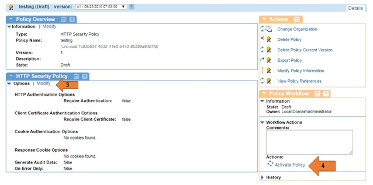
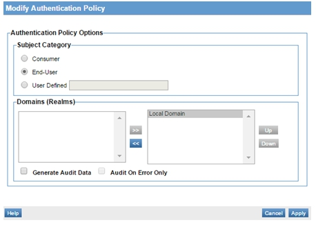
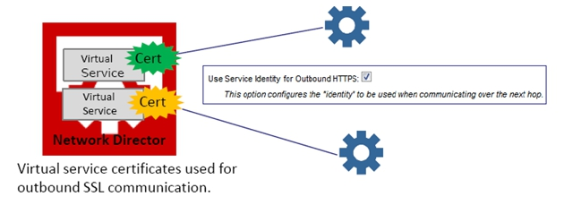
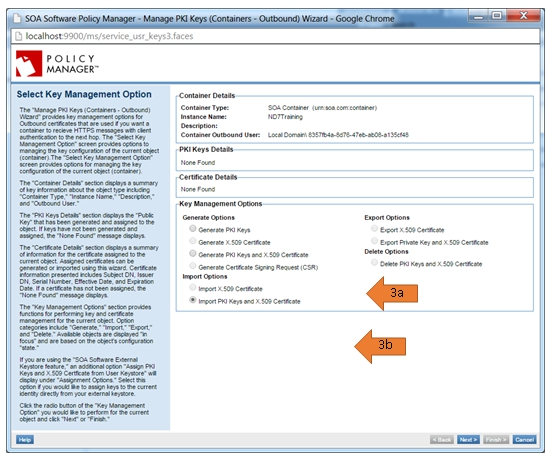
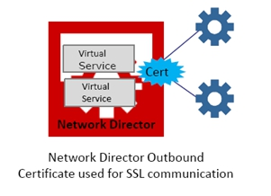
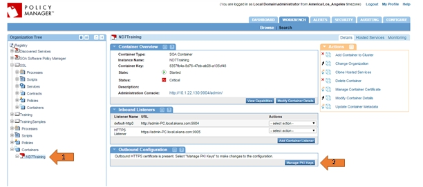
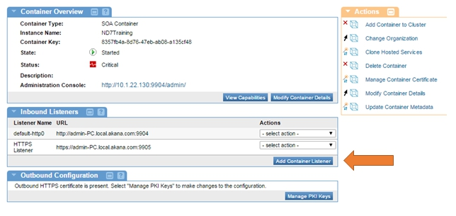
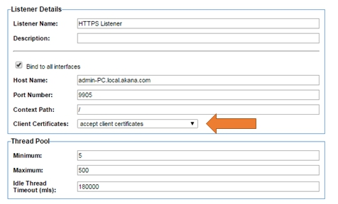
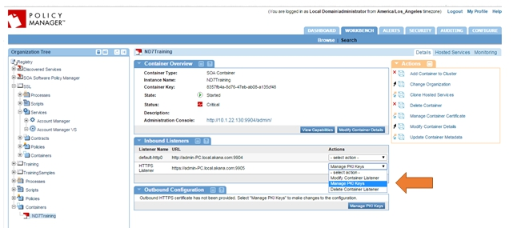
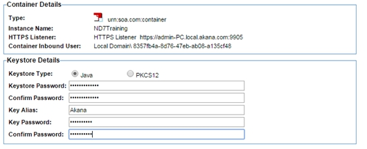

## Implementing 2-Way SSL
Learn how to use Policy Manager to implement mutual authentication using an SSL (Secure Socket Layer) Certificate to authenticate either your business' legal name and location or, alternatively, just your domain.

### Table of Contents

* [SSL Overview](#ssl-overview)  
* [2-Way SSL Prerequisites](#2-way-ssl-prerequisites)
* [Assumptions](#assumptions)
* [Create HTTP Security Policy](#create-http-security-policy)
* [Create Authentication Policy](#create-authentication-policy)
* [Configure Outbound HTTPS Support](#configure-outbound-https-support)
* [Configure Inbound HTTPS Support](#configure-inbound-https-support)
* [Add Trusted Client Certificates to Policy Manager](#add-trusted-client-certificates-to-policy-manager)
* [Test](#test)

<h5 class="stamp">Supported Platforms: 7.x</h5>

## SSL Overview

### Identity Certificates

When a user visits your secure site, your web server will send a copy of your SSL (Secure Socket Layer) certificate to the user's web browser. The information in the certificate will always include your web site's domain name, such as *www.yourdomain.com* and the name of the **certificate authority (CA)** that issued the certificate; *sometimes* it will also include your company's information. This lets the browser know that the web site it's connecting to is the correct web site, and not an impostor or phishing site. This is **authentication.**

There are two types of SSL Authentication: **full-authentication** and **domain-authentication**.

#### Fully-Authenticated SSL Certificates

A **fully-authenticated** SSL certificate will contain information about your domain name and the legal name of your business organization. It will also contain the geographical location information for the city, state, and country where your business is registered to do business. Before a Certificate Authority issues this certificate, the applying business has to fax in supporting proof-of-organization documents to prove its identity. Fully-authenticated websites will typically have a green bar before their domain name.

**Domain-Authenticated SSL Certificates**

A **domain-authenticated** certificate will vouch for your domain only. It will not include any information about your company nor its location in the certificate (except for the two-letter country code).  Domain-authenticated websites will have a lock icon before their name. 

<a href="#top">back to top</a>

## 2-Way SSL Prerequisites

In order for Policy Manager to properly implement mutual authentication, the following requirements must be met inside Policy Manager:

1. You must have an *HTTP Security Policy* with the *Require Client Certificate Authentication* option enabled and attached to the service you want.
2. You must have an *Authentication Policy* that will check that the correct certificate is presented
3. You must set your *HTTPS Inbound Listener* on your Network Director to *Accept Client Certificates*.
4. Your *HTTPS Inbound Listener* must have a set of PKI Keys and an X.509 Certificate.

<a href="#top">back to top</a>

## Assumptions

This topic implements mutual authentication with an anonymous contract. It allows any user in your Workbench with the correct certificate attached to access the service.

<a href="#top">back to top</a>

## Create HTTP Security Policy

The purpose of the HTTP Security Policy is to require a certain credential from the client. In this case we want to require the client to send a certificate as their credentials, which will be validated by the authentication policy in the next step. The HTTP Security Policy must be attached to the virtual service of any service you would like to implement mutual authentication on. 

1. Go to *[Organization Containing Service] > Polices > Operational Policies*.
2. On the *Policies Summary*, click **Add Policy** and create an *HTTP Security Policy*.
3. On the *HTTP Security Policy Details* portlet, click **Modify**. 
4. Click **Next** on the *Specify HTTP Authentication Options* screen.
5. On the *Specify Client Certificate Authentication* screen, click the **Require Client Certification Authentication** checkbox and select the **Use clients X.509 certificate from the SSL context** radio button.
6. Under *Subject Category*, select **End-User** and click **Finish**
   
7. In the *Policy Workflow* actions portlet, click **Activate Policy**.
8. Attach this policy to the service you want to implement mutual authentication on.
9. Navigate to [*Your Virtual Service*].
10. In the *Policy Attachments* portlet, click **Manage** in the *Operational* section.
11. Navigate the Policy Hierarchy, select the newly created HTTP Security Policy and click **Apply**.

<a href="#top">back to top</a> 

## Create Authentication Policy

The purpose of the authentication policy is to ensure that the correct certificate is received. The *HTTP Security Policy* only requires that a certificate be sent by the client, but that could be any certificate. This policy must also be attached to the service you want to implement mutual authentication on.

1. Go to *[Organization Containing Service] > Polices > Operational Policies*.
2. On the *Policies Summary*, click **Add Policy** and create an *Authentication Policy*.
3. On the *Authentication Policy* portlet, click **Modify**. 
4. On the *Modify Authentication Policy* pop-up, select the **End User** radio button.  
5. In the *Domains* section, select any domains you wish to have access to, use **>>** to move them to the right panel, and click **Apply**.
   
6. In the *Policy Workflow" actions portlet, click **Activate Policy**.
7. Attach this policy to the service you want to implement mutual authentication on.
8. Navigate to [*Your Virtual Service*].
9. In the *Policy Attachments" portlet, click **Manage** in the *Operational* section.
10. Navigate the Policy Hierarchy, select the newly created *Authentication Policy*, and click **Apply**

<a href="#top">back to top</a>

## Configure Outbound HTTPS Support

The Network Director supports Outbound HTTPS to the physical service/endpoint using the following two methods:

### Outbound HTTP Certificate Configured on the Virtual Service (Suggested Method)

If you would like to use different outbound certificates for different services, you can accomplish this by attaching them to a particular virtual service.

1. In *Policy Manager* Workbench, select the virtual service you would like to attach an Outbound Certificate to.
2. On the *Service Details* screen, click **Manage PKI Keys** from the *Actions* portlet. 
3. On the *Select Key Management Option* screen. Two options can be used.
4. **Option 1: Generate Your Own PKI keys and an X.509 certificate.** Use this option if you do not have your own certificate and PKI keys. Policy Manager will create them for you and display the information after. *Note that Policy Manager must be configured as a Certificate Authority in order to complete the following steps.*
5. Select **Generate PKI Keys and X.509 Certificate**, and click **Next**.
6. Select the key length value (2048 is recommended).
7. Fill out *Certificate Details* and click **Finish**.
8. **Option 2: Import your already existing certificate and keys**. Use this option if you have purchased a certificate from a CA and would like to use it.
9. Select **Import PKI Keys and X.509 Certificate** and click **Next**.
10. Specify the *Keystore Type*.
11. Specify the *Keystore Path*.
12. Enter the password for the selected keystore.
13. Click **Load Aliases**.
14. Select the *Key Alias* you would like to import and click **Finish**.
	

### Outbound HTTPS Certificate Configured on the Network Director Container

This optional method can be thought of as a “default” certificate that is sent with every request made by services hosted on the Network Director. It is configured in the *Details* tab in the *Outbound Configuration* portlet.

1. In *Policy Manager* Workbench, go to *Organization Tree > Containers* and select the Network Director container instance the service is hosted on.
2. In the *Outbound Configurations* portlet, click **Manage PKI Keys**.

3. On the *Select Key Management Option* screen, select from two options:
4. **Option 1: Generate Your Own PKI keys and an X.509 certificate**. Use this option if you do not have your own certificate and PKI keys. Policy Manager will create them for you and display the information after. *Note that Policy Manager must be configured as a Certificate Authority in order to complete the following steps.*
5. Select **Generate PKI Keys and X.509 Certificate** and click **Next**.
6. Select the key length value (2048 is recommended).
7. Fill out the *Certificate Details* and click **Finish**.
8. **Option 2: Import your already existing certificate and keys**. Use this option if you have purchased a certificate from a CA and would like to use it.
9. Select **Import PKI Keys and X.509 Certificate** and click **Next**.
10. Specify the *Keystore Type*.
11. Specify the *Keystore Path*.
12. Enter the password for selected keystore.
13. Click **Load Aliases**.
14. Select the *Key Alias* you would like to import and click **Finish**.

<a href="#top">back to top</a> 

## Configure Inbound HTTPS Support

There are two things to do in order to enable client certification:

* Set your HTTPS inbound listener to accept client certificates.
* Use Policy Manager to create a client certificate and add it to your store of Trusted CA Certificates.

### Create an HTTPS Inbound Listener

*Note: If you have an existing HTTPS listener you want to use, you can just modify it under **Actions > Modify Container Listener** and change its client certificate requirements.*

1. In the *Inbound Listeners* portlet, select the *Network Director* container instance you plan to host the service on.
2. Click **Add Container Listener**.

3. From the drop-down, select **HTTPS** and click **Next**.
4. From the *Client Certificates* drop-down, select **Accept Client Certificates**.
5. Fill out the rest of the fields to your preference and click **Finish**.

6. Go to **Actions > Manage PKI Keys**.
7. Create or import PKI Keys and certificate for HTTPS Inbound Listener.

8. On the *Select Key Management Option* screen, select from two options.
9. **Option 1: Generate Your Own PKI keys and an X.509 certificate**. Use this option if you do not have your own certificate and PKI keys. Policy Manager will create them for you and display the information after. *Note that Policy Manager must be configured as a Certificate Authority in order to complete the following steps.*
10. Select **Generate PKI Keys and X.509 Certificate** and click **Next**.
11. Select the key length value (2048 is recommended).
12. Fill out the *Certificate Details* and click **Finish**.
13. **Option 2: Import your already existing certificate and keys**. Use this option if you have purchased a certificate from a CA and would like to use it.
14. Select **Import PKI Keys and X.509 Certificate** and click **Next**.
15. Specify the *Keystore Type*.
16. Specify the *Keystore Path*.
17. Enter the password for the selected keystore.
18. Click **Load Aliases**.
19. Select the *Key Alias* you would like to import and click **Finish**.

<a href="#top">back to top</a>

## Add Trusted Client Certificates to Policy Manager
Add any additional trusted client certificates to the Trust CA Store in Policy Manager.

1. Go to *Configure > Security > Certificates > Trusted CA Certificates*.
2. To import the certificate for the client, click **Add Trusted CA Certificate** and click **Apply**.
3. Go to **Security > Users**.
4. Assign PKI Keys and X.509 certificate to desired user(s).
5. Select user(s).
6. Click **Manage PKI Keys**.
7. **Import PKI Keys and X.509 Certificate** and click **Next**.
8. Select a **valid .jks file** and click **Finish**.

<a href="#top">back to top</a>

## Test 

You can test to be sure that mutual authentication is working properly by testing it with SOAPUI. You just need to export the Private Key and X.509 Certificate from the HTTPS Inbound Listener and add them to your SOAPUI.

1. Navigate to [*Your Network Director*].
2. Locate your [HTTPS Listener created earlier in this guide](#configure-inbound-https-support) under *Inbound Listeners* portlet.
3. From the *Actions* drop-down, select **Manage PKI Keys**.
4. Under *Key Management Options*, select **Export Private Key and X.509 Certificate** and click **Next**.
5. Confirm that *Keystore* Type is set to **Java**.
6. Fill out the **Keystore Details** fields and click **Finish**.

7. Inside SOAPUI, go to **File > Preferences > SSL Settings**.
8. Inside the *Keystore* field, **browse** to where you saved the exported file.
9. Under **KeyStore Password**, enter the same password you made when you exported the keys and click **OK**.
10. SOAPUI should now be able to successfully test services with mutual authentication.

<a href="#top">back to top</a>

 