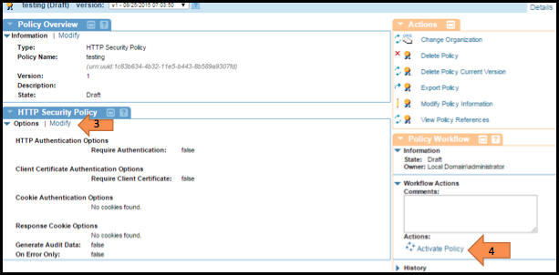
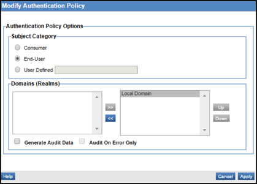
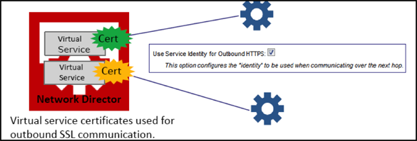
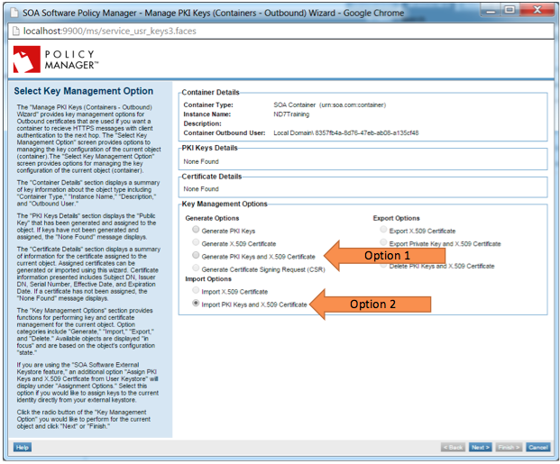
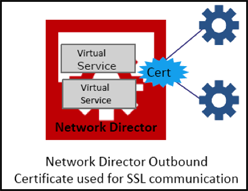
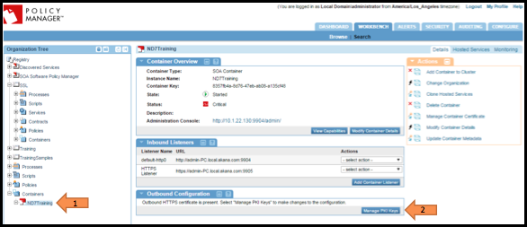
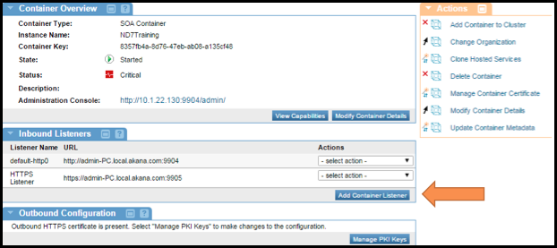
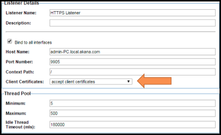
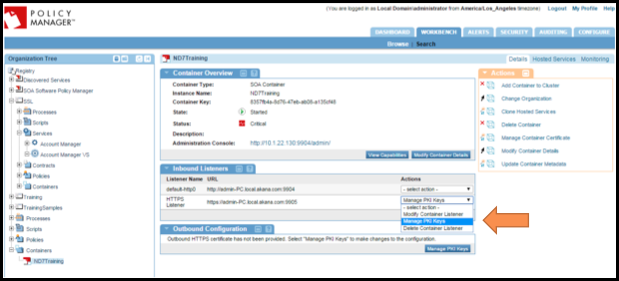
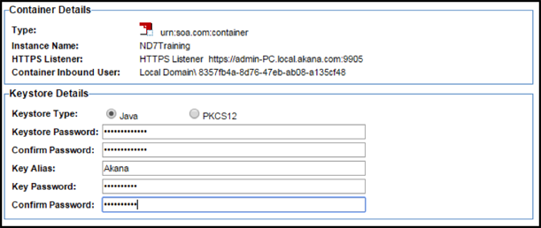

## Implementing 2-Way SSL
Learn about how Policy Manager implements mutual authentication using an SSL (Secure Socket Layer) Certificate to authenticate either your business' legal name and location or, alternatively, just your domain.

<h5 class="stamp">Supported Platforms: 7.0 and greater.</h5>
### Table of Contents

* [SSL Overview](#ssl-overview)  
* [2 Way SSL Prerequisites](#2-way-ssl-prerequisites)
* [Assumptions](#assumptions)
* [Create an HTTP Security Policy](#create-an-http-security-policy)
* [Create an Authentication Policy](#create-an-authentication-policy)
* [Configuring Outbound HTTPS Support](#configuring-outbound-https-support)
* [Configuring Inbound HTTPS Support](#configuring-inbound-https-support)
* [Add Trusted Client Certificates to Policy Manager](#add-trusted-client-certificates-to-policy-manager)
* [Upon Completion](#upon-completion)

## SSL Overview

###Identity Certificates
When a user visits your secure site, your web server will send a copy of your SSL (Secure Socket Layer) certificate to the user's web browser. The information in the certificate will always include your web site's domain name, such as *ww&#8203;w.yourdomain.com* and the name of the **certificate authority (CA)** that issued the certificate; *sometimes* it will also include your company's information. This lets the browser know that the web site it's connecting to is the correct web site, and not an impostor or phishing site. This is **authentication.**

There are two types of SSL Authentication: **full-authentication** and **domain-authentication**. 

**Fully-Authenticated SSL Certificates**  

A **fully-authenticated** SSL certificate will contain information about your domain name and the legal name of your business organization. It will also contain the geographical location information for the city, state, and country where your business is registered to do business. Before a Certificate Authority issues this certificate, the applying business has to fax in supporting proof-of-organization documents to prove its identity. Fully-authenticated websites will typically have a green bar before their domain name.  

**Domain-Authenticated SSL Certificates**  

A **domain-authenticated** certificate will vouch for your domain only. It will not include any information about your company nor its location in the certificate (except for the two-letter country code).  Domain-authenticated websites will have a lock icon before their name. 
 

<a href="#top">back to top</a> 

## 2 Way SSL Prerequisites
In order for PM to properly implement mutual authentication, the following requirements must be met inside Policy Manager:

1. You must have an HTTP Security Policy with the *Require Client Certificate Authentication* option enabled and attached to the service you want.
2. You must have an Authentication Policy that will check that the correct certificate is presented.
3. You must set your HTTPS *Inbound Listener* on your network director to *Accept Client Certificates*.
4. Your HTTPS Inbound Listener must have a set of PKI Keys and an X.509 Certificate.

<a href="#top">back to top</a> 

## Assumptions
This guide implements mutual authentication with an anonymous contract. It allows any user in your workbench with the correct certificate attached to access the service. 

<a href="#top">back to top</a> 

## Create an HTTP Security Policy
The purpose of the HTTP Security Policy is to require a certain credential from the client. In this case we want to require the client to send a certificate as their credentials, which will be validated by the authentication policy in the next step. The HTTP Security Policy must be attached to the virtual service of any service you would like to implement mutual authentication on. 

###Step-by-step Instructions
1. Go to **[Organization containing service] > Polices > Operational Policies**.
2. Add Policy  
   a. Under the *Policies Summary* portlet, click **Add Policy**.  
   b. From the *Type* drop-down menu, select **HTTP Security Policy**.  
   c. Click **Next**.  
   d. Enter the policy a name.  
   e. Click **Finish**.  
   f. Click **Close**.
3. Modify Policy  
   a. Under the *HTTP Security Policy*, click on **Modify**.  
   b. Click **Next** (The authentication scheme is not necessary).  
   c. Check the **Require Client Certification Authentication** checkbox.  
   d. Make sure the **Use clients X.509 certificate from the SSL context** radio button is selected.  
   e. Under *Subject Category*, select **End-User**.  
   f. Click **Finish**.  
      
4. Click the **Activate Policy** link (on the right side of the *workbench*, under *Policy Workflow*). 
5. Attach this policy to the service you want to implement mutual authentication on.  
   a. Navigate to [*your virtual service*].  
   b.  Click **Manage** under the *Policy Attachments* portlet.  
   c. Put a **check** by the name of your newly created HTTP Security Policy.  
   d. Click **Apply**.

<a href="#top">back to top</a> 

## Create an Authentication Policy
The purpose of the authentication policy is to ensure that the correct certificate is received. The HTTPS Security policy only requires that a certificate be sent by the client, but that could be any certificate. This policy must also be attached to the service you want to implement mutual authentication on. 

###Step-by-step Instructions
1. Go to **[Organization containing service] > Polices > Operational Policies**.
2. Add Policy  
   a. Under the *Policies Summary* portlet, click on **Add Policy**.  
   b. From the *Type* drop-down menu, select **Authentication Policy**.  
   c. Click on **Next**.  
   d. Give the policy a name.  
   e. Click **Finish**.  
   f. Click **Close**.
3. Modify Policy  
   a. Under the *Authentication Policy*, click on **Modify**.  
   b. Select the **End User** radio button.  
   c. In the *Domains* portlet, move any domain you wish to have access from the left window to the right by highlighting its name and clicking on the **>>** button.  
   d. Click **Apply**.  
   
4. Click the **Activate Policy** link (on the right side of the *workbench*, under *Policy Workflow*).
5. Attach this policy to the service you want to implement mutual authentication on.  
   a. Navigate to [*your virtual service*].  
   b.  Click **Manage** under the *Policy Attachments* portlet.  
   c. Put a **check** by the name of your newly created Authentication Policy.  
   d. Click **Apply**.

<a href="#top">back to top</a> 

## Configuring Outbound HTTPS Support
The Network Director supports outbound HTTPS to the physical service/endpoint using the following two methods: 

###Outbound HTTP Certificate Configured on the Virtual Service (Suggested Method)
If you would like to use different outbound certificates for different services, then you can accomplish this by attaching them the particular virtual service.  
  
   

**Step-by-step Instructions**

1. In the *Policy Manager* workbench, select the virtual service you would like to attach an outbound Certificate to.
2. Click **Manage PKI Keys** (from the *Actions* portlet on the right).  
The *Select Key Management Option* Wizard is displayed.  Select from two options:  
  * **Generate Your Own PKI keys and an X.509 certificate**  
  Use this option if you do not have your own certificate and PKI keys. Policy Manager will create them for you and display the information after.  
  ***Note***: *Policy Manager must be configured as a Certificate Authority in order to complete the following steps*.  
  a. Select **Generate PKI Keys and X.509 Certificate**.  
  b. Click **Next**.  
  c. Select the desired key length value (2048 is recommended).   
  d. Fill out the *Certificate Details*.  
  e. Click **Finish**.  
  * **Import your already existing certificate and keys**  
  Use this option if you have purchased a certificate from a CA and would like to use it.  
  a. Select **Import PKI Keys and X.509 Certificate**.  
  b. Click **Next**.  
  c. Specify the *Keystone Type*.  
  d. Specify the *Keystone Path*.  
  e. Enter the password for that keystore selected in step d.  
  f. Click **Load Aliases**.  
  g. Select the *Key Alias* you would like to import.  
  e. Click **Finish**.  
  

###Outbound HTTPS Certificate Configured on the Network Director Container
This optional method can be thought of as a “default” certificate that is sent with every request made by services hosted on the Network Director. It is configured in the *Details* tab in the *Outbound Configuration* portlet.    

**Step-by-step Instructions**

1. In the *Policy Manager* workbench, go to **Organization Tree > Containers** on the left-hand pane to select the Network Director that the service is hosted on.
2. Under *Outbound Configurations* portlet, click **Manage PKI Keys**.  
  
The *Select Key Management Option* wizard is displayed.  Select from two options:  
  * **Generate Your Own PKI keys and an X.509 certificate**  
  Use this option if you do not have your own certificate and PKI keys. Policy Manager will create them for you and display the information after.  
  ***Note***: *Policy Manager must be configured as a Certificate Authority in order to complete the following steps*  
  a. Select **Generate PKI Keys and X.509 Certificate**.  
  b. Click **Next**.  
  c. Select the desired key length value (2048 is recommended).  
  d. Fill out the *Certificate Details*.  
  e. Click **Finish**. 
  * **Import your already existing certificate and keys**  
  Use this option if you have purchased a certificate from a CA and would like to use it.  
  a. Select **Import PKI Keys and X.509 Certificate**.  
  b. Click **Next**.  
  c. Specify the *Keystone Type*.  
  d. Specify the *Keystone Path*.  
  e. Enter the password for that keystore selected in step d.  
  f. Click **Load Aliases**.  
  g. Select the *Key Alias* you would like to import.  
  e. Click **Finish**.   

<a href="#top">back to top</a> 

## Configuring Inbound HTTPS Support
There are two things to do in order to enable client certification:  

* Set your HTTPS inbound listener to accept client certificates.
* Use Policy Manager to create a client certificate and add it to your store of Trusted CA Certificates. 

###Creating an HTTPS Inbound Listener 

**Step-by-step Instructions**  
***Note***: *if you have an existing HTTPS listener you want to use, you can just modify it under* ***Actions > Modify Container Listener*** *and change its client certificate requirements.*

1. Under the *Inbound Listeners* portlet, select the *Network Director* you plan to host the service on.
2. Click **Add Container Listener**.  

3. From the drop-down menu, select **HTTPS**.
4. Click **Next**.
5. From the *Client Certificates* drop-down menu, select **Accept Client Certificates**.
6. Fill out the rest of the fields to your preference.
7. Click **Finish**.  

8. Go to **Actions > Manage PKI Keys**.
9. Create or import PKI Keys and certificate for HTTPS Inbound Listener.  
  
The *Select Key Management Option Wizard* is displayed.  Select from two options:  
  * **Generate Your Own PKI keys and an X.509 certificate**  
  Use this option if you do not have your own certificate and PKI keys. Policy Manager will create them for you and display the information after.  
  ***Note***: *Policy Manager must be configured as a Certificate Authority in order to complete the following steps*  
  a. Select **Generate PKI Keys and X.509 Certificate**.  
  b. Click **Next**.  
  c. Select the desired key length value (2048 is recommended).   
  d. Fill out the *Certificate Details*.  
  e. Click **Finish**.  
  * **Import your already existing certificate and keys**  
  Use this option if you have purchased a certificate from a CA and would like to use it.  
  a. Select **Import PKI Keys and X.509 Certificate**.  
  b. Click **Next**.  
  c. Specify the *Keystone Type*.   
  d. Specify the *Keystone Path*.  
  e. Enter the password for that keystore selected in step d.  
  f. Click **Load Aliases**.  
  g. Select the *Key Alias* you would like to import.  
  e. Click **Finish**.   
 
<a href="#top">back to top</a> 

## Add Trusted Client Certificates to Policy Manager
Add any additional trusted client certificates to the Trust CA Store in Policy Manager.

###Step-by-step Instructions
1. Go to **Configure > Security > Certificates > Trusted CA Certificates**.
2. To import the certificate for the client, click **Add Trusted CA Certificate**.
3. Click **Apply**.
4. Go to **Security > Users**.
5. Assign PKI Keys and X.509 certificate to desired user(s):  
  a. Select user(s).  
  b. Click **Manage PKI Keys**.  
  c. Select **Import PKI Keys and X.509 Certificate**.  
  d. Click **Next**.  
  e. Select a **valid .jks file**.  
  f. Click **Finish**.

<a href="#top">back to top</a> 

## Upon Completion
You can test to be sure that mutual authentication is working properly by testing it with SoapUI. You just need to export the Private Key and X.509 Certificate from the HTTPS Inbound Listener and add them to your SoapUI. 

###Step-by-step Instructions
1. Navigate to [*your network director*]. 
2. Locate your [HTTPS Listener created earlier in this guide](#configuring-inbound-https-support) under *Inbound Listeners* Port.
3. From the *Actions* drop-down, select **Manage PKI Keys**.
4. Under *Key Management Options*, select **Export Private Key and X.509 Certificate**.
5. Click **Next**.
6. Confirm that *Keystore* Type is set to **Java**.
7. Fill out the **Keystore Details** fields.
8. Click **Finish**.  

9. Inside SoapUI, go to **File > Preferences > SSL Settings**.
10. Inside the *Keystore* field, **browse** to where you saved the exported file.
11. Under **KeyStore Password**, under the same password you made when you exported the keys.
12. Click **OK**.    
SoapUI should now be able to successfully test services with mutual authentication.

<a href="#top">back to top</a> 