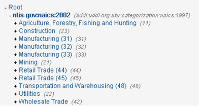
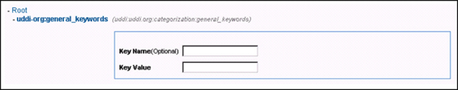
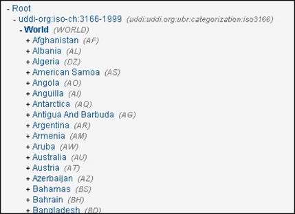
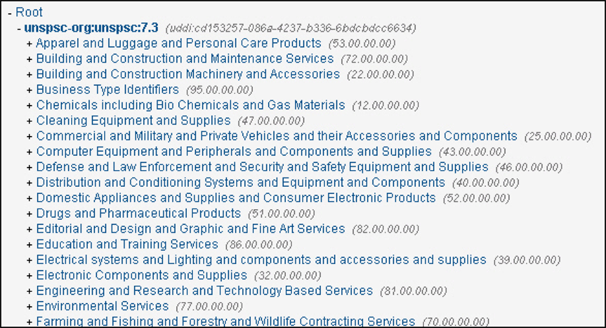

## Regeistry Reference
Includes WSDL Entity Type tModels, UDDI Category tModels, Policy Manager Category tModels and Business Taxonomy tModels.

<a href="../registry/registry_toc.html" class="button secondary">Registry (Home)</a> <a href="../registry/category_schemes.html" class="button secondary">Category Schemes</a> <a href="../registry/categories.html" class="button secondary">Categories</a> <a href="../registry/identifier_schemes.html" class="button secondary">Identifier Schemes</a> <a href="../registry/schema.html" class="button secondary">Schema</a> <a href="../registry/interfaces.html" class="button secondary">Interfaces</a> <a href="../registry/tmodels.html" class="button secondary">tModels</a>    <a href="../registry/subscriptions.html" class="button secondary">Subscriptions</a> <a href="../registry/replications.html" class="button secondary">Replications</a>

Supported Platforms: 7.0 and greater.</h5>

### Table of Contents

* [Identifier Scheme Types](#identifier-scheme-types)
* [WSDL Entity Type tModels](#wsdl-entity-type-tmodels)
* [UDDI Category tModels](#uddi-category-tmodels)
* [Policy Manager Category tModels](#policy-manager-category-tmodels)
* [Business Taxonomy tModels](#business-taxonomy-tmodels)
* 

## Identifier Scheme Types

Identifier Schemes (also referred to as Identifier  tModels) are used to logically group Providers by a common form of identification. 

* Identifiers are optional descriptions and are intended to enhance the discovery of business providers and services in search operations.
* Identifiers are generally trade-focused and indicate the identity of the businessEntity or publishing party associated with the business providers and services.  Some examples are:  
  * D-U-N-S numbers
  * Global Location Number (GLM)
  * Tax identifiers
* Inclusion of identifiers in your business providers and services definitions enhances the search process by providing a mechanism that allows you to more efficiently target your business searches.

The Identifier information is configured using a <keyedReference> tag that is stored in the businessEntity under the identifyBag construct. The "key" data includes:

* **tModelKey** - The tModel key associated with the identifier information.
* **keyName ()** - The human readable name assigned to the identifier.
* **keyValue()** - The internal system identifier id of the identifier.

The *Identifiers Summary* screen allows you to view current identifiers, assign identifiers, and unassign identifiers for the current Provider definition.

The following identifier schemes are provided with the default installation:

* **digev-com:clientsdk_url_lookup** - Policy Manager WSClientSDK Identifier Binding lookup scheme.
* **digev-com:identification** - Subsystem Identification System.
* **digev-com:jms_properties** - Policy Manager Properties to support SOAP over JMS.
* **dnb-com:D-U-N-S** - The Dun & Bradstreet registry is an industry-focused identifier scheme that specifies the Dun & Bradstreet D-U-N-S Number identifier.
* **thomasregister-com:supplierID** - The Thomas Registry is an industry-focused identifier scheme that provides a comprehensive online resource for finding companies and products manufactured in North America.

<a href="#top">back to top</a> 

## WSDL Entity Type tModels

**Note:** *The WSDL Technote Category Schemes are reserved for system use and cannot be deleted.*

* **uddi-org:wsdl:categorization:protocol** - Category system used to describe the protocol supported by a by a wsdl:binding.
* **uddi-org:wsdl:categorization:transport** - Category system used to describe the transport supported by a wsdl:binding.
* **uddi-org:wsdl:portTypeReference** - A category system used to reference a wsdl:portType tModel.
* **uddi-org:wsdltypes** - WSDL Entity Type Category System. 
  * This mapping uses a number of UDDI entities to represent the various entities within a WSDL document. 
  * A mechanism is required to indicate what type of WSDL entity is being described by each UDDI entity. 
  * The WSDL Entity Type tModel provides a typing system for this purpose. 
  * This category system is used to indicate that a UDDI entity represents a particular type of WSDL entity.
* **uddi-org:xml:localName** - A category system used to indicate XML local names.
* **uddi-org:xml:namespace** - A category system used to indicate namespaces.

<a href="#top">back to top</a> 

## UDDI Category tModels

* **uddi-org:category_types** - UDDI TYPES CATEGORY SYSTEM. A category scheme that provides a listing of "valid values" from uddi-org:types for categorizing tModels that will be published.
* **uddi-org:xml:namespace** - A category system used to indicate namespaces.

<a href="#top">back to top</a> 

## Policy Manager Category tModels

* **digev-com:categorization** - Subsystem Category System
* **digev-com:managementpoint:discoveredservice:relationship** - Services MP Relationships Category System
* **digev-com:service type categorization** - Service Type Category System
* **digev.com:metadata** - Custom Metadata Category System
* **digev.com:notification_status** - Notification Status System
* **ntis-gov:naics:2002** - 2002 North American Industry Classification System
* **soa-com:organization type categorization** - Organization Type Category System
* **soa-com:servicelifecyclestage** - Service Lifecycle Stages
* **soa-com:servicemanager:servicerelationship** - Policy Manager Service Relationships Category System
* **soa-com:serviceversion** - Service Version
* **soa-com:wsdl:location** - Main WSDL Location
* **uddi-org:category_types** - UDDI Types Category System
* **uddi-org:entityKeyValues** - Category system used to declare that a value set uses entity keys as valid values
* **uddi-org:general_keywords** - UDDI General Keyword Category System
* **uddi-org:iso-ch:3166-1999** - ISO 3166-1:1997 and 3166-2:1998. 
   * Codes for names of countries and their subdivisions. 
   * Part 1: Country codes. 
   * Part 2: Country subdivision codes. 
   * Update newsletters include ISO 3166-1 V-1 (1998-02-05), V-2 (1999-10-01), ISO 3166-2 I-1 (1998).
* **uddi-org:nodes** - Category system for identifying nodes of a registry
* **uddi-org:wsdl:categorization:protocol** - Category system used to describe the protocol supported by a wsdl:binding
* **uddi-org:wsdl:categorization:transport** - Category system used to describe the transport supported by a wsdl:binding
* **uddi-org:wsdl:portTypeReference** - A category system used to reference a wsdl:portType tModel
* **uddi-org:wsdl:types** - WSDL Type Category System
* **uddi-org:xml:localName** - A category system used to indicate XML local names
* **uddi-org:xml:namespace** - A category system used to indicate namespaces
* **uddi:soa.com:dynamicbinding:lookup** - SOA Service dynamic binding tmodel to dynamically bind to service by identifier
* vuddi:soa.com:serviceendpoint:connprop:string** - SOA service endpoint connection property
* **uddi:soa.com:serviceendpoint:containername** - SOA Service endpoint container tmodel   
* **uddi:soa.com:serviceendpoint:contextpath** - SOA Service endpoint context path
* **uddi:soa.com:serviceendpoint:listenername** - SOA Service endpoint listener tmodel
* **uddi:soa.com:serviceendpoint:msgprop:string** - SOA service endpoint message property
* **uddi:soa.com:serviceendpoint:protocolvar** - SOA service endpoint protocol variant
* **uddi:soa.com:serviceendpoint:weight** - SOA Service endpoint weight tmodel
* **uddi:soa.com:wsdl:schemareference** - A category system used to reference a schema tModel
* **unspsc-org:unspsc:7.3** - Universal Standard Products and Services Classification (UNSPSC) Version 7.3  

<a href="#top">back to top</a> 

## Business Taxonomy tModels

###ntis-gov:naics:2002

NORTH AMERICAN INDUSTRY CLASSIFICATION SYSTEM (NAICS) taxonomy. Provides common definitions of the industries within the three countries and a common statistical framework for analyzing statistical data relating to industry and the economy.

###uddi-org:general_keywords

GENERAL KEYWORDS TAXONOMY. Provides a method of defining unchecked taxonomies, each consisting of a namespace identifier and an associated set of category values. Unlike other taxonomies, the "Key Name" and "Key Value" attributes of the keyedReference elements are semantically meaningful. See http://uddi.org/taxonomies/UDDI_Taxonomy_tModels.htm for technical information on the use of this tModel.

###uddi-org:iso-ch:3166-1999

ISO 3166 GEOGRAPHIC TAXONOMY. A geographic taxonomy that provides codes for names of countries and their subdivisions. This categorization scheme can be used to indicate that a business or service serves a particular geographic area.

###unspsc-org:unspsc:73

UNIVERSAL STANDARD PRODUCTS AND SERVICES CLASSIFICATION (UNSPSC). An industry-focused category scheme that allows you to code products and services according to an industry-agreed naming standard.

<a href="#top">back to top</a> 

