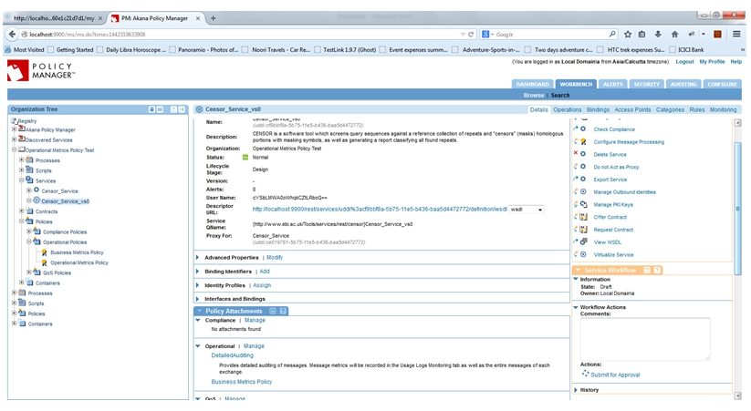
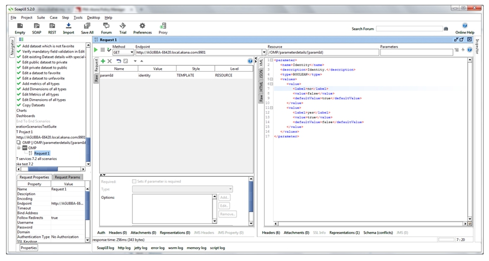
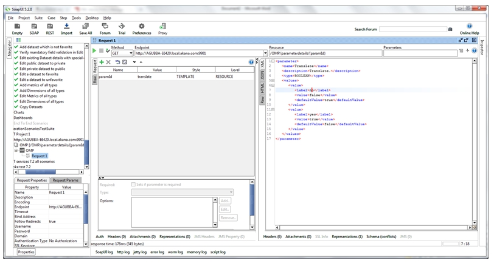

## How Do I Extract Business Information from Service Usage Data Using XPath/JsonPath/RegEx?

The following use case illustrates how to use the Business Metrics Policy to Extract Business information from service usage data using XPath/JsonPath/RegEx from Request payload and derive operational metrics.

<a href="policy_management.htm" class="button secondary">Managing Policies</a>  <a href="policies_use_case_toc.html" class="button secondary">Business Metrics Policy Use Cases</a>

<h5 class="stamp">Supported Platforms: 8.0 and greater.</h5>

### Configuration

1. Launch the *Envision Console*, select **New Dataset** and define a dataset with sharing as **Public**.

2. In the new dataset, select **New Dimension** and define a dimension with the **TEXT** type.  

3. Select **New Metric** in the same dataset and define a metric with the the **COUNT** type and all aggregations. 

4. Save aggregation settings for the selected dataset.  

5. Select **New Chart**, and create a chart using this dataset with the follwing configuration:  

6. Select **New Dashboard** and create a dashboard with the newly defined chart:  

7. Launch the *Policy Manager Management Console* and create a service with [http://www.restfulwebservices.net/wcf/CurrencyService.svc?wsdl7](http://www.restfulwebservices.net/wcf/CurrencyService.svc?wsdl7).
8. Virtualize the service on Network Director.  

9. Navigate to *Policies > Operational* and create a *Business Metrics Policy* using **Add Policy**.
10. Configure the policy and select the dataset defined above.  

11. Provide Extract/Derive Configuration for each of the dimensions and metrics using the example illustrated below:  
  * a.	Dimension using Extract – To obtain a value in request payload using XPath/JsonPath/RegEx.
  * b.	Metric using Derive – To obtain usage count.  

12. Attach the policy to the service.

13. Send multiple requests to generate data for various usage scenarios.  

14. Check the data to be recorded in MongoDB and Dataset. The data should be appropriate per the requests sent.
15. The chart should record information based on the data generated in the datasets from above requests. 

<a href="#top">back to top</a>