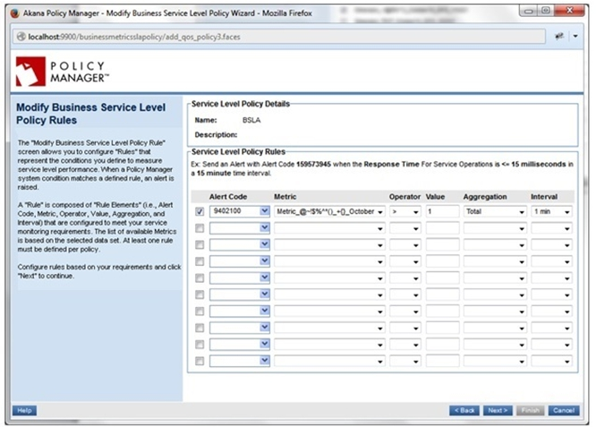
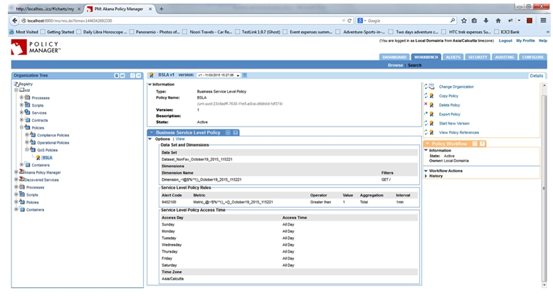
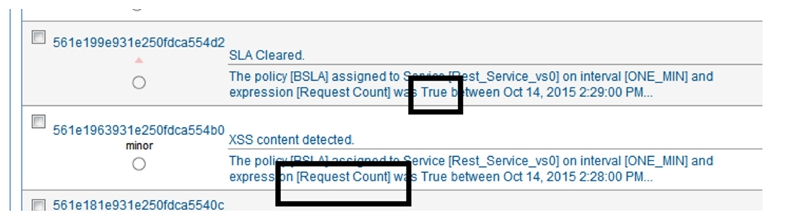

## Business Service Level Policy Use Case - How Do I Configure a Business Metrics policy to set SLA for a service?

The following use case illustrates how to configure a Business Metrics policy to set SLA for a service.

<h5 class="stamp">Supported Platforms: 8.0 and greater.</h5>

### Configuration

1. Create a physical service.
2. Virtualize the physical service.

3. Configure the Business Metrics Policy:  
 * a. Select any dataset  
 
 * b. Provide dimensions and metrics configuration  
   
 
 * c. Activate the policy  
  
4. Configure the Business service level policy:  
  * a. Select tehe same dataset as above  
  
  * b. Select filters (by dimensions)  
  
  * c. Select desired condition based on the metrics in the dataset(data is loaded into the metrics as per the configuration in Business metrics policy)  
  
  * d. Select alert code
  * e. Select the days and durations for which alert to be triggered  
  
  * f. Activate the policy  
  
5. Attach Business metrics policy in operational policies
6. Attach Business service level policy in qos policies  

7. Send few requests to the virtual service so that the condition described in the Business service level policy is crossed.
8. See alerts at service level.
9. See SLA cleared alerts at service level (Similar to the below picture).


<a href="#top">back to top</a>