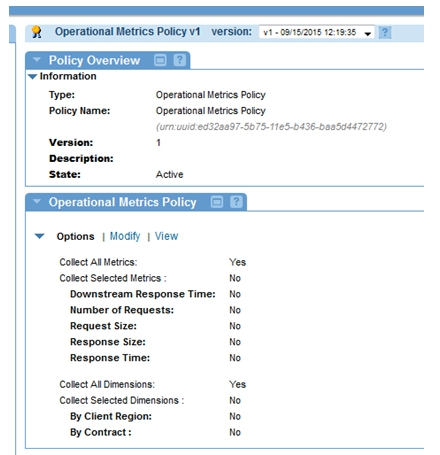
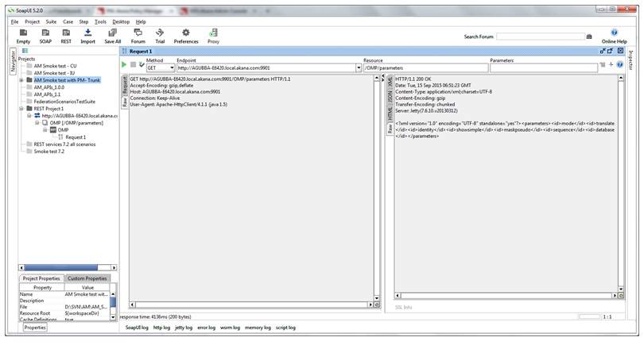
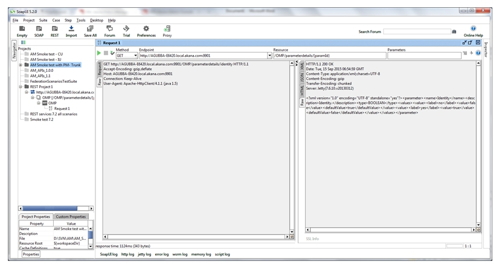

## How Do I Generate a Chart from Operational Metrics Obtained from Service Operational Data 

The following use case illustrates how to generate a chart from Operational Metrics obtained from Service Operational Data.

## Configuration

1. Perform the [Policy Manager / Envision Integration Installation](http://docs.akana.com/docs-test/ev/envision_install/installing_pm_env_integration_v11.html). At the end of this process you will have configured Envision, Policy Manager, and Network Director container instances. This process also includes using **Add Container** in the *Policy Manager Management Console* to register the Network Director container.
2. Launch the *Akana Administration Console* for the Network Director container instance and change the following configuration properties via the *Configuration* tab:
  
 
3. Restart the Network Director container instance.
4. Launch the Policy Manager Management Console and create a physical service with [http://www.ebi.ac.uk/Tools/services/rest/censor?wadl](http://www.ebi.ac.uk/Tools/services/rest/censor?wadl)
5. Select **Virtualize Service** and virtualize the physical service in the Network Director container. 
6. Go to *Policies > Operational* and use **Add Policy** to create an Operational Metrics Policy and configure it based on the illustration below.  
 
7. Attach a Detailed Auditing Policy (found in the root Policies folder) and an Operational Metrics Policy to the virtual service.
8. Send requests to virtual service.

9. See usage logs for the service.  

10. View the recorded logs in MongoDB in AUDIT_LOG collection.  

11. METRICDATASEC should be aggregating the logs per second. View the collections following collections: API Operational Metric Data Set, API Contract Metric Data Set, and API User Metric Data Set.  

12. METRICDATAMIN should be aggregating the logs per minute on the basis of METRICDATASEC. View the following collections: API Operational Metric Data Set, API Contract Metric Data Set, and API User Metric Data Set.
13. Send request to various operations.  

14. View the usage logs in MongoDB. The logs should contain the fields and information as per the Operational policy configuration made above  

15. Launch the *Envision Console* and make a chart using the collections API Operational Metric Data Set, API Contract Metric Data Set, and API User Metric Data Set. The charts should show appropriate data:  
  * a.	API Operational Metric Data Set  

16. Similarly verify charts for the API Contract Metric Data Set and API User Metric Data Set.

<a href="#top">back to top</a> 