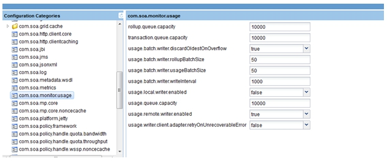
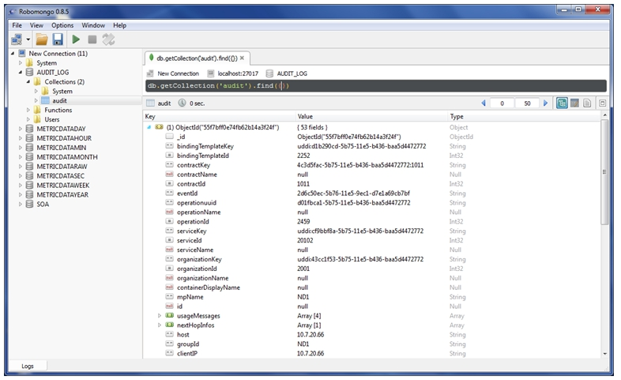
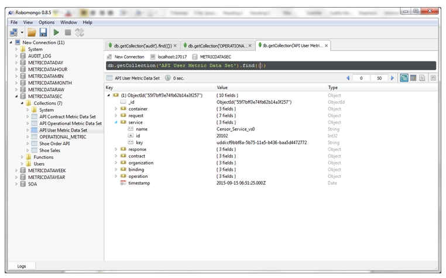
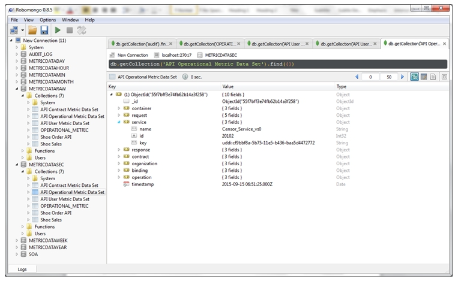
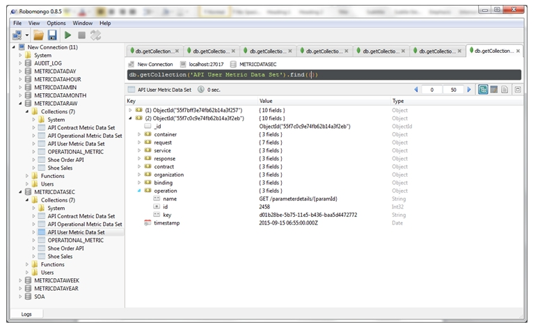

## Operational Metrics Policy Chart Generation

Learn how to generate a chart from Operational Metrics obtained from Service Operational Data.

## Introduction

The Operational Metrics Policy collects numeric data relating to service request/response time and by contract, subject, and client region that can be visualized in charts.

## How Do I Generate a Chart from Operational Metrics Obtained from Service Operational Data?

1. Install AM container with a new MongoDB instance
2.	Install PM container over same MongoDB
3.	Install ND container 
4.	Change configuration properties in ND admin console as shown below  
  
 
5. Restart ND container
6.	Add ND container to PM 
7.	Create a physical service with [http://www.ebi.ac.uk/Tools/services/rest/censor?wadl](http://www.ebi.ac.uk/Tools/services/rest/censor?wadl)
8.	Virtualize it on ND
9.	Create Operational Metrics Policy and configure it.  
 
10. Attach detailed auditing policy and operational metrics policy to the virtual service
11.	Send requests to Virtual service  

12. See usage logs for the service  

13. View the recorded logs in MongoDB in AUDIT_LOG collection  

14. And METRICDATASEC should be aggregating the logs per second , view the collections: API Operational Metric Data Set, API Contract Metric Data Set, API User Metric Data Set  

15. And METRICDATAMIN should be aggregating the logs per minute on the basis of METRICDATASEC , view the collections: API Operational Metric Data Set, API Contract Metric Data Set, API User Metric Data Set
16. Send request to various operations  

17. View the usage logs in MongoDB. The logs should contain the fields and information as per the operational policy configuration made above  

18. In AM console, make a chart using the collections: API Operational Metric Data Set, API Contract Metric Data Set, API User Metric Data Set, the charts should show appropriate data  
  * a.	API Operational Metric Data Set  

19. Similarly verify charts for API Contract Metric Data Set and API User Metric Data Set

<a href="#top">back to top</a> 