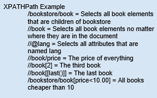
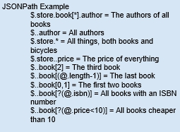
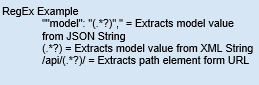
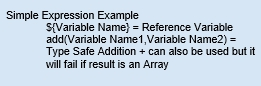
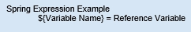
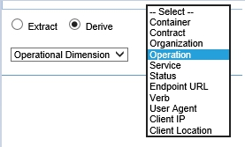

## Using the Business Metrics Policy
Learn how to specify what business metrics should be gathered from the contents of messages being exchanged.

<a href="policy_management.htm" class="button secondary">Managing Policies</a>  <a href="policies_use_case_toc.html" class="button secondary">Use Cases</a> <a href="using_the_business_service_level_policy.html" class="button secondary">Using the Business Service Level Policy</a>

<h5 class="stamp">Supported Platforms: 8.0 and greater.</h5>

### Table of Contents

* [Introduction](#introduction)
* [Prerequisites](#prerequisites)
* [Configuration Options](#configuration-options)
	* [Select Data Set](#select-data-set)
	* [Define Payload Structures](#define-payload-structures)	
	* [Define Variables](#define-variables)
	* [Define Dimensions](#define-dimensions)
	* [Define Metrics](#define-metrics)
	* [Extraction Examples](#extraction-examples)
	* [Derivation Expression Types](#derivation-expression-types)
	* [Test Message](#test-message)

### Introduction

The Business Metrics Policy specifies what business specific metrics should be gathered from the contents of the messages being exchanged. It differs from an Operational Metrics Policy in that the information collected is not general to all messages but very specific using data from message payloads, headers, or URLs. 

The *Business Metrics Policy Details* displays a summary of the policy configuration including:

* **Data Set** - Name of the data set the policy collects metrics for.
* **Dimensions** - List of dimensions the policy is collecting.
* **Metrics** - List of metrics the policy is collecting. 
* **Payload Structures** - List of payload structures that will be extracted from the request or response.

<a href="#top">back to top</a>

### Prerequisites

  * Completion of the [Policy Manager / Envision Integration Installation](http://docs.akana.com/docs-test/ev/envision_install/installing_pm_env_integration_v11.html). Note that this policy is used with the Envision product and is installed as part of the *Envision Console Extension Feature* which is included in this installation. . 
  * MongoDB must be started to log into the *Policy Manager Management Console* and modify a Business Metrics Policy. 
  * A data set must be previously defined so it can be selected as part of the policy configuration. Data sets can be defined using the Envision Console, or can be imported into MongoDB. 

### Configuration Options

#### Select Data Set

This screen allows you to select the data set the policy will define the collection of metrics for and then define data you want to *extract* or *derive* from them. Data displayed for data sets is read only.

##### **Data Set Drop-Down** 

* Allows you to select a data set. Available data sets are those created using the *Envision Console* or imported into MongoDB. 
* The data set selected determines what Dimensions and Metrics will be collected. 
* You can view the Dimensions and Metrics of the selected data set in the read-only tables.

<a href="#top">back to top</a>

#### Define Payload Structures

This screen allows you to configure payload structures. By default, the entire request and response body content (payloads) can be used as the context from which to extract information. However in some cases the payloads may be complex with 0 to many nested structures.

* When extracting multiple items from nested structures it may be important to preserve the relationships between those items. 
* For example, a purchase transaction may have multiple nested item structures with both a name and a price. 
* You could collect two separate arrays of names and prices easily, but if you want to match the prices collected with their names you will need to identify the item as a payload structure on the page.

You define a Payload structure using the **Add** function, and identify what portion of the message will be extracted (i.e., Source) using a path language. 

##### Configuration Options

* **Add** - Define a payload structure by specifying Name and optional Description. 
* **Delete** - Delete a payload structure by highlighting row.
* **Source** - Identify if the structure will be extracted from the Request, Response, or Fault portion of a message. 
* **Path** - Specify the method used to identify the location of the structure using XPath, JsonPath, or RegEx path languages. 
* **Test Message** - Specify the test message to be used for testing expressions in the text box. Test messages are optional.
* **Apply** – Button that applies the values in the Extraction instructions or Derivation Instructions to the selected row in the Payload Structures Table. 

<a href="#top">back to top</a>

#### Define Variables

You can optionally define variables to identify what to extract from the payload. Variables can be used later in an expression for deriving dimension or metric values.

* You begin by adding a variable and assigning a particular type (Currency, Number, or Text). 
* You can “extract” data from a selected “source” (e.g., Payload, Header, or Param), or “derive” data by selecting an expression type and defining an expression of how you want to extract data. 
* Payload source types provide an option for testing the response message. XPath, JsonPath, and RegEX examples are provided for Payload source options, and expression examples are provided for simple and spring expression types. 

##### Configuration Options

* **Variables Table** – Holds the variables used by other variables, dimensions, or metrics. The table cells are editable.
	* **Name** – Variable name. 
	* **Description** – Variable description. This field is optional.
	* **Type** – Drop down menu of available types of variables including 3 LETTER COUNTRY CODE, AREA NAME, AREA POSTAL CODE, CITY, CONTINENT, COUNT, COUNTRY ABBREVIATION NAME, COUNTY, CURRENCY, DATE, IP-ADDRESS, KEY-NAME, LAT-LONG, NUMBER, SIZE, STATE, TEXT, TIME.
* **Add** – Adds a new row in the Variables table. 
* **Delete** – Deletes the selected row. Any variable, dimension, or metric definitions that reference the deleted variable will be deleted.
* **Extract** – Radio button displays the Extraction Instructions for the highlighted row in the Variables table. 
	* **Source** – Drop down for selecting the Request Header, Response Payload, Response Header, Fault Payload, Fault Header, Form Param, Path Param, and Query Param.
	* **Path** - Specify the method used to identify the location of the structure using XPath, JsonPath, or RegEx path languages. 
	* **Multi-Valued** – Check-box enables the Multi-Valued Aggregation Pull. Options include Number of Records, Get First, and Get Last.
	* **Name (text box)** - Enter query or path parameter name to extract from. Only visible if the Source is Query Param, Form Param, or Path Param.
	*  **Name (drop-down)** - Select area of header to extract from. Only visible if the Source is Header.
	* **Test Message** -  Specify the test message to be used for testing expressions in the text box. Test messages are optional.
* **Derive** – Radio button that displays the Derivation Instructions for the highlighted row in the Variables table. Options include Constant, Simple Expression, Spring Expression, and Operational Dimension. 
	* **Derivation** – For Constant, Simple Expression, or Spring Expression options, enter a definition in the text box. For Operational Metric or Operational Dimension select a metric or dimension from the drop-down.
	* Use the **Test** button to perform the expression in the Derivation Text Box against the sample message identified by the Source Pull Down. 
	* The results will display in the text box. 
* **Apply** – Button that applies the values in the Extraction or Derivation Instructions to the selected row in the Variables table. 
* **Clear** - Clears the contents of the selected table row. 

<a href="#top">back to top</a>

#### Define Dimensions

A dimension is an organization property of a transaction. Merchant or style is an example of a dimension. Metrics are partitioned or grouped into dimensions. This section allows you to define the constructions of dimensions in the data set by selecting one or more dimensions that you would like to map, and defining how to collect the data into the data set.

* You can “extract” data from a selected “source” (e.g., Payload, Header, or Param), or “derive” data by selecting an expression type and defining an expression of how you want to extract data. 
* Payload source types provide an option for testing the response message. XPath examples are provided for Payload source options, and expression examples are provided for simple and spring expression types.
* You can also use Variables you defined in the previous section in your expressions. 

##### Configuration Options

* **Dimensions Table** – Table that holds the dimensions collected. The cells of the table are not editable. They are filled when the page is displayed based on the data set selected on the Select Data Set page. 
	* **Name** – Dimension name.
	* **Description** – Dimension description. This field is optional. 
	* **Type** – Dimension type. Possible types include Currency, Number, Location, Text, Date, and Multi-Valued.
* **Extract** – Radio button displays the Extraction Instructions for the highlighted row in the Dimensions table. 
	* **Source** – Drop-down for identifying if the dimension will be extracted from the Request Header, Response Payload, Response Header, Fault Payload, Fault Header, Form Param, Path Param, or Query Param portion of the message. 
	* **Name (text box)** - Enter query or path parameter name to extract from. Only visible if the Source is Query Param, Form Param, or Path Param.
	* **Name (drop-down)** - Select area of header to extract from. Only visible if the Source is Header.
	* **Path** - Specify the method used to identify the location of the structure using XPath, JsonPath, or RegEx path languages. 
	* **Multi-Valued** – Check-box enables the Multi-Valued Aggregation Pull. Options include Number of Records, Get First, and Get Last.
	* **Test Message** -  Specify the test message to be used for testing expressions in the text box. Test messages are optional.
* **Derive** – Radio button that displays the Derivation Instructions for the highlighted row in the Dimensions table. Options include Constant, Simple Expression, Spring Expression, and Operational Dimension. 
	* **Derivation** – For Constant, Simple Expression, or Spring Expression options, enter a definition in the text box. For Operational Metric or Operational Dimension select a metric or dimension from the drop-down. 
	* Use the **Test** button to perform the expression in the Derivation Text Box against the sample message identified by the Source Pull Down. 
	* The results will display in the text box. 
* **Apply** – Button that applies the values in the Extraction or Derivation Instructions to the selected row in the Dimensions table. 
* **Clear** - Clears the contents of the selected table row. 

<a href="#top">back to top</a>

#### Define Metrics

Metrics represent numeric values such as a price or quantity. The Metrics section allows you to select one or more Metrics that you would like to map, and define how to collect the data into the data set. 

* You can “extract” data from a selected “source” (e.g., Payload, Header, or Param), or “derive” data by selecting an expression type and defining an expression of how you want to extract data. 
* Payload source types provide an option for testing the response message. XPath examples are provided for Payload source options, and expression examples are provided for simple and spring expression types. 
* You can also use Variables you defined in the previous section in your expressions. 

The Metrics section displays the following read-only metrics information of the selected data set:

* **Metrics Table** – Table that holds the metrics collected. The cells of the table are not editable. They are filled when the page is displayed based on the data set selected on the Select Data Set page. 
	* **Name** - Metric name. 
	* **Description** - Metric description. 
	* **Type** - Metric type. Possible types include Currency, Number, Location, Text, Date, and Multi-Valued.
***Extract** – Radio button displays the Extraction Instructions for the highlighted row in the Metrics table. 
	* **Source** – Drop-down for identifying if the metric will be extracted from the Request Header, Response Payload, Response Header, Fault Payload, Fault Header, Form Param, Path Param, or Query Param portion of the message.
	* **Name (text box)** - Enter query or path parameter name to extract from. Only visible if the Source is Query Param, Form Param, or Path Param.
	*  **Name (drop-down)** - Select area of header to extract from. Only visible if the Source is Header.
	* **Multi-Valued** – Check-box enables the Multi-Valued Aggregation Pull. Options include Number of Records, Get First, Get Last, Get Maximum, Get Minimum, Add All
	* **Path** - Specify the method used to identify the location of the structure using XPath, JsonPath, or RegEx path languages. 
	* **Test Message** -  Specify the test message to be used for testing expressions in the text box. Test messages are optional.
* **Derive** – Radio button that displays the Derivation Instructions for the highlighted row in the Metrics table. Options include Constant, Simple Expression, Spring Expression, and Operational Metric. 
	* **Derivation** – For Constant, Simple Expression, or Spring Expression options, enter a definition in the text box. For Operational Metric or Operational Dimension select a metric or dimension from the drop-down. 
	* Use the **Test** button to perform the expression in the Derivation Text Box against the sample message identified by the Source Pull Down. 
	* The results will display in the text box. 
* **Apply** – Button that applies the values in the Extraction or Derivation Instructions to the selected row in the Dimensions table. 
* **Clear** - Clears the contents of the selected table row. 

<a href="#top">back to top</a>

### Extraction Examples

#### Request, Response, and Fault Payload Examples

*  XPath Example

	

*  JsonPath Example

	

*  RegEX Example

	

<a href="#top">back to top</a>

### Derivation Expression Types

After you select the Derive radio button, the following expression types can be selected.

* **Constant** – Indicates the content of the Derivation Text Box is a constant value. A constant value can be:
	* A number
	* A string
	* An array of numbers/strings in the form of: 1, 2, 3 or “ a”, “b”, “c”
	* A map of numbers/strings to numbers/strings in the form of: “a”=1, 2=”b”, “c”=”d”
* **Simple Expression** – Indicates the content of the Derivation Text Box is a mathematical expression. The functions available are addition, subtraction, multiplication, division, and modulus.

	

* **Spring Expression** – Indicates the content of the Derivation Text Box is a valid expression string. 

	

* **Operational Dimension** – Allows you to define the derive instructions for the selected Dimension by selecting a property of the data set from a drop-down menu.  

	

<a href="#top">back to top</a>

##### Test Message

* **Test Message** – Specify the test message to be used for testing expressions in the text box. Changes made on the current page are available on subsequent pages. Test messages are optional. *Option available for Request Payload, Response Payload, and Fault Payload.*  
* **URL** – Specify a sample URL including query parameters. *Option available for Path Param.* 

<a href="#top">back to top</a>

### Configuration

Refer to the following Business Metrics Policy use cases for walk-through tutorials on adding and configuring a Business Metrics Policy. 

* [Extracting Data Using Path Param](bus_metrics_policy_use_case_extract_data_using_path_param.html) 
* [Extracting Data Using XPath, JsonPath, or Regex](bus_metrics_policy_use_case_extract_data_using_xpath_jsonpath_regex.html)

<a href="#top">back to top</a>