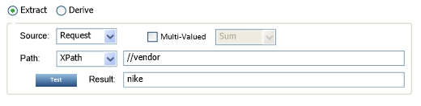
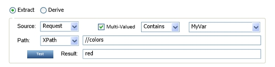
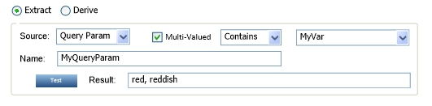
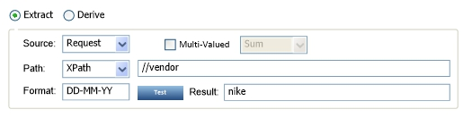
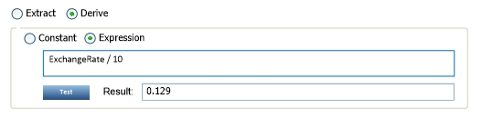

## Using the Business Metrics Policy
Learn how to specify what business metrics should be gathered from the contents of messages being exchanged.

<h5 class="stamp">Supported Platforms: 8.0 and greater.</h5>
### Table of Contents

* [Introduction](#introduction)
* [Prerequisites](#prerequisites)
* [Configuration](#configuration)
	* [Data Set Selection](#data-set-selection)
		* [Dimensions](#dimensions)
		* [Metrics](#metrics)
	* [Variable Definition](#variable-definition)
		* [Sample Messages](#sample-messages)
		* [Variables](#variables)
		* [Extraction Instructions](#extraction-instructions)
		* [Derivation Instructions](#derivation-instructions)
	* [Derivation Instructions](#derivation-instructions)

### Introduction

The Business Metrics Policy specifies what business specific metrics should be gathered from the contents of the messages being exchanged. It differs from an Operational Metrics Policy in that the information collected is not general to all messages but very specific using data from message payloads, headers, or URLs. 

The *Business Metrics Policy Details* displays a summary of the policy configuration including:

* **Data Set** - Name of the data set the policy collects metrics for.
* **Dimensions** - List of dimensions the policy is collecting.
* **Metrics** - List of metrics the policy is collecting. 

### Prerequisites

  * MongoDB must be started to log into the *Policy Manager Management Console* and modify a Business Metrics Policy. 
  * A data set must be previously defined so it can be selected as part of the policy configuration. Datasets can be defined using the Envision Console, or can be imported into MongoDB. 

### Configuration Options

#### Select Data Set
This screen allows you to select the data set the policy will define the collection of metrics for. Data displayed for data sets is read only. 

* **Data Set Pull Down** - Displays the data sets that can be viewed by the user. The list of available data sets represents those you created using the Envision Console or imported into MongoDB. The data set selected determines what dimensions and metrics will be collected. Data from the selected data set displays in the following tables:

#### Dimensions
Displays the following read-only dimensions of the selected data set: 
* **Name** - Dimension name.
* **Description** - Dimension description. 
* **Type** - Dimension type. Possible types include Currency, Number, Location, Text, Date, and Multi-Valued (where values could be of the other types already listed).

#### Metrics
Displays the following read-only metrics information of the selected data set:
* **Name** - Metric name. 
* **Description** - Metric description. 
* **Type** - Metric type. Possible types include Currency, Number, Location, Text, Date, and Multi-Valued (where values could be of the other types already listed).

#### Define Variables

This screen is used to define variables that can be used when defining dimensions or metrics on subsequent pages of the wizard. Defining variables is optional.

* **Add** - Add a variable. Select **Add** and specify Name, Description, and Type (Currency, Number, or Text).
* **Delete** - Delete a variable. Highlight a row and select **Delete**. Any Variable, Dimension, or Metric definitions that reference the deleted variable will be deleted. 

##### Extract

##### Derive

* **Constant** - 
* **Expression** - 
* **Operation Metric** - 

*  

##### Test Messages

* **Test Message** – Specify the test message to be used for testing expressions. Changes made on the current page are available on subsequent pages. Test messages are optional.
* **URL** – Text box where user can type in a sample URL including query parameters.
* **Request Tab** – Text area where user can type in a sample request message.
* **Response Tab** – Text area where user can type in a sample response message.
* **Fault Tab** – Text area where user can type in a sample fault message.

##### Variables

* **Variables Table** – Holds the variables used by other variables, dimensions, or metrics. The table cells are editable.
	* **Completion** – Displays a check mark if the variable has been completed by filling either extraction or derivation information for it.
	* **Name** – Name of the variable.
	* **Description** – Optional description of the variable.
	* **Type** – Pull down for available types of variables. Available types are Currency, Number, Location, Text, Date, and Multi-Valued (where values could be of the other types already listed).
* **Add Link** – Adds a new row in the Variables Table. 
* **Delete Link** – Deletes the selected row. Any variable, dimension, or metric definitions that reference the deleted variable would be deleted.
* **Extract** – Radio button displays the Extraction Instructions for the highlighted row in the Variables table. 
* **Derive** – Radio button that displays the Derivation Instructions for the highlighted row in the Variables table. 
* **Apply** – Button that applies the values in the Extraction instructions or Derivation Instructions to the selected row in the Variables Table. 

##### Extraction Instructions

* **Source** – Pull down for selecting the Request, Response, Fault, Header, Query Param, or Path Param.
* **Multi-Valued** – Check box that when selected enables the Multi-Valued Aggregation Pull Down.
* **Multi-Valued Aggregation** – Pull Down of aggregation functions for multi-valued extraction results. The options that are always available Count, First, Last, Contains, Exclude and Include. The additional options that are available for items of type Number are Sum, Avg, Count, Max, Min, Equal To, Greater Than, and Less Than. The additional options that are available for items of type Text are Begins With and Ends With. The additional options that are available for items of type Date are Max, Min, Greater Than, and Less Than. Only enabled when the Multi-Valued Check Box is selected.
* **Aggregation Comparator** – Pull Down of variables to use if the Multi-Valued Aggregation Pull Down value is either Equal To, Begins With, Ends With, Contains, Exclude, Include, Greater Than, or Less Than. See image below. The pull down is not displayed if one of these values is not selected.

* **Path Expression Language** – Pull Down for selecting the language for specifying the path in the message to extract. The possible options are XPath, JSONPath, and Regex. Only displayed when Source is Request, Response, or Fault.
* **Path Expression** – Text box for entering the path expression for extraction. Only displayed when Source is Request, Response, or Fault.
* **Path Test** – Button that when pressed will attempt to perform the expression in the Path Expression Text Box against the sample message identified by the Source Pull Down and perform any aggregation functions if multi-valued.
* **Path Result** – Text box that will display the results of the test attempted by selecting the **Path Test** Button. The text box is not editable.

* **Header/Param Name** – Text box for entering the header, query parameter, or path parameter name to extract from. Only visibile if the Source is Header, Query Param, or Path Param.
* **Param Test** – Button that when pressed will attempt to extract the query parameter from the sample URI text box and perform any aggregation functions if multi-valued. Only displayed when the Source is Query Param.
* **Param Result** – Text box that will display the results of the test attempted by selecting the **Param Test** Button. The text box is not editable.

* **Format** – Text box for entering the format of data values that will be extracted. The format is constructed using Y for year, M for month, D for day, h for hour, m for minute, s for second, S for millisecond, and Z for timezone. Only displayed if data item is of type Date.

##### Derivation Instructions

* **Constant Radio** – Radio Button that when selected indicates the content of the Derivation Text Box is a constant value. A constant value can be:
	* A number
	* A string
	* An array of numbers/strings in the form of: 1, 2, 3 or “ a”, “b”, “c”
	* A map of numbers/strings to numbers/strings in the form of: “a”=1, 2=”b”, “c”=”d”
* **Expression** – Radio Button that when selected indicates the content of the Derivation Text Box is a mathematical expression. The functions available are addition, subtraction, multiplication, division, and modulus.
* **Derivation** – Text box for entering a constant’s definition or an expression depending on the radio button selected.
* **Derivation Test** – Button that when pressed will attempt to perform the expression in the Derivation Text Box against the sample message identified by the Source Pull Down. Only visible if the Expression Radio Button is selected.
* **Derivation Result** – Text box that will display the results of the test attempted by selecting the Derivation Test Button. The text box is not editable. Only visible if the Expression Radio button is selected.

#### Dimension Definition

This page is the third page of the wizard used to modify a business metrics policy. This purpose of this page is to define the construction of dimensions in the data set. 

Descriptions of the page components are as follows:

##### Sample Messages

* **Sample Messages Frame** – Frames the sample messages the user can type in and use while testing expressions. The contents of this frame (and changes made) are persisted across pages in the wizard.
* **URL** – Text box in which a user can type in a sample URL.
* **Request Tab** – Text area in which a user can type in a sample request message.
* **Response Tab** – Text area in which a user can type in a sample response message.
* **Fault Tab** – Text area in which a user can type in a sample fault message.
* **Response Tab** – Text area in which a user can type in a sample response message.
* **Fault Tab** – Enter a sample fault message.

##### Dimensions

* **Dimensions Table** – Table that holds the dimensions collected. The cells of the table are not editable. They are filled when the page is displayed based on the data set selected on the Data Set page. 
	* **Completion** – Displays a check mark if the dimension has been completed by filling either extraction or derivation information for it.
	* **Name** – Dimension name.
	* **Description** – Dimension description. This field is optional. 
	* **Type** – Dimension type.
* **Extract** – Radio button that displays the Extraction Instructions for the highlighted row in the Dimensions table. 
* **Derive** – Radio button that displays the Derivation Instructions for the highlighted row in the Dimensions table. 
* **Apply** – Button that applies the values in the Extraction instructions or Derivation Instructions to the selected row in the Dimensions Table. 

#### Metrics Definition

#### Step 2: Add Policy
1. In Policy Manager, you can create a Business Metrics Policy instance using <strong>Add Policy</strong> in the <em>Policies &gt; Operational Policies</em> section. 
 
#### Step 3: Attach Policy
After you have saved your policy you can  attach it to a web service  or operation that you would like to capture roll-up data for.

#### Step 4: Test Policy and View Monitoring Data

After you attached the Business Metrics Policy to a service or operation, send a request to your service and go to the *Services \> Monitoring* section to view the results for Logs, Real Time Charts, and Historical Charts. 

<a href="#top">back to top</a>