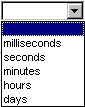

## Using the Business Service Level Policy
Learn how to define conditions for measuring and reporting performance of a specific Contract.

<a href="policy_management.htm" class="button secondary">Managing Policies</a>  <a href="policies_use_case_toc.html" class="button secondary">Use Case</a> <a href="qos_policies.htm" class="button secondary">QoS Policies</a> 

<h5 class="stamp">Supported Platforms: 8.0 and greater.</h5>

### Table of Contents

* [Introduction](#introduction)
* [Prerequisites](#prerequisites)
* [Configuration](#configuration)

### Introduction

The "Business Service Level Policy" defines conditions for measuring and reporting performance of a specific Contract. Each policy is composed of a "Rule" and "Access Interval." 

* **Rules** represent the conditions you define to measure and report performance of a service contract. When a defined system condition matches a defined rule, an alert is raised. A **Rule** is composed of "Rule Elements" (i.e., Alert Code, Metric, Operator, Value, Units, and Interval) that are configured to meet your service monitoring requirements.

* An **Access Interval** is composed of one or more "Access Days" (Sunday through Saturday). Each "Access Day" is configured with an "Access Time" that can represent one complete day (All Day) or a date range (Range) that is specified using a 24-hour clock format (HH:MM). See [QoS Policy Functionality Overview](../qos_policies.htm) for more information.

<a href="#top">back to top</a>

### Service Level Policy Options

When you add a Service Level Policy Rule, you define the service measurement and reporting configuration that will be referenced by services and contracts. The attributes you will define include:

* Service Level Policy Name and Description
* Service Level Policy Rules
* Service Level Policy Access Time

#### Service Level Policy Name and Description

The name and description you assign to the Service Level Policy.

#### Service Level Policy Rules

**Rules** represent the conditions you define to measure and report performance for that specific service that is referencing or contains the configuration of a Service Level Policy. When a defined system condition matches a defined rule, an alert is raised in the Policy Manager.

**Notes:** 

* *Available SLA Custom Alert Codes are selectable from the drop-down list box on the Alert Code field.*
* *You can also enter a new SLA Custom Alert Code directly into the Service Level Policy Rule line item.*
* *The minimum SLA Alert Code start number is 700000.*
* *Refer to See About Alert Codes in the Policy Manager Online Help (accessible via the Policy Manager Management Console) for more information on adding a new alert code in* Alerts > Alert Codes *section of the Management Console.*

A rule is composed of the following elements:

Rule Element  | Description
------------- | -------------
Alert Code  | The Alert Code identification number that represents the alert you would like to send when the defined condition is met. This value is manually entered into a text box.
Metric  | A Metric is a measurable function (such as a Response Time) that is used in the rule calculation. Selectable options include:      Figure: Service Level Policy Metrics   **Note**: *The "Total" metric options add up the combined size of all the message payload over the time period.*
Operator  | An Operator is a symbol that represents a mathematical function (<=, >=, etc.) used to limit or expand your search to qualify the metric. Selectable options include:      Figure: Service Level Policy Metrics
Value  | A Value is a numerical value that establishes the threshold of the metric.  This value is manually entered into a text box.
Units  | A Unit is the unit measure by which the value is counted. Selectable options include:      Figure: Service Level Policy Units
Interval  | An Interval is the time interval over which the rule is measured. Selectable options include:      Figure: Service Level Policy Intervals

#### Example Rule Definition

Send alert code [30002] when the [Maximum Response Time] for Service Operation is
[>] [5] [Seconds] in a [1 hour] time interval.

Before you begin creating rules, you should review the list of available alert codes to determine which codes you wish to use. One common approach is to establish a series of two or three thresholds, each using the same metric. The first threshold indicates that there may be a problem with a service monitored by the Service Level Policy, the second indicates that there is a problem, but it may not be a serious one, and the third is a warning that there is a major problem that needs to be addressed immediately.

#### Example Rule Definition with Thresholds

Rule  | Significance
------------- | -------------
Send alert code [30002] when the [Maximum Response Time] for Service Operation is [>] [5] [Seconds] in a [15 minute] time interval.  | Response time is slow, but tolerable. Monitor this service.
Send alert code [30004] when the [Maximum Response Time] for Service Operation is [>] [30] [Seconds] in a [1 hour] time interval.  | Response time is unacceptable. Investigate.
 Send alert code [30007] when the [Maximum Response Time] for Service Operation is [>] [2] [Minutes] in a [ANY] time interval. | Response time is critical. Address immediately.

#### Service Level Policy Access Time

Access Time is configured by defining an "Access Interval" (see above for definition).

Rule  | Significance
------------- | -------------
Access Day  | Checkbox options that allow you to select the days you would like to include in the Access Interval. Selectable days include Monday, Tuesday, Wednesday, Thursday, Friday, Saturday, and Sunday.
Access Time  | A drop-down list box option that allows you to select "All Day" or "Range" for each"Access Day" defined in the Access Interval. "All Day" represents a full 24-Hour Day. "Range allows you to select a "To" and "From" times using a 24-hour clock format (HH:MM).
From Time (Hours:Minutes)  | "Hour" and "Minute" drop-down list boxes that allow you to select the "From Time" range to apply to the "Access Time" selection for the "Access Interval" definition. Hour increments are based on a 24-Hour.
To Time (Hours:Minutes)  | "Hour" and "Minute" drop-down list boxes that allow you to select the "To Time" range to apply to the "Access Time" selection for the "Access Interval" definition. Hour increments are based on a 24-Hour.
Time Zone  | A drop-down list box that allows you to select the time zone to apply to the "Access Time" for the current "Access Interval" definition.

<a href="#top">back to top</a>

### Configuration

Refer to the following Business Service Level Policy use case for a walk-through tutorial on adding and configuring a Business Service Level Policy. 

* [Configure Business Metrics Policy to Set SLA for Service]bus_service_level_policy_use_case_config_bus_metrics_pol_to_set_SLA_for_service.html) 

<a href="#top">back to top</a>