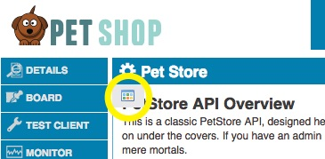

## How to Control Document File Visibility in the Default Theme
This article describes how to use licenses to control the visibility of documentation files in the default theme.  This is typically used in conjunction with [content visibility controls](howto_control_content_visibility.html) to provide a comprehensive solution.  This article provides a simple set of instructions to get you started, for a comprehensive guide to the documentation visibility controls [click here](../learnmore/api_admin_documentation_tagging.htm).

A common scenario is where you have a set of documents for an API with an overview doc, and one document for each API operation.  The documentation for some of the API operations should only be visible to users with an admin license, while the rest should be visible to all users.  All of the docs also contain a content element (e.g. a footer) with links to each of the other docs.  This article describes how you can use the ```metadata.xml``` file to control which files a user will be allowed to see (which also controls what will show up in the default theme API documentation table of contents).  You will need to use these instructions along with [content visibility controls](howto_control_content_visibility.html) to hide links to these protected files and other sensitive content from within the documents.

This article assumes that you have completed the steps in the [simple license setup](howto_simple_license_setup.html) article.

### Step 1 - Upload Documentation Files
In our example we have an API with 5 operations, 2 of which are scoped for end users and 3 are scoped to admins.  There are separate documents for each of the 5 operations, plus an overview document.  For convenience you can download a package of the sample docs [here](assets/sample_docs.zip).

* Click the "Documents" left nav for your API
* Access the file manager by clicking on the tool that appears to the left under the page title



* Either upload the zip archive, or upload the files individually (there are different buttons for each option)
* Use the actions tools to set display names for each document, and check the "Show in ToC" box so that the documents will appear in the table of contents

### Step 2 - Create and upload a metadata.xml file
You will use a metadata.xml file to specify access rules for the uploaded documents.  The following is an example of a file that provides simple controls for the sample documents:

```xml
<?xml version="1.0" encoding="UTF-8" standalone="yes"?>
<metadataconfig xmlns="http://soa.com/xsd/metadataconfig/1.0">
	<!-- When API use Licenses then by default all files are restricted.
		Hence all unrestricted entries should be added to metadata.xml and assignd a public license.
	-->
	<metadata>
		<target>documents/overview.htm</target>
		<licenses>
			<license name="User"/>
		</licenses>
	</metadata>
	<metadata>
		<target>documents/findPetById.htm</target>
		<licenses>
			<license name="User"/>
		</licenses>
	</metadata>
	<metadata>
		<target>documents/findPetByTag.htm</target>
		<licenses>
			<license name="User"/>
		</licenses>
	<metadata>
		<target>documents/addPet.htm</target>
		<licenses>
			<license name="Admin"/>
		</licenses>
	</metadata>
	<metadata>
		<target>documents/updatePet.htm</target>
		<licenses>
			<license name="Admin"/>
		</licenses>
	</metadata>
	<metadata>
		<target>documents/deletePet.htm</target>
		<licenses>
			<license name="Admin"/>
		</licenses>
	</metadata>
</metadataconfig>
```
This example is quite self-explantory.  Basically each entry defines a target by file name, and specifies the list of licenses that will grant access to this document.  So in this case in order to access the updatePet.htm file, a user will need to be a in group that has the Admin license assigned.

There are a lot of different ways of specifying targets and rules.  For a comprehensive description please see the [Community Manager Document Tagging Guide](../learnmore/api_admin_documentation_tagging.htm).

Once you have created your metadata.xml file you need to upload it to your API's documentation folder using the file manager as described above.

### Step 3 - Test it out
Now you should have appropriate controls in place to be able to view some of your documents as an anonymous user, and you should need to be logged in as a user who is a member of your Admin group to see the other docs.

* Logout of the system
* Find your API and click "Documents"
* Verify that you see only the unrestricted documents in the table of contents
* If you are using the sample docs, you should see a block of links to other docs at the bottom, try and click on one of the admin only docs (e.g. addPet.htm) - verify that you get an unauthorized error

NOTE: the default set of documents include internal element tags that will likely hide the protected file links from you.  You can always remove the tags described in [content visibility controls](howto_control_content_visibility.html) to ensure that your access controls are working correctly.

With anonymous access working, you can now verify that a user in your Admin group has appropriate access:

* Login as a user who is a member of the Admin group - NOTE: this user should not be a Site or Business Administrator, as these roles override any license resrictions.
* Find your API an click "Documents"
* Verify that you see all the documents in the table of contents
* Verify that you can view any of these documents both from ToC links and the links in the files themselves (assuming you are using the sample docs)