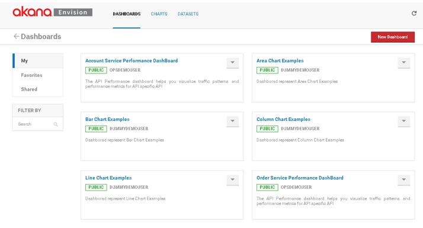

## Installing Envision 1.1 

Learn how to install the Envision 1.1 analytics and monitoring solution.

<a href="../envision_install/installing_envision_features.html" class="button secondary">Installing Envision Features (Main Topic)</a>  
<a href="../envision_reference/env_toc.html" class="button secondary">Envision Reference</a>    

<h5 class="stamp">Supported Platforms: 8.0, 8.1</h5> <h5 class="stamp">Supported Envision Versions: 1.1</h5>

### Table of Contents

[Introduction](#introduction)
[Step 1: Download and Install MongoDB](#step-1-download-and-install-mongodb)
[Step 2: Create MongoDB Data Folder](#step-2-create-mongodb-data-folder)
[Step 3: Start MongoDB](#start-mongodb)
[Step 4: Install Akana Platform](#step-4-install-akana-platform)
[Step 5: Download Envision Zip File](#step-5-download-envision-zip-file)
[Step 6: Install Envision Zip File](#step-6-install-envision-zip-file)
[Step 7: Configure Envision Container](#step-7-configure-envision-container)
[Step 8: Install and Configure Envision Feature](#step-8-install-and-configure-envision-feature)   
[Step 9: Install and Configure Sample Data Sets](#step-9-install-and-configure-sample-data-sets)   
[Step 10: Launch Envision Console](#step-10-launch-envision)   
[Step 11: Review Reference Guide](#step-11-review-reference-guide)     
[Step 12: Container and Database Shutdown Procedure](#step-12-container-and-database-shutdown)   

### Introduction
Installation of the Envision 1.1 analytics and monitoring solution requires installation of the Akana 8.0 platform, installation and setup of a MongoDB database, and installation and configuration of the Envision feature using the <em>Akana Administration Console</em>. 

### Step 1: Download and Install MongoDB
1. Go to http://www.mongodb.org/downloads and download the MongoDB Version 3.0.0 file for your platform. Windows 64-bit (MSI), Linux 64-bit (TGZ), and Solaris 64-bit (TGZ) are supported. If you are on a Mac you can install Mongo with homebrew using "brew install mongo."
2. Install MongoDB on your platform.**
3. Note that these instructions provide a basic MongoDB installation approach. Refer to the MongoDB documentation for information on installation instructions and shutdown procedures for your specific deployment. The site link is listed below:* 

 https://docs.mongodb.org/v3.0/tutorial/manage-mongodb-processes/">https://docs.mongodb.org/v3.0/tutorial/manage-mongodb-processes/ 

<a href="#top">back to top</a>

### Step 2: Create MongoDB Data Folder
1. Create a MongoDB data folder. The default is **/data/db**. If you prefer to use a different location use --dbpath.    

<a href="#top">back to top</a>

### Step 3: Start MongoDB
1. Navigate to the MongoDB installation directory:

    **/MongoDB/Server/3.0/bin**
2. Enter **mongod**. 

3. If MongoDB  successfully starts, your command window will say "waiting for connections" followed by the port number. 

<a href="#top">back to top</a>

### Step 4: Install Akana Platform
The Envision  product  must be installed to the Akana Platform. See [Installing the Akana Platform](../../sp/platform_install/installing_akana_platform.htm) for instructions.

If you have previously installed the Akana Platform, skip to the next step.

<a href="#top">back to top</a>

### Step 5: Download Envision Zip File
The Envision  zip file must be installed to the Akana Platform. Download the Envision self-extracting zip file from the Akana Customer Support site. 

1. Launch www.support.akana.com.
2. Go to *Downloads > Envision > 1.0*.
3. Download the Envision zip file:
   akana-envision-1.1.xxxx.zip

<a href="#top">back to top</a>

### Step 6: Install Envision Zip File
1. Extract the Envision zip file to the Akana platform folder. 

<a href="#top">back to top</a>

### Step 7: Configure Envision Container
The Envision feature is typically installed into a Standalone container.

1. Launch the *Configure Container Instance Wizard*. Navigate to the  Platform release directory \release_directory\bin  and enter:
 - startup.bat configurator (Windows)
 - startup.sh configurator (UNIX)
2. Select the *Standalone Deployment* option and complete the configuration. 
3. For detailed instructions see [Configure Standalone Container](../../../sp/container_management/configure_standalone_container.htm) and for a complete list of options see [Container Deployment Options](../../../sp/container_management/container_management.htm#deployment).

<a href="#top">back to top</a>

### Step 8: Install and Configure Envision Feature
1. Launch the *Administration Console* (http://hostname:port/admin/).
2. Select the *Repository* tab and click the **Refresh** icon. The *Akana Envision Repository* will display. 
3. On the *Available Features* screen, select **Feature** from the *Filter* menu. 
4. Select the *Akana Envision* feature and click **Install Feature**.
5. After the installation is complete, click **Configure** and continue.
6. On the *Configure MongoDB Database* screen, specify the host name and port where the MongoDB database is installed in the MongoClientURI field. The default MongoDB port is 27017. Click **Finish**. The URI is assigned and the system automatically configures seed data and adds schemas. 

<a href="#top">back to top</a>

### Step 9: Install and Configure  Sample Data Sets
1. On the *Available Features* screen, select **Plug-ins** from the *Filter* menu. 
2. Select the *Akana Sample Data Sets for Demo Charts* plug-in and click **Install Feature**.
3. After the installation is complete, click **Configure** and continue.
4. On the *Configure Sample Data Sets* screen, select the checkbox for each data set you wold like to install. Click **Finish**, then **OK** to restart the container. Click **Close** after the container is restart is completed. 

**Note:** After the installation is compete, you can manage (i.e., install / uninstall) data sets a the *Configuration* tab by selecting *Configure Sample Data Sets*. 

<a href="#top">back to top</a>

### Step 10: Launch Envision Console
1. Enter the following URL to launch the *Envision Console*. 
2. http://hostname:port/analytics/login
3. Log into the *Envision Console* using the Username/Password you defined for your Envision container, then click the *Dashboards* tab.
   
4. If you do not see the DataSets and/or have problems logging into the *Envision Console*, restart the Envision container (See [Starting and Stopping a Container Instance](../../../sp/container_management/start_stop_container_instance.htm) and refer to [Step 3: Start MongoDB](xxx) for instructions on how to start MongoDB.

<a href="#top">back to top</a>

### Step 11: Review Reference Guide</h3></a>
To learn about Envision functionality and how to configure various monitoring scenarios, refer to  [Envision Reference 1.0](../envision_reference/env_toc.html). 

<a href="#top">back to top</a>

### Step 12: Database and Container Shutdown Procedure
When shutting down your Envision system, its important to shutdown the Envision container, and MongoDB database in the following sequence to  avoid data loss and/or the requirement of performing data repair.

1. Shutdown the container first. Refer to [Starting and Stopping a Container Instance](../../../sp/container_management/start_stop_container_instance.htm) for shutdown options. 
2. Shutdown the MongoDB container second. Refer to the MongoDB documentation for information on shutdown procedures for your specific deployment. The site link is listed below: 

  https://docs.mongodb.org/v3.0/tutorial/manage-mongodb-processes/

<a href="#top">back to top</a>

