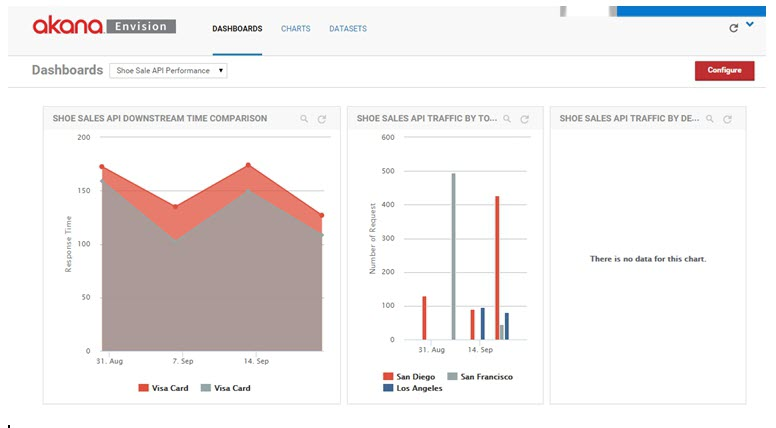

## Performing Policy Manager / Envision Integration Installation 

Learn how to perform the Policy Manager / Envision integration installation.

<a href="../envision_install/installing_envision_features.html" class="button secondary">Installing Envision Features (Main Topic)</a>  <a href="../envision_reference/env_toc.html" class="button secondary">Envision Reference</a>

<h5 class="stamp">Supported Platforms: 8.0, 8.1</h5> <h5 class="stamp">Supported Envision Versions: 1.1</h5> 

### Table of Contents

* [Introduction](#introduction)
* [Reference Documentation](#reference-documentation)
* [Setup MongoDB](#setup-mongodb)
	* [Step 1: Download and Install MongoDB](#step-1-download-and-install-mongodb)
	* [Step 2: Create MongoDB Data Folder](#step-2-create-mongodb-data-folder)
	* [Step 3: Start MongoDB](#step-3-start-mongodb)
	* [Step 4: Database and Container Shutdown Procedure](#step-4-database-and-container-shutdown-procedure)
* [Install Akana Platform](#install-akana-platform)
	* [Step 1: Install Akana Platform](#step-1-install-akana-platform)
* [Configure Envision](#configure-envision)
	* [Step 1: Download Envision Zip File](#step-1-download-envision-zip-file)
	* [Step 2: Install Envision Zip File](#step-2-install-envision-zip-file)
	* [Step 3: Configure Envision Container](#step-3-configure-envision-container)
	* [Step 4: Install and Configure Envision Feature](#step-4-install-and-configure-envision-feature)
	* [Step 5: Install and Configure Sample Data Sets](#step-5-install-and-configure-sample-data-sets)
* [Configure Policy Manager](#configure-policy-manager)
	* [Step 1: Download Policy Manager Zip File](#step-1-download-policy-manager-zip-file)
	* [Step 2: Install Policy Manager Zip file](#step-2-install-policy-manager-zip-file)
	* [Step 3: Configure Policy Manager Container](#step-3-configure-policy-manager-container)
	* [Step 4: Install and Configure Policy Manager Services and Console Features](#step-4-install-and-configure-policy-manager-services-and-console-features)
	* [Step 5: Install Envision Console Extensions Plug-in](#step-5-install-envision-console-extensions-plug-in)
* [Configure Network Director](#configure-network-director)
	* [Step 1: Create Network Director Container](#step-1-create-network-director-container)
	* [Step 2: Install Network Director Feature](#step-2-install-network-director-feature)
	* [Step 3: Configure Network Director](#step-3-configure-network-director)
	* [Step 4: Install Envision Metrics Collector Plug-in](#step-4-install-envision-metrics-collector-plug-in)
	* [Step 5: Modify Usage Writer Properties](#step-5-modify-usage-writer-properties)
	* [Step 6: Register Network Director Container](#step-6-register-network-director-container)
	* [Step 7: Host Virtual Services in Network Director Container](#step-7-host-virtual-services-in-network-director-container)
* [Launch Envision Console](#launch-envision-console)
	* [Step 1: Launch Envision Console](#step-1-launch-envision-console)
	* [Step 2: Review Envision Reference Guide](#step-2-review-envision-reference-guide)

### Introduction
Integrating Policy Manager with the Envision 1.1 analytics and monitoring solution allows you to take advantage of the Policy Manager business metrics related policies. These policies are plug-in extensions to the *Policy Manager Management Console* and provide support for capturing business metrics data (i.e., usage data and logs for a selected dataset). This data is then fed into the Envision product and can be used to generate statistical reports about API/service usage. 

* The integration requires the installation of MongoDB, the Akana Platform, and Policy Manager and Envision Products. 
* The presented installation requires you to configure three container instances (Envision, Policy Manager, and Network Director). 
* Each container instance requires a unique port number.
* You have the option to use a different container configuration scenario based on your requirements. 

<a href="#top">back to top</a>

## Reference Documentation

Detailed instructions of common tasks are available in expanded reference documentation as follows:

##### Containers:

* [Configure Standalone Container](../../../sp/container_management/configure_standalone_container.htm)
* [Container Deployment Options](../../../sp/container_management/container_management.htm#deployment)
* [Starting and Stopping a Container Instance](../../../sp/container_management/start_stop_container_instance.htm) 

##### Envision:

* [Installing Envison Features](http://docs.akana.com/ev/envision_install/installing_envision_features.html)

##### Policy Manager:

* [Policy Manager Services Feature](http://docs.akana.com/sp/admin_console/using_pmservices_feature.htm)
* [Policy Manager Console Feature](http://docs.akana.com/sp/admin_console/using_pmconsole_feature.htm)

##### Network Director:

* [Using Network Director Feature](http://docs.akana.com/sp/admin_console/using_network_director_feature.htm)

<a href="#top">back to top</a>

## Setup MongoDB

### Step 1: Download and Install MongoDB

1. Go to http://www.mongodb.org/downloads and download the MongoDB Version 3.0.0 file for your platform. Windows 64-bit (MSI), Linux 64-bit (TGZ), and Solaris 64-bit (TGZ) are supported. If you are on a Mac you can install Mongo with homebrew using "brew install mongo."
2. Install MongoDB on your platform.
3. Note that these instructions provide a basic MongoDB installation approach. Refer to the MongoDB documentation for information on installation instructions and shutdown procedures for your specific deployment. The site link is listed below:

	https://docs.mongodb.org/v3.0/tutorial/manage-mongodb-processes/

### Step 2: Create MongoDB Data Folder

1. Create a MongoDB data folder. The default is **/data/db**. If you prefer to use a different location use --dbpath.    

### Step 3: Start MongoDB

1. Navigate to the MongoDB installation directory:
    **/MongoDB/Server/3.0/bin**
2. Enter **mongod**. 
3. If MongoDB  successfully starts, your command window will say "waiting for connections" followed by the port number. 

### Step 4: Database and Container Shutdown Procedure

When shutting down your Envision system, its important to shutdown the Envision container, and MongoDB database in the following sequence to  avoid data loss and/or the requirement of performing data repair.

1. Shutdown the container first. Refer to [Starting and Stopping a Container Instance](../../../sp/container_management/start_stop_container_instance.htm) for shutdown options. 
2. Shutdown the MongoDB container second. Refer to the MongoDB documentation for information on shutdown procedures for your specific deployment. The site link is listed below: 

     https://docs.mongodb.org/v3.0/tutorial/manage-mongodb-processes/

<a href="#top">back to top</a>

## Install Akana Platform

### Step 1: Install Akana Platform

Envision and Policy Manager must both be installed to the Akana Platform.

See [Installing the Akana Platform](../../sp/platform_install/installing_akana_platform.htm) for instructions.

*If you have previously installed the Akana Platform, skip to the next step.*

<a href="#top">back to top</a>

## Configure Envision

### Step 1: Download Envision Zip File

The Envision zip file must be installed to the Akana Platform. Download the Envision self-extracting zip file from the Akana Customer Support site. 

1. Launch www.support.akana.com.
2. Go to *Downloads > Envision > 1.1*.
3. Download the Envision zip file:
   akana-envision-1.1.xxxx.zip

### Step 2: Install Envision Zip File

1. Extract the Envision zip file to the Akana platform folder. 

### Step 3: Configure Envision Container

The Envision feature is typically installed into a Standalone container.

1. Launch the *Configure Container Instance Wizard*. Navigate to the  Platform release directory \release_directory\bin  and enter:
 - startup.bat configurator (Windows)
 - startup.sh configurator (UNIX)
2. Select the *Standalone Deployment* option and complete the configuration. 
3. For detailed instructions on container configuration and deployment options see [Reference Documentation](#reference-documentation).

### Step 4: Install and Configure Envision Feature

1. Launch the *Administration Console* (http://hostname:port/admin/).
2. Select the *Repository* tab and click the **Refresh** icon. The *Akana Envision Repository* will display. 
3. On the *Available Features* screen, select **Feature** from the *Filter* menu. 
4. Select the *Akana Envision* feature and click **Install Feature**.
5. After the installation is complete, click **Configure** and continue.
6. On the *Configure MongoDB Database* screen, specify the host name and port where the MongoDB database is installed in the MongoClientURI field. The default MongoDB port is 27017. Click **Finish**. The URI is assigned and the system automatically configures seed data and adds schemas. 
7. Click **Cancel** on the container restart message, then **Close** on the summary screen and continue to the next step.

### Step 5: Install and Configure Sample Data Sets

1. On the *Available Features* screen, select **Plug-ins** from the *Filter* menu. 
2. Select the *Akana Sample Data Sets for Demo Charts* plug-in and click **Install Feature**.
3. After the installation is complete, click **Configure** and continue.
4. On the *Configure Sample Data Sets* screen, select the check-box for each data set you wold like to install. Click **Finish**, then **OK** to restart the container. Click **Close** after the container restart is completed. 

**Note:** After the installation is complete, you can manage (i.e., install / uninstall) data sets a the *Configuration* tab by selecting *Configure Sample Data Sets*. 

<a href="#top">back to top</a>

## Configure Policy Manager

### Step 1: Download Policy Manager Zip File

The Policy Manager zip file must be installed to the Akana Platform. Download the Policy Manager self-extracting zip file from the Akana Customer Support site. 

1. Launch www.support.akana.com.
2. Go to *Downloads > PolicyManager > 8.1*.
3. Download the Policy Manager zip file:
   akana-pm-8.1.xxxx.zip

### Step 2: Install Policy Manager Zip File

1. Extract the Policy Manager zip file to the Akana platform folder. 

### Step 3: Configure Policy Manager Container

1. Launch the *Configure Container Instance Wizard*. Navigate to the  Platform release directory \release_directory\bin  and enter:
 - startup.bat configurator (Windows)
 - startup.sh configurator (UNIX)
2. Select the *Standalone Deployment* option and complete the configuration. 
3. For detailed instructions on container configuration and deployment options see [Reference Documentation](#reference-documentation).

### Step 4: Install and Configure Policy Manager Services and Console Features

1. On the *Available Features* screen, select the *Policy Manager Services* and *Policy Manager Console* features, click **Install Feature**. 
2. Complete the installation and configuration. 
3. For detailed instructions on installing these features see [Reference Documentation](#reference-documentation).
4. Click **Cancel** on the container restart message, then **Close** on the summary screen and continue to the next step.

### Step 5: Install Envision Console Extensions Plug-in

1. On the *Available Features* screen, select **Plug-ins** from the *Filter* menu. 
2. Select the *Envision Console Extensions* plug-in and click **Install Feature**. Note that this feature also installs the Envision Service Extensions Feature. 
3. After the installation is complete, click **Configure** and continue.
4. On the *Configure MongoDB Database* screen, specify the host name and port where the MongoDB database is installed in the MongoClientURI field. The default MongoDB port is 27017. Click **Finish**. The URI is assigned and the system automatically configures seed data and adds schemas. 
5. After the installation is complete, Click **Finish**, then **OK** to restart the container. Click **Close** on the summary screen after the container restart is completed. 

<a href="#top">back to top</a>

## Configure Network Director

You have the option of using the Network Director detailed instructions to complete Network Director configuration see [Reference Documentation](#reference-documentation). 

Because this is a custom configuration, not that you must add Step 4: Install Envision Metrics Collector Feature, and  and Step 5: Modify Usage Writer Properties to your configuration sequence. 

### Step 1: Create Network Director Container

1. Launch the *Configure Container Instance Wizard*. Navigate to the  Platform release directory \release_directory\bin and enter:
 - startup.bat configurator (Windows)
 - startup.sh configurator (UNIX)
2. Select the *Standalone Deployment* option and complete the configuration. 

### Step 2: Install Network Director Feature

1. Launch the Administration Console (http://hostname:port/admin/).
2. On the **Installed Features** screen, select the *Network Director* feature and click **Install Feature**.
3. After the installation is complete, click **Configure** and continue to the next step. 

### Step 3: Configure Network Director

1. Specify WS-MetadataExchange URL, configure keys. The Generate PKI Keys & X.509 Certificate option is the most commonly used default option.
2. Click **Finish**, then **Cancel** on the container restart message, then **Close** on the summary screen and continue to the next step.

### Step 4: Install Envision Metrics Collector Plug-in

**Note:** If the *Network Director* feature is installed directly to the Policy Manager container, skip this step. The *Envision Metrics Collector* feature is installed as part of the *Envision Policy Manager Console Extensions* features that is installed as part of the Policy Manager container configuration. 

1. On the *Available Features* screen, select **Plug-ins** from the *Filter* menu. 
2. Select the *Envision Metrics Collector Feature* plug-in and click **Install Feature**.
3. After the installation is complete, click **Cancel** on the container restart message, then **Close** on the summary screen and continue to the next step.

### Step 5: Modify Usage Writer Properties

1. Click the *Configuration* tab.
2. In the *Configuration Categories* section, navigate to the **com.soa.monitor.usage** configuration category.
3. Set **usage.local.writer.enabled** to **false**.
4. Set **usage.remote.writer.enabled** to **true**.
5. Click **Apply Changes**, then restart the container.

### Step 6: Register Network Director Container

1. Log into the *Policy Manager Management Console* (http://hostname:port/ms/index.do/), and navigate to *Organization > Containers*. 
2. On the *Containers Summary* screen click **Add Container**. 
3. Specify the container type, container metadata, add metadata certificate to trusted CA (if applicable), and container details.
4. Complete your entries and click **Finish**, then **Close**. The *Container Details* page for the Network Director displays. 

### Step 7: Host Virtual Services in Network Director Container 

1. Navigate to *Containers > Hosted Services* and click **Host Virtual Service**. 
2. On the *Select Virtual Service* screen, select a virtual service from the Organization tree, and map one or more bindings from the selected virtual service to the access points of the current container. 

<a href="#top">back to top</a>

## Launch Envision Console

### Step 1: Launch Envision Console

1. Enter the following URL to launch the *Envision Console*.
	http://hostname:port/analytics/login
3. Log into the *Envision Console* using the Username/Password you defined for your Envision container, then click the *Dashboards* tab, and select a dashboard from the drop-down menu. 
   
4. If you do not see the DataSets and/or have problems logging into the *Envision Console*, restart the Envision container and refer to [Step 3: Start MongoDB](#step-3-start-mongodb) for instructions on how to start MongoDB.

<a href="#top">back to top</a>

### Step 2: Review Envision Reference Guide

To learn about Envision functionality and how to configure various monitoring scenarios, refer to  [Envision Reference](../envision_reference/env_toc.html). 

<a href="#top">back to top</a>

