## Appendix
Provides a list of chart properties used in the Envision Dashboard.

<a href="env_toc.html" class="button secondary">Envision Reference (Main Topic)</a>  <a href="../envision_install/installing_envision.htm" class="button secondary">Installing Envision 1.0</a>
<h5 class="stamp">Supported Platforms: 8.0</h5>  <h5 class="stamp">Supported Envision Versions: 1.0</h5> 

<h3 name="top" style="color: grey;">Table of Contents</h3>

1. [Main Chart Category](#main-chart-category)
2. [Common Characteristics](#common-characteristics)
	- [New Chart](#new-chart)
	- [Dataset Details](#dataset-details)
	- [X-AXIS](#xaxis)
	- [Series](#series)
3. [Charts and Examples](#charts-and-examples)
4. [Line Chart](#line-chart)
	- [Example - Monthly Response Time](#line-chart-monthly-response-time)
5. [Area Chart](#area-chart)
	- [Example - Data Exchange per Container](#area-chart-data-exchange-per-container)
	- [Example - Regional Throughput since Start](#area-chart-regional-throughput-since-start)
6. [Pie Chart](#pie-chart)
	- [Example - Traffic by Browser Agent](#pie-chart-traffic-by-browser-agent)
	- [Example - Error Summary - Semi Donut](#pie-chart-error-summary-semi-donut)
	- [Example - Sales Process (Funnnel/Pyramid)](#pie-chart-sales-process-funnel-pyramid)
7. [Column Chart](#column-chart)
	- [Example - Monthly Throughput per Service](#pie-chart-monthly-throughput-per-service)
8. [Bar Chart](#bar-chart)
	- [Example - API Traffic by App](#bar-chart-api-traffic-by-app)
	- [Example - Success vs. Error (Stacked Bar Chart)](#bar-chart-success-vs-error)
9. [Indicator Chart](#indicator-chart)
	- [Example - Response Time Range](#indicator-chart-response-time-range)

### Main Chart Category

The properties of an Envision chart are divided into three broad categories:

* **Visualization** - Gather information on the visual aspect of the chart.
* **Basic Info** - Specify name and description (required), sharing, favorite information. 
* **Data Series**  
	* *Datasets* - Select Dataset and configure data grouping, filters, and aggregation (X-AXIS)
	* *Chart Type* - Select a chart type, filters and data mapping (X-AXIS) to configure how and where the data will be displayed on the chart. Options in this category will vary based on the requirements of the selected chart type.

<a href="#top">back to top</a>

#### Common Characteristics
When you create a chart using the **New Chart** function, each chart includes the following common information. 

##### New Chart

| Chart Option    | Description | 
|:--------------------|:-------------------------------------------------|
| Name           | Enter a chart name. This field is required.      |
| Description           | Enter a chart description. This field is required.           |
| Sharing      | Select whether chart visibility will be public or private.           |
| Marked as Favorite       | Select if you want your chart added to the *Favorites* menu.           |
 
##### Dataset Details

###### Datasets

| Chart Option    | Description | 
|:--------------------|:-------------------------------------------------|
| Select Dataset           | Select a dataset the application will use to collect data.      |
| Duration           | Select the data rollup interval.           |
| Data Grouping      | Select one or more categories of data to collect.           |
 
###### Filters

| Chart Option     | Description          | 
|:----------------------------|:------------------------------------------|
| Select Filter           | Select one or more objects that data will be collected for.   |
| Operator             | Select a boolean operator to filter data with and specify a value in the text box.     Options include (CONTAINS, ENDSWITH, EQUALS, NOT EQUALS, IN, NOT_IN, and STARTSWITH). |
| Alias      | Specify an alias name to assign to the dataset filter.  |
| +      | Add an additional filter.   |
 
###### Charts

The *Charts* section includes the same set of options for each Chart Type selected. 

*Refer to each specific chart type section for additional detail and examples.*

| Chart Option     | Description          | 
|:----------------------------|:------------------------------------------|
| Select Chart Type           | Select the chart type you would like to render.    |
| Select Chart Layout             | Select a chart layout. Options will vary based on the selected chart type. |
| X Position      | Specify the x-coordinate of the upper left-corner of the Chart.  |
| Y Position      | Specify the y-coordinate of the upper left-corner of the Chart.   |
| Size      | Specify the height and width of the chart.    |
| Show Legend      | Enable / Disable legend data for chart (True/False).   |
| Threshold      | Specify and color for chart threshold line.   |
 

#### X-AXIS

The *X-AXIS* section defines the X-AXIS of the chart, what data will be used for tick marks, the title of the axis and the format of the tick mark labels.

| Chart Option     | Description          | 
|:----------------------------|:------------------------------------------|
| Value           | This option is used to select the data to use for the X-AXIS tick marks. These values represent dimensions and metrics of the selected dataset.     |
| Title             | This option is used to specify an X-AXIS title. The format of the tick marks is handled differently depending on the type of the dimension used.  |
| Format      | Select a date format. If you are not a date dimension an optional prefix and suffix can be added to each tick mark label. 
 

#### Series

The *SERIES* section defines data series of the chart.

###### Filter
| Chart Option     | Description          | 
|:----------------------------|:------------------------------------------|
| Select Filter           | Select a filter for the current data series.   |
| Operator             | Select a boolean operator to filter data with and specify a value in the text box.     Options include (CONTAINS, ENDSWITH, EQUALS, NOT EQUALS, IN, NOT_IN, and STARTSWITH). |
| Alias      | Specify an alias name to assign to the series filter.  |
| +      | Add an additional filter.   |
 

###### Y-AXIS
| Chart Option     | Description          | 
|:----------------------------|:------------------------------------------|
| Value           | Select the metric you want plotted along the y axis. The Value pulldown lists all metrics from the data set.    |
| Aggregation           | Select the aggregation method (sum, average, etc.). |
| Label             | Select option for how each series will be labeled. In a line chart this would be the label for each line. For a bar chart it would be the label for each bar. Since there may be multiple series the label will be derived from the dimensions used in the Group By field of the DATASET section which identifies how the data points are organized. 
| Title      | Enter the y axis title in the Title text box. This field is optional.  |

<a href="#top">back to top</a>

### Charts and Examples

The following sections provide a description of each supported chart type, a sample illustration of a rendered chart, and what the chart configuration might look like in the Envision product. 

#### Line Chart

Line charts are used to illustrate trends over time. This is done most often to measure the long term progression of any other empirical statistic important to businesses or organizations. It can also be used to compare two different variables over time.

#####Sub Type
* Standard 
* Stacked
* Percentage Stacked

##### Example - Monthly Response Time

Simple line chart with global filter and grouping.

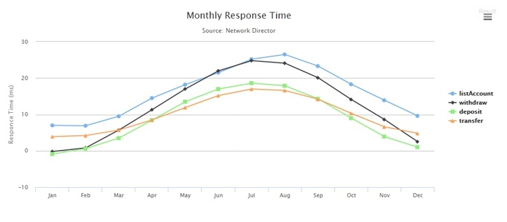
 
###### Configuration

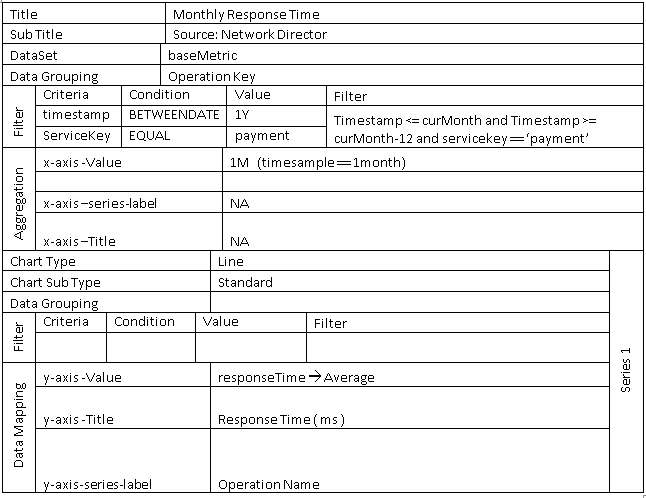

<a href="#top">back to top</a>

#### Area Chart

Area charts are useful for emphasizing the magnitude of change over time. Stacked area charts are also used to show the relationship of parts to a whole.

#####Sub Type
* Standard 
* Stacked
* Percentage Stacked

##### Example - Data Exchange per Container

Simple area chart with global filter, grouping and context filter. 

###### Configuration

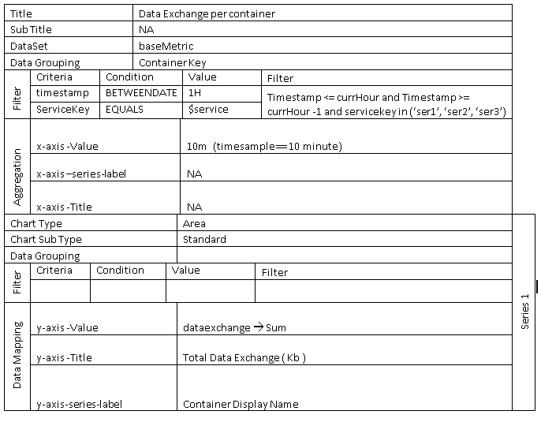  

##### Example - Regional Throughput Since Start

Stacked area chart with no filter and custom dimension grouping. 

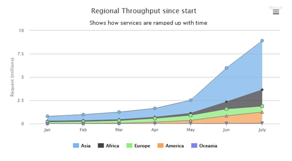
 

###### Configuration

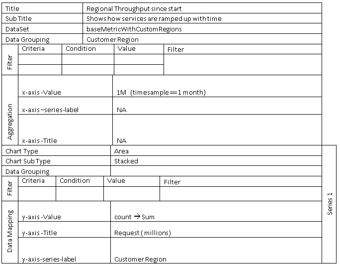

<a href="#top">back to top</a>

#### Pie Chart

Pie charts are best used to illustrate a sample break down in a single dimension. In other words, it is best to use pie charts when you want to show differences within groups based on one variable.  

#####Sub Type
* Pie
* Pyramid
* Funnel
* Donut
* Semi Donut

##### Example - Traffic By Browser Agent

Measures how much traffic is coming from a specific application, like Chrome, Safari, Firefox, IE, and other platform. 

###### Configuration

 

##### Example - Error Summary - Semi Donut

The sum of errors generated by each developer app consuming the selected API. 

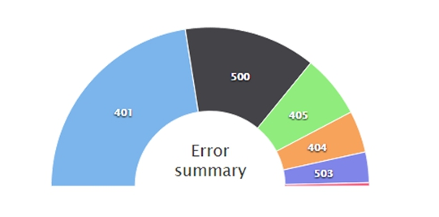
 
###### Configuration

 
##### Example - Sales Process (Funnel/Pyramid)

Simple funnel chart with some visual customization. 

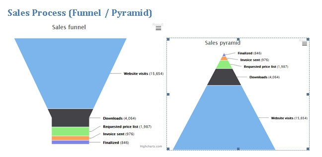
 

###### Configuration

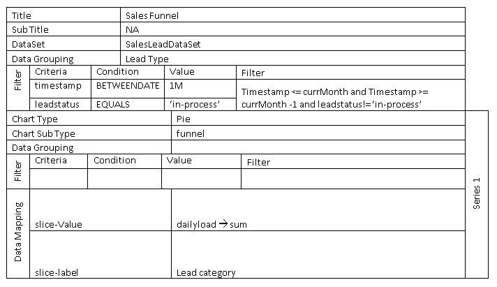

<a href="#top">back to top</a>

#### Column Chart
Column charts are useful for comparing discrete data or showing trends over time. Column charts use vertical data markers to compare individual values. Can be plotted as standard, stacked and percentage stacked.

#####Sub Type
* Standard 
* Stacked 
* Stacked Percentage

##### Example - Monthly Throughput per Service

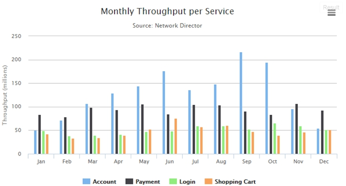

###### Configuration 

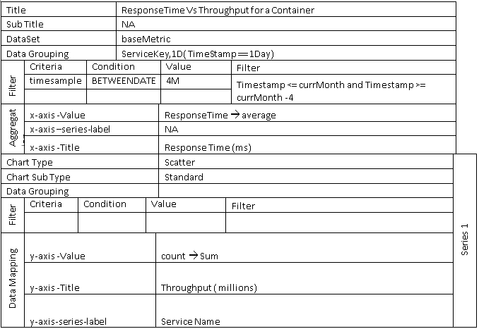

<a href="#top">back to top</a>

#### Bar Chart

Bar charts are useful for showing trends over time and plotting many data series. Bar charts use horizontal data markers to compare individual values. Can be plotted as standard, stacked and percentage stacked.

#####Sub Type
* Standard 
* Stacked 
* Stacked Percentage

##### Example - API Traffic by App

The sum of errors generated by each developer app consuming the selected API. 

###### Configuration 

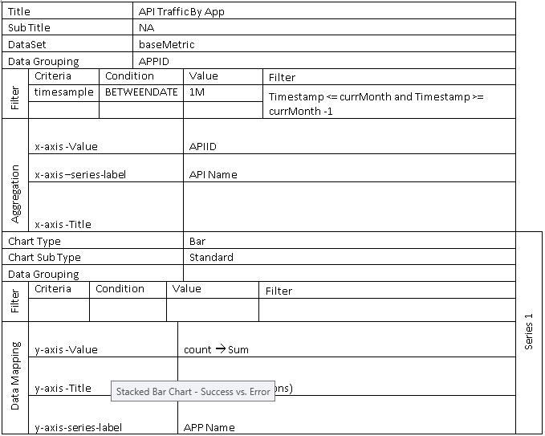
 

##### Example - Success vs. Error (Stacked Bar Chart)

Stacked bar chart that illustrates success vs error. Multiple filters are used to create a series. 

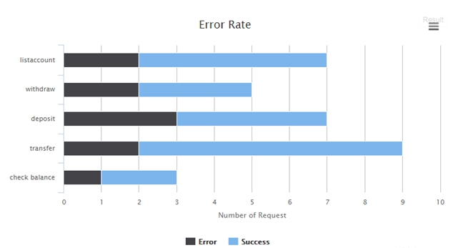

###### Configuration 

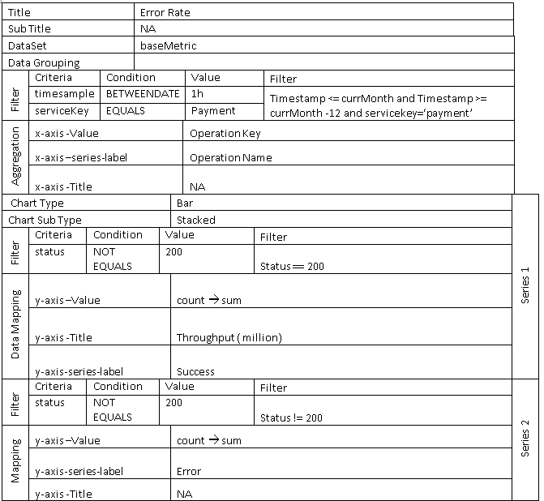

<a href="#top">back to top</a>

#### Indicator Chart
The range is a Cartesian series type with higher and lower Y values along an X axis. These charts are useful for showing a target range and a tolerance range.

#####Sub Type 
* Area
* Candle Stick
* Bar Range
* Column Range

##### Example - Indicator Chart - Response Time Range

The response time range per month. 

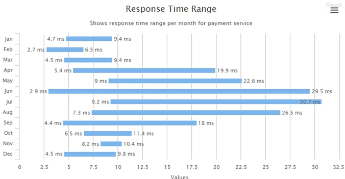

###### Configuration 

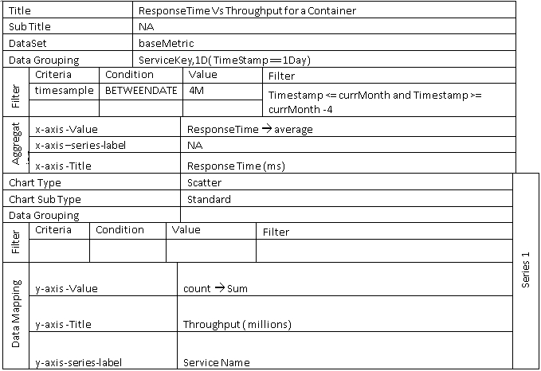

<a href="#top">back to top</a>

