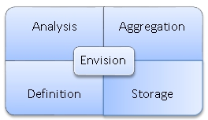

## Basic Concepts
Provides a technical overview of the Envision product.

<a href="env_toc.html" class="button secondary">Envision Reference (Main Topic)</a>  <a href="../envision_install/installing_envision.htm" class="button secondary">Installing Envision 1.0</a>
<h5 class="stamp">Supported Platforms: 8.0</h5>  <h5 class="stamp">Supported Envision Versions: 1.0</h5> 

<h3 name="top" style="color: grey;">Table of Contents</h3>

1. [Introduction](#introduction)
2. [Capabilities](#capabilities)
3. [Data Definition](#data-definition)
4. [Data Storage](#data-storage)
5. [Data Analysis](#data-analysis)
6. [Data Aggregation](#data-aggregation)

### Introduction

Envision is an analytics platform that allows you to slice and dice your data to analyze every aspect of your business and digital strategy. It can help you collect data and identify patterns, trends, violations, baselines, or historical context. The domain of the data you wish to analyze is open ended. You may wish to analyze:

General API operations such as:

* API usage patterns by apps, by geographic region, users, etc.
* API performance patterns and trends by examining load, throughput, and latency
* SLA violations

Business specific transactions such as:

* Sales trends based on model in different regions
* Channel partner effectiveness by examining sales volumes
* Effectiveness of sales mediums
* Effectiveness of different apps

Or business operations such as:

* API/microservice lifecycle and bottlenecks
* Time to market trends for client apps
* Popularity of APIs
* Customer satisfaction trends

The Envision product does not require any prior understanding of what the data it analyzes represents. It does not require any business understanding. It can analyze data from any business domain because it works using general analytical concepts.

<a href="#top">back to top</a>

### Capabilities

Envision’s capabilities can be broken down into different four categories, data definition, data enrichment & storage, data aggregation, and data analysis

<a href="#top">back to top</a>

### Data Definition

The foundation for analytics is understanding and defining what data you have to work with and what you want to do with that data. This is what is done with the data definition capabilities of Envision. 

Then the data must be collected. Envision at its core does not reach out to different business systems to collect data. Instead it provides a data storage API for clients to push the data into a highly scalable Envision data store. Connectors are then provided that are domain specific to extract data from different business systems and use the Envision data storage API.  One such connector is provided by Akana Policy Manager which enables the extraction of business specific data from payload and stores it for future analysis.  The use of the Envision data storage API is optional. Alternatively data can be saved directly to the Envision data store if access is permitted. 

<a href="#top">back to top</a>

### Data Storage

Envision also supports data enrichment during the storage process. This is the amending, or altering, of data before it is persisted based on information obtained from a different source. For example the business system might be just collecting the user-agent field but for proper charting the corresponding browser/OS/device may be what is persisted instead. Enrichment is performed by plugins invoked by the data storage API prior to persisting the data or by scheduled jobs to manipulate data not persisted through the API.

<a href="#top">back to top</a>

### Data Analysis

Based on the data definition raw business data must be transformed into metrics that can be compared, charted, and trended. This is done by organizing, or grouping, the data in ways that can be queried with the proper granularity and purpose, and performing aggregating calculations on the data according to those groupings. For example calculating the average sales figures of each channel partner on a quarterly basis. This is what the Envision data aggregation capabilities provide.

<a href="#top">back to top</a>

### Data Aggregation

Finally users of Envision want to view the aggregated data in ways that easily depict the trends, patterns, and violations they are looking for. Envision provides analysis capabilities for the user to do this. Envision does this through a highly tailorable charting and dashboard generation portal. It can also support the extraction of data through the use of an API so that third party visualization tools can be used.

The following illustration shows how Envision would interact with users and other systems.

Envision stores all data in a NoSQL database. Connectors extract data from business systems and call Envision API’s that store the data in the NoSQL database. Envision performs the needed aggregations on the data in the NoSQL database. The data is then available for viewing in a browser using the Envision web application in user designed dashboards and charts. Alternatively a Third  Party reporting product can query the data from Envision.

<a href="#top">back to top</a>