## Creating a Chart
Learn how to create a chart with Envision and configure datasets, use chart options, and preview charts in Live Mode.

<a href="env_toc.html" class="button secondary">Envision Reference (Main Topic)</a>  <a href="../envision_install/installing_envision.htm" class="button secondary">Installing Envision 1.0</a>
<h5 class="stamp">Supported Platforms: 8.0</h5>  <h5 class="stamp">Supported Envision Versions: 1.0</h5> 

<h3 id="table-of-contents" name="top" style="color: grey;">Table of Contents</h3>

1. [Introduction](#introduction)
	* [Create New Chart](#create-new-chart)
	* [Chart Card](#chart-card)
	* [Configure Chart](#configure-chart)
2.  [Datasets](#datasets)
	* [Select Dataset](#select-dataset)
	* [Select Dataset Options](#select-dataset-options)
	* [Set Dataset Aggregation Level](#set-aggregation-level)
	* [Group Dataset by Dimension](#group-dataset-by-dimension)
3. [Charts](#charts)
	* [Filter Chart Data](#filter-chart-data)
	* [Chart Filter Options](#chart-filter-options)
	* [Chart Filter Example](#chart-filter-example)
	* [Chart Types](#chart-types)
	* [Chart Options](#chart-options)
	* [Chart X-AXIS](#chart-xaxis)
	* [Chart X-AXIS Example](#chart-xaxis-example)
4. [Series](#series)
	* [Series](#series)
	* [Series Options](#series-options)
	* [Filter Series](#filter-series)
	* [Series Examples](#series-examples)
5. [Preview Chart](#preview-chart)
	* [Preview Examples](#preview-examples)
6. [Rename Chart](#rename-chart)
7. [Overlaying Charts](#overlaying-charts)
	* [Create Combination Charts](#create-combination-charts)

### Introduction

Once a data set has been created a Chart can be created that will display the metrics collected for the data set. There are several kinds of Charts that are available in Envision. This topic will describe the common concepts of all charts. The options specific to each chart and examples of their use can be found in [Envision Appendix](../envision_reference/env_appendix.html).

#### Create New Chart

1. From the Envision top level menu select the *Charts* menu. You are presented three lists of charts:
	* **My** - Charts that the logged in user has created. 
	* **Shared** - Charts that others have created and made available to the user.
	* **Favorites** - Those selected by the user to (either their own or someone else’s) to be in the list. This option provides a faster look-up of commonly used items by giving them their own list.  
	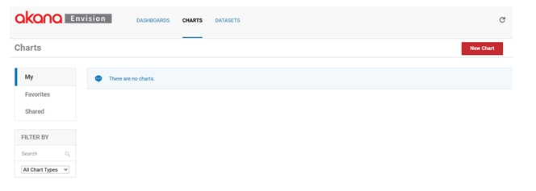
2. Select **New Chart**. On the *New Chart* pop-up enter a name and description for the chart.

	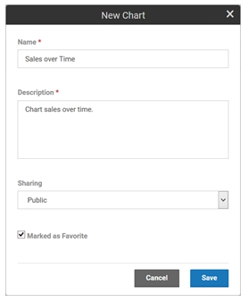
3.  Next, from the *Sharing* drop-down menu designate how the chart will be shared, then **Save**.  
	* A chart can be shared other users. When a chart is shared users who are not the auther can view the chart and place them on dashboards. They cannot change the chart. 
		* The chart will automatically be placed in the *My Charts* list. 
	* If the **Marked as Favorite** checkbox is checked it will also be placed in the *Favorites* charts list.

<a href="#top">back to top</a>

#### Chart Card

Each chart card in a list has a pull-down menu of options that can be performed on the chart. 

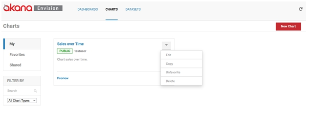

* **Edit**  - Displays the pop-up used to create the chart initially so that **changes** can be made. 
* **Copy** - Creates a copy of the chart. The same pop-up will be displayed once again but this time it will be for a new chart and all the information from the copied chart will be filled in. 
* **Favorite / Unfavorite**  - Used to toggle whether the chart should be placed in the Favorites list. 
* **Delete** - Removes the chart from the system. If any dashboards exist that use the chart a warning will be displayed. If the user chooses to continue the chart will be removed from the dashboards.

<a href="#top">back to top</a>

#### Configure Chart

To configure a chart, select the name of the chart on the chart card. The *Chart Configuration* page displays. 

* The page is divided into two columns. 
* The left column contains the configuration settings for the chart. 
* The right column has a preview area to test the chart configuration.

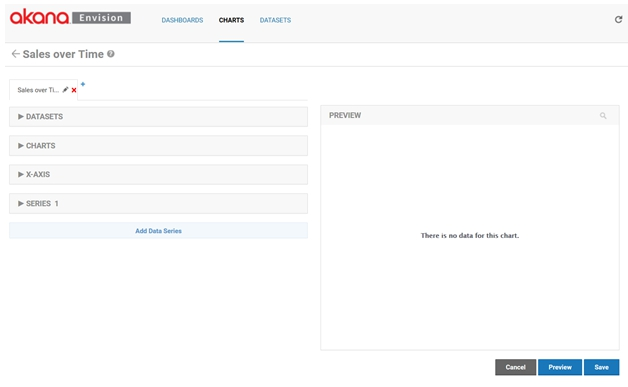

<a href="#top">back to top</a>

### <a id="datasets">Datasets

#### Select Dataset

There are several configuration settings for a chart organized into multiple sections in the configuration column.

* The *DATASETS* section defines what data from a data set will be queried to fill the chart.

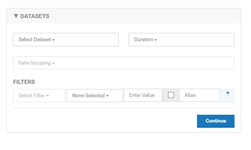

* Select a data set using the **Select Dataset** pulldown. 
* All data sets you have defined or are defined by others and are public will be listed in the pulldown.

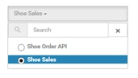

<a href="#top">back to top</a>

#### Select Dataset Options

Because there may be a large number of data sets a search box is displayed above the pulldown options to narrow the options down. In general all pulldowns of potentially large option sets will have this capability.

<a href="#top">back to top</a>

#### Set Dataset Aggregation Interval

As described in the *Data Sets* section each data set can be defined to have different aggregation intervals. 

* You must choose which interval you want to populate the chart with using the *Duration* pulldown. 
* Only the intervals defined for the selected data set will be displayed in the pulldown. 

The interval is important because it will dictate the data points plotted. 
For example, if you choose the Months duration the only data points that will be plotted will be monthy.  

<a href="#top">back to top</a>

#### Group Dataset by Dimension

If the selected data set has more than one dimension you must select one or more dimensions that you want the charted data to be organized by using the *Group By* pulldown. For example if you want to chart sales by shoe style you would select the Style dimension. 

The dimensions of the data set are displayed as pulldown options. The pulldown supports the selection of multiple options.

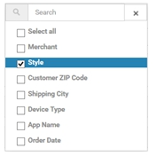

<a href="#top">back to top</a>

### <a id="charts">Charts

#### Filter Chart Data

The data from the data set that will be charted can also be filtered. For example, if you want to chart only data from a particular period of time or if you want to only chart certain Styles. 

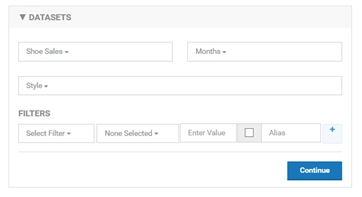

<a href="#top">back to top</a>

#### Chart Filter Options

A filter is a constructed using one or more expressions represented as rows in the *FILTERS* section. 

* To create a filter you work from left to right starting by selecting a dimension to filter by using the Select Filter pulldown. 
* Then, moving to the right you select an operator in the operator pulldown. 
* The operator choices will be different based on the type of dimension being filtered by. 

The following table shows what choices you have.

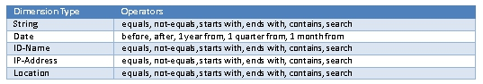

* The search operator allows matching using regular expressions.
* Next you enter a value to filter by. The type of value you enter must be of the same type as the dimension being filtered by. 
* The checkbox to the right allows you to show the filter to the user when viewing the chart in a dashboard. This means the user can change the filter value and change the data being charted. If this option is chosen the value you entered to the left becomes the default value. 
* When displaying the filter you can then specify the name of the filter you want to display to the user in the Alias field. 
* Finally, if you want to add additional expressions to your filter you can select the ‘+’ button and a new row will be displayed.

<a href="#top">back to top</a>

#### Chart Filter Example

The following illustrates the *DATASETS* section using our Shoe Sales data set.

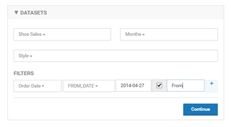

* In this example we will be plotting monthly data points from the Shoe Sales data by Style. 
* Only data points starting from 2014-04-27 will be plotted. 
* The user will be able to change the start date of the data on the chart with a field named “From”.

<a href="#top">back to top</a>

#### Chart Types

The *CHARTS* section identifies the type of chart to visually display the data with. There are several choices of charts, such as line chart, bar chart, or pie chart. Each of those charts may have a set of variations, or sub-types, such as standard, or stacked. The types of charts and their variations are listed in [Envision Appendix](../envision_reference/env_appendix.html).

The following illustrates the selection of a Standard Column Chart.

* The *Drilldown* option will be described later in this section. 

* The *Zoom* option, when enabled, allows you to select a visible area of the chart and expand it. 

* To select an area to zoom in on with a mouse select the top left corner of the area to zoom and drag diagonally to the right to create rectangular area.

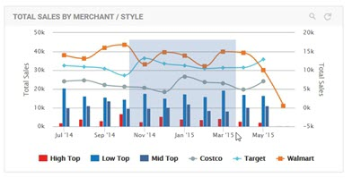

The rectangular area then becomes the complete view of the chart as seen below.

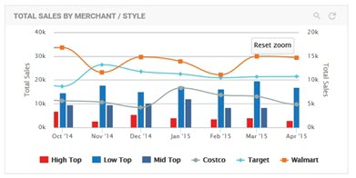

<a href="#top">back to top</a>

#### Chart Options

##### Customize More Link

The *Customize More* link expands the section to show more advanced options for the chart and options that may be specific to the type and subtype of the chart selected. These options are also listed in the [Envision Appendix](../envision_reference/env_appendix.html). The following illustrates these options for the Standard Column Chart.  

The following illustrates these options for the Standard Column Chart.  

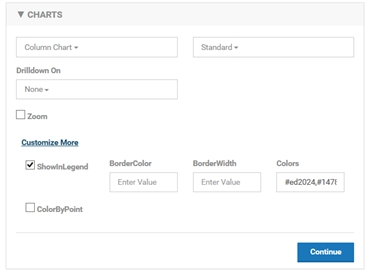

##### Color Theme

The *Color Theme* is available for all chart types. A color theme is a group of colors that will be used to draw the data series on the chart. The themes can be experimented with using the *Preview* function.

The *Show In Legend* option is also available for all chart types. When selected each data series will be listed in a legend for the chart.

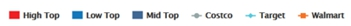

<a href="#top">back to top</a>

#### Chart X-AXIS

The *X-AXIS* section defines the x axis of the chart, what data will be used for tick marks, the title of the axis and the format of the tick mark labels.

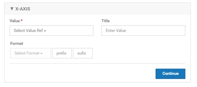

* To select the data to use for the x axis tick marks select a data set dimension from the Value pulldown. 
* The x axis title can optionally be entered in the Title text box. The format of the tick marks is handled differently depending on the type of the dimension used. 
* If using a date the format will be selected from a pulldown. 
* If not using a date dimension an optional prefix and suffix can be added to each tick mark label. If using a date dimension you can allow the system to format the tick marks using an AUTO option or you can specify it manually. The following is a list of formats available for dates. Based on the duration used for the data set only some of the formats will apply.

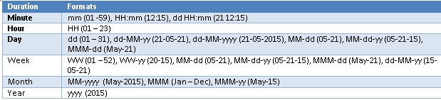

<a href="#top">back to top</a>

#### Chart X-AXIS Example

The following illustrates the *X-AXIS* section using our Shoe Sales data set.

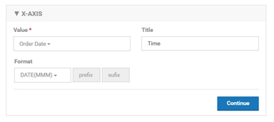

In this example our x axis will consist of tick marks representing the order dates. Each tick mark will be labeled with the month abbreviation (Jan, Feb, March, etc.). The x axis title will be Time.

<a href="#top">back to top</a>

### Series

The *SERIES* section defines data series of the chart. There may be more than one data series for a chart which can be defined in a single *SERIES* section if they all share the same definition. However you can also define multiple data series with unique definitions by using the Add Data Series button at the bottom of the column. This will add a new *SERIES* section to the column.

Each data series is plotted using the y axis of the chart. For example a data series of a column chart may be the sales totals of the high top shoe style which would be drawn as a single bar. Each shoe style may have its own data series which would result in multiple bars on the column chart.

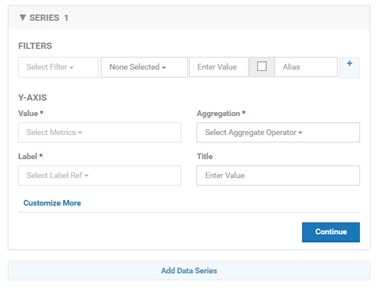

<a href="#top">back to top</a>

#### Series Options

* **Value** - You select the metric you want plotted along the y axis using the *Value* pulldown. The *Value* pulldown will list all metrics from the data set. You then choose the aggregation method (sum, average, etc.) for the metrics using the Aggregation pulldown. 
* **Aggregation** - The *Aggregation* pulldown will list the aggregations that were chosen for the metric in the data set definition. The y axis title can optionally be entered in the Title text box.
* **Label** - The *Label* pulldown provides options for how each series will be labeled. In a line chart this would be the label for each line. For a bar chart it would be the label for each bar. Since there may be multiple series the label will be derived from the dimensions used in the Group By field of the *DATASET* section which identifies how the data points are organized. For example if we are grouping by shoe style then we would want each line to be labeled with the shoe style. Since we can group by multiple dimensions the label can be derived using multiple dimensions chosen in the pulldown. The format will be dim1 – dim2 – dim3.

<a href="#top">back to top</a>

#### Filter Series

Just as we can filter the data in the *DATASET* section we can filter the data in a series. For example if we want to only have a single bar in the column chart for high top shoes we would add a filter for Style equal to high top. 

The *FILTERS* section works the same as the *FILTERS* section in the *DATASET* section described previously. By using the filter in conjunction with multiple *SERIES* sections we can define individual data series with their own settings.

<a href="#top">back to top</a>

#### Series Examples

Each chart type and variation may have specific SERIES options. These options are also listed in <a href="env_appendix.html">Envision Appendix</a> and can be accessed in the user interface by selecting the **Customize More** link. 

The following illustrates these options for the Standard Column Chart.  

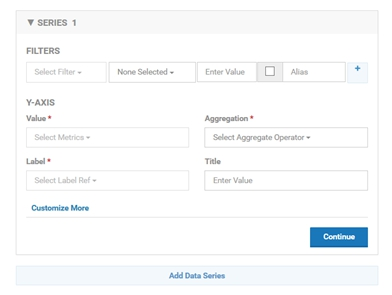

The following illustrates the *X-AXIS* section using our Shoe Sales data set.

In this example we will have a vertical bar representing the sum of all orders’ sales amounts for a given shoe style for a given month on the x axis. The label of each bar will be the name of the corresponding shoe style. The y axis title will be Style Sales.

<a href="#top">back to top</a>

### Preview Chart

At any time while modifying the settings of a chart you can preview what the chart will look like when placed on a dashboard by using the *PREVIEW* section in the right column. 

* To see the preview you must select **Preview**. 
* If you make changes on the left column, to see those changes on the right you must select **Preview** again. 
* The changes are not saved until you select **Save**. 

<a href="#top">back to top</a>

#### Preview Examples

The following illustrates the preview of our chart at this point.

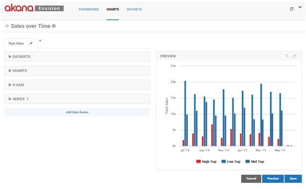

To this point we have only created a single chart although multiple charts can be grouped together to create a combination chart. Charts can be combined so that they overlay on each other (visible at the same time) or so that they can be navigated to by drilling down.

You’ll notice the name of the chart we’ve created thus far is displayed on a tab. A combination chart will have multiple tabs with different chart configurations. 

<a href="#top">back to top</a>

### Rename Chart

Each tab, or chart, in a combination chart can be renamed. 

* To rename a chart click on the pencil icon on the tab. 
* The *Edit Chart Tab* pop-up will be displayed where a new name can be entered.

<a href="#top">back to top</a>

### Overlaying Charts

Next to the last tab there is a ‘+’ symbol. Another chart can be overlaid on top of the current chart by clicking on the ‘+’ symbol. When this is done a new tab will be displayed.

From the new tab we can configure the second chart just as we did with the first.

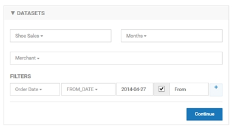

<a href="#top">back to top</a>

#### Create Combination Charts

In this example we will be plotting monthly data points from the Shoe Sales data by Merchant instead of Style. Only data points starting from 2014-04-27 will be plotted. The user will be able to change the start date of the data on the chart with a field named From.

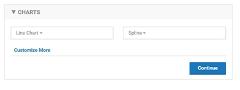

The type of chart used to display the Merchant sales will be a Spline Line Chart.

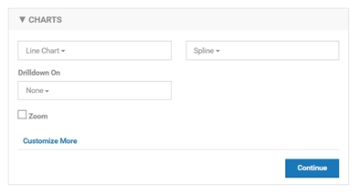

In the data series we will continue to chart the sum of the orders’ sales amounts but because the data is grouped by Merchant the data points will be different than in the original chart.

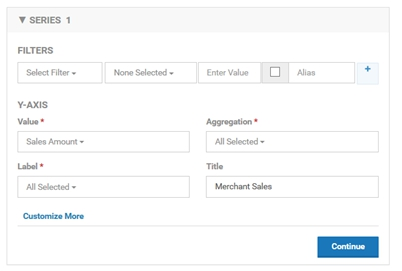

In the data series we will continue to chart the sum of the orders’ sales amounts but because the data is grouped by Merchant the data points will be different than in the original chart.

You can see the overlay effect of the charts when you select **Preview**.

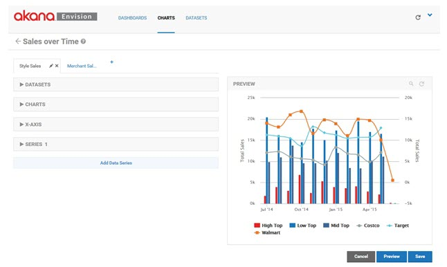

Notice the lines of the line chart are on top of the bars from the column chart. The charts are layered in order of the tabs. The first tab is the bottom layer. The last tab is the top layer.

As an alternative to displaying two charts simultaneously one chart can provide a navigation action to display the other. 

To do this in the chart that you want to be the origin of the navigation, select the series of the chart you would like to drill from in the Drilldown On* pulldown menu. Since each chart can have multiple Y series you must choose which one to use.

Next select the chart to navigate to from the Tab pulldown menu. By doing this you are telling the system that when a user selects a data point of the data series to hide the current chart and display the new chart. All filter values from the originating chart are provided to the newly displayed chart as well as the value of the dimension corresponding to the selected data point of the data series. You can use the Preview column to test the navigation. Notice how referencing the Merchant Sales chart from the Style Sales chart now hides the Marchant Sales chart in the preview, no longer overlaying it.

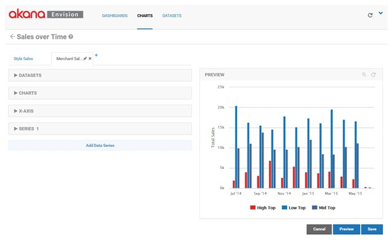

Then by selecting any of the Low Top bars the Merchant Sales chart replaces the Style Sales chart.

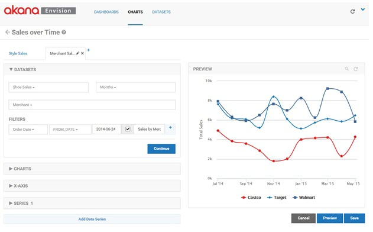

The Merchant Sales chart is passed the Order Date filter from the Style Sales chart so the time frame remains the same. The selected style, Low Top in this example, is passed to the Merchant Sales chart filtering the data series to just the selected style. This results in data series for each of the merchants but limited to the Low Top style. Note however that drilling down on a data series is only available when a single dimension is selected in the data series section of the chart.

In addition to the ability to drill down from one chart to another, there is a drill down option that allows you to easily build a chart that will drill down based on time. This can be done from the Merchant Sales chart. Open the CHARTS section and select the X-AXIS drill down option.

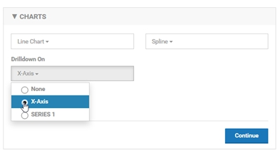

From the *PREVIEW* section you can select any of the data points on a data series and it will reopen the same chart but with the next available more granular set of data points as defined by the data set. For example, if you select any of the data series on their November data point the chart will be redrawn with data points per week instead of per month.

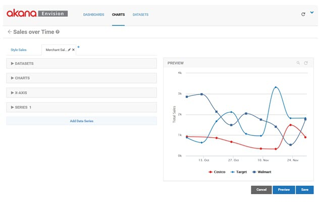

The weekly data points will include all the weeks within the selected month. More data points before and/or after the month may also be displayed.

<a href="#top">back to top</a>
