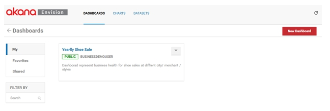
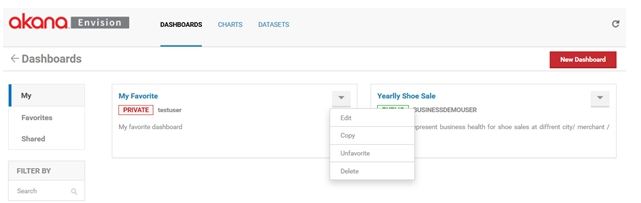
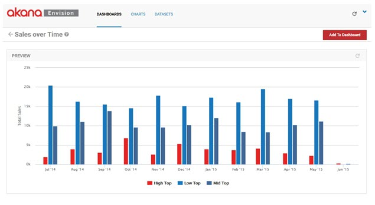
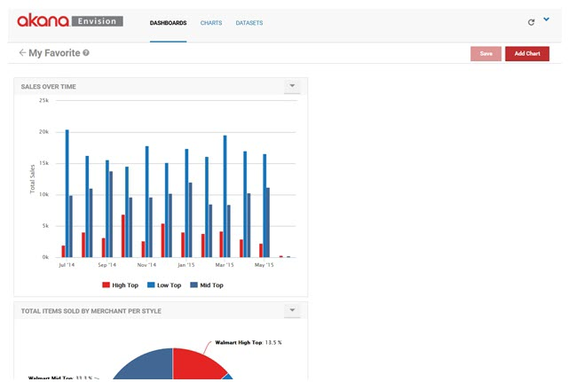
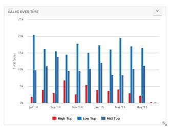
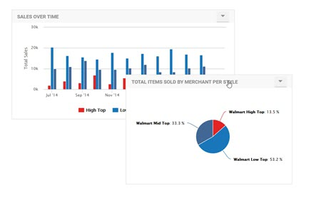
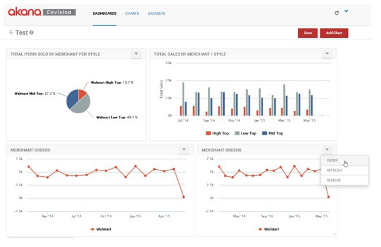
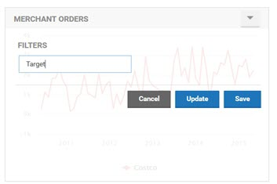
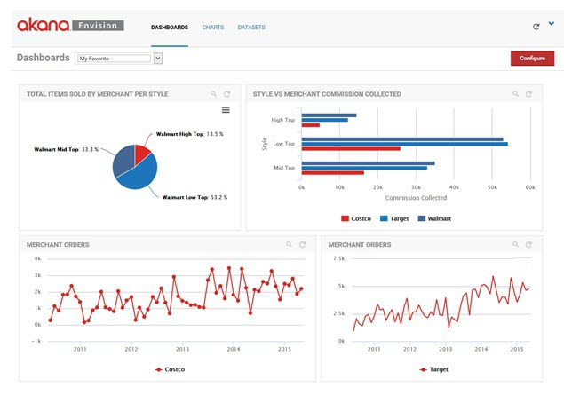
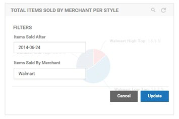

## Creating a Dashboard
Learn how add and reposition charts on an Envision Dashboard and display in Live Mode.

<a href="env_toc.html" class="button secondary">Envision Reference (Main Topic)</a>  <a href="../envision_install/installing_envision.htm" class="button secondary">Installing Envision 1.0</a>
<h5 class="stamp">Supported Platforms: 8.0</h5>  <h5 class="stamp">Supported Envision Versions: 1.0</h5> 

<h3 name="top" style="color: grey;">Table of Contents</h3>

1. [Introduction](#introduction)
2. [Dashboards](#Dashboard)
	* [Create New Dashboard](#create-new-dashboard)
	* [Dashboard Options](#dashboard-options)
	* [Configure Dashboard](#configure-dashboard)
	* [Add Chart To Dashboard](#add-chart-to-dashboard)
	* [Resize Charts on Dashboard](#resize-charts-on-dashboard)
	* [Position Charts on Dashboard](#position-charts-on-dashboard)
	* [Multiple Charts with Different Filters](#multiple-charts-with-different-filters)
	* [Save Charts on Dashboard](#save-charts-on-dashboard)
	* [Display Dashboard in Live Mode](#dashboard-live-mode)
	* [View Chart Filters in Live Mode](#view-chart-filters)

### Introduction

To present working Charts to Envision users those Charts need to be placed on a *Dashboard*. 

* A Dashboard is simply a web page that will display 0 or more functional Charts. 

* It is not for editing Charts but for displaying their results. 
* If the Chart was designed to have interactive Filters then those would be functional on the Dashboard.
From the Envision top level menu select the *DASHBOARDS* menu item.

* The default, or your most favorite, dashboard is displayed. It is a fully functional dashboard where you can view data. 
* To switch to a configuration view of dashboards select **Configure** in the upper right.

You are then presented three lists of dashboards, *My*, *Favorites*, and *Shared*. 

* **My** - Dashboards that the logged in user has created. 
* **Shared** - Dashboards that others have created and made available to the user. 
* **Favorites** - Those selected by the user to (either their own or someone else’s) to be in the list. It provides a faster lookup of commonly used items by giving them their own list.

<a href="#top">back to top</a>

### Dashboards

#### Create New Dashboard

Select **New Dashboard** to start the process of creating a new dashboard. A pop-up displays where you can enter a name, a description, and designate how it will be shared.

A dashboard can be shared by other users. 

* When a dashboard is shared users who are not the author can view the chart and place them on dashboards. They cannot change the dashboard. 
* The dashboard will automatically be placed in the My dashboards list. 
* If the *Marked as Favorite* checkbox is checked it will also be placed in the *Favorites* dashboards list.
* Each dashboard card in a list has a pull-down menu of options that can be performed on the dashboard. 

<a href="#top">back to top</a>

#### Dashboard Options

* **Edit** - Displays the pop-up used to create the dashboard initially so that changes can be made. 
* **Copy** - Creates a copy of the dashbboard. The same pop-up will be displayed once again but this time it will be for a new dashboard and all the information from the copied dashboard will be filled in. 
* **Favorite /Unfavorite**  - Can be used to toggle whether the dashboard should be placed in the Favorites list. 
* **Delete** - Removes the dashboard from the system. 

<a href="#top">back to top</a>

#### Configure Dashboard

To configure a dashboard select the name of the dashboard on the dashboard card. The dashboard configuration page displays. 

")

<a href="#top">back to top</a>

#### Add Chart To Dashboard

Initially the dashboard is empty. To add a chart to the dashboard select **Add Chart**.

* The **Add Chart** page looks very similar to the page you see when you click on the *CHARTS* link. 
* There are three different sections for *My*, *Favorites*, and *Shared*. 
* There are cards displayed for each chart. 
* The difference here is that each chart card has an **Add** button and a **Preview** link. 
* The **Add** button, when selected, will add the chart to the dashboard. 
* You can continue to add charts to the dashboard without leaving this page. 
* When you are finished click on the back arrow in front of the dashboard name.

The **Preview** link will present a full page preview of the chart. 

From the *Preview* page there is an **Add to Dashboard** button that you can select to add the chart to the dashboard immediately.

<a href="#top">back to top</a>

#### Resize Charts on Dashboard

When returning to the dashboard page the charts are added but most likely may not be sized or positioned exactly as you want them.

A chart can be resized by grabbing its bottom right corner and dragging it to the desired size.

<a href="#top">back to top</a>

#### Position Charts on Dashboard

Charts can also be moved to different positions. To move a chart grab the title bar of the chart and drag it to the desired position on the dashboard.

<a href="#top">back to top</a>

#### Multiple Charts with Different Filters

In some situations you may want multiple charts of the same kind but with different filters on the data being displayed on the same dashboard. 

For example, you can create a chart that displays a single merchant’s number of orders over time but you want to show this for your two top merchants on a single dashboard. 

To save effort, instead of having to create two different charts the same chart can be reused for both merchants on the same dashboard. 

This is done by configuring default filters for charts relative to a dashboard they are displayed on. Once a chart with a filter is displayed on a dashboard you can select the *Filter* option from the options pulldown in the upper right hand corner of the chart.

This option will display the filters for the chart as they would on a completed functioning dashboard. You can change the value of the filters and the chart contents will be changed. In this example we’ll change the Merchant name to Target in the second chart.

To see the changed filter take effect on the chart select the Update button. To save the new filter value for the next time the dashboard is displayed select the **Save** button.

#### Save Charts on Dashboard

Finally when the charts have been positioned and sized properly and the filter changes are made you can save the dashboard by selecting **Save**. 

If the dashboard is saved as a favorite it will be listed in the *Dashboards* pulldown. 

<a href="#top">back to top</a>

#### Display Dashboard in Live Mode

When you select the dashboard from the pulldown it is displayed in its live mode. 

#### View Chart Filters in Live Mode

In Live mode the charts can no longer be repositioned or resized. However if a chart was configured to display filters to users the magnifying glass icon in the upper right corner of the chart can be selected to view those filters.

By changing the values in the filters and selecting **Update** the data charted will be changed.

<a href="#top">back to top</a>