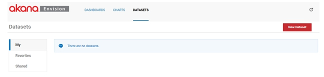
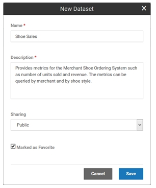
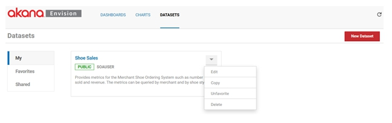
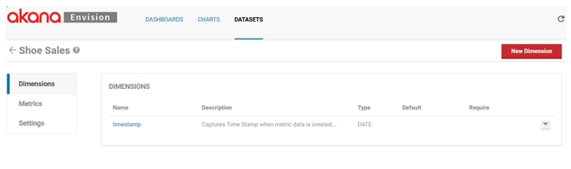
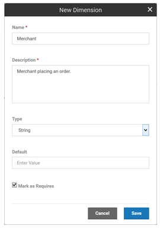
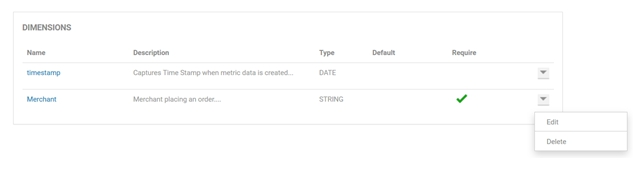
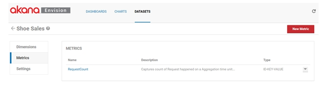
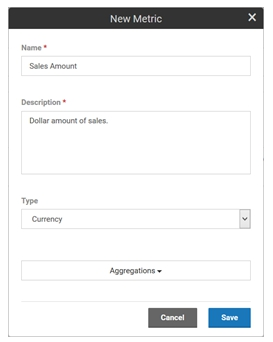
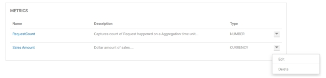

## Creating a Data Set
Learn how to create an Envision data set and configure dimensions and metrics.

<a href="env_toc.html" class="button secondary">Envision Reference (Main Topic)</a>  <a href="../envision_install/installing_envision.htm" class="button secondary">Installing Envision 1.0</a>
<h5 class="stamp">Supported Platforms: 8.0</h5>  <h5 class="stamp">Supported Envision Versions: 1.0</h5> 

<h3 name="top" style="color: grey;">Table of Contents</h3>

1. [Introduction](#introduction)
2. [Data Sets](#data-sets)
	* [Create New Dataset](#create-new-data-set)
	* [Dataset Options](#dataset-options)
3. [Dimensions](#dimensions)
	* [Add New Dimension](#add-new-dimension)
	* [Dimension Options](#dimension-options)
4. [Metrics](#metrics)
	* [Add New Metric](#add-new-metric)
	* [Metrics Options](#metrics-options)

### Introduction

In the previous topics we described the concept of a data set. In this chapter we will describe how a data set is created in the Envision product.

### Data Sets

When you log into Envision you are presented with a top level menu consisting of *DASHBOARDS*, *CHARTS*, and *DATASETS*. Select the *DATASETS* menu item.

You are then presented three lists of data sets, My, Favorites, and Shared. 

* **My** - Data sets that the logged in user has created. 
* **Shared** - Data sets that others have created and made available to the user. 
* **Favorites** - Data sets are those selected by the user to (either their own or someone else’s) to be in the list. It provides a faster lookup of commonly used items by giving them their own list.

#### Create New Data Set

Select **New Dataset** to start the process of creating a new data set. A pop-up will be displayed where you can enter a name, a description, and designate how it will be shared.

#### Dataset Options

A data set can be shared other users. When a data set is shared users who are not the author can view the data set and build charts against it. They cannot change the data set. The data set will automatically be placed in the My data sets list. If the **Marked as Favorite** checkbox is checked it will also be placed in the Favorites data sets list.

Each data set card in a list has a pull-down menu of options that can be performed on the data set. 

* **Edit** – Displays the pop-up used to create the data set initially so that changes can be made. 
* **Copy** - Creates a copy of the data set. The same pop-up will be displayed once again but this time it will before a new data set and all the information from the copied data set is filled in.
* **Favorite /Unfavorite** - Can be used to toggle whether the data set should be placed in the Favorites list. 
* **Delete** - Removes the data set from the system. If any charts exist that use the data set an error will be displayed to avoid breaking any dependent charts.

To define the details of a data set such as metrics and dimensions, select the name of the data set on the data set card. The data set details page displays. The page is divided into three sections, *Dimensions*, *Metrics*, and *Settings*. 

<a href="#top">back to top</a>

### Dimensions

The *Dimensions* section lists all the dimensions for the data set. Dimensions are the properties of a data set you use to query or organize metrics by. They provide the basis for how many combinations of aggregations will be made. 

#### Add New Dimension

* Each data set is created initially with a single default dimension, *timestamp*. 
* The timestamp dimension will group all metrics collected with a timestamp within the same collection time interval. 
* The dimension can be deleted if you are not interested in time based aggregations but there must be at least one Date dimension for aggregation over time to function properly. 

To add another dimension, select **New Dimension**. A pop-up displays where you can enter a name, a description, a type, a default value (if any), and if the dimension is required or not. 

*Note: At least one Dimension must be defined per Data set.*

#### Dimension Options

Dimensions can be one of the following types: Date, String, ID-Name, IP-Address, and Location. 

* The ID-Name type is a dual valued property with both an ID and a name. For example, if integrating with Policy Manager a dimension may be an organization. 
* An organization in Policy Manager has an ID and a descriptive name. 
* The engine will group metrics using the organization’s ID. But when displaying choices of organizations in the Envision UI the organization names will be displayed to the user since they won’t likely know the IDs. 
* The Location type is a property that can reference a city, state, zip code, country, or geolocation (latitude/longitude).

If a Default is specified, any data set row that does not have the dimension will have the dimension added with the default value. The default value must be of the same type as the dimension. If the dimension is classified as required any collector of data MUST include the dimension or the data will not aggregate correctly and charts will likely not work well.

Each dimension in the list has a pull-down menu of options that can be performed on the dimension.

* **Edit** – Displays the pop-up used to create the dimension initially so that changes can be made (excluding the name which cannot be changed). 
* **Delete** - Removes the dimension from the data set. 

<a href="#top">back to top</a>

### Metrics

The *Metrics* section lists all the metrics for the data set. Metrics are the properties of a data set that can be measured, aggregated, and compared.

Each data set is created initially with a single default metric, **RequestCount**. The RequestCount metric is the measure for the number of transactions, or orders in this example. The metric can be deleted if you do not wish to collect it. 

To add another metric select **New Metric**. A pop-up displays where you can enter a name, a description, a type, and a set of aggregation calculations to perform.

Metrics can be one of the following types: Count, Time, Size, Number, and Currency. The aggregation choices are average, sum, minimum, maximum, first, and last. 

#### Metrics Options

Each metric in the list has a pull-down menu of options that can be performed on the metric.

* **Edit** – Displays the pop-up used to create the metric initially so that changes can be made (excluding the name which cannot be changed). 
* **Delete** – Removes the metric from the data set. 

The *Settings* section lists all the aggregation and storage intervals for the data set. 

Envision supports aggregating metrics every minute, hour, day, week, month, and/or year. For each of these aggregation sets you can also specify how long the results should be held in the data store. This is done by selecting the a unit of time (minutes, hours, days, weeks, months, years) and a number of units. 

* For example in the image above the metrics will be aggregated on a weekly and monthly basis. 
* The weekly results will be held in the data store for 1 year and the monthly results will be held in the data store for 5 years. 

It is important to think about how these intervals will limit the ability to make charts. It is not possible to create a chart with data points more granular than the aggregations calculated. Once again in our example you could not create a chart that shows metrics for shoe orders per minute or day.

<a href="#top">back to top</a>