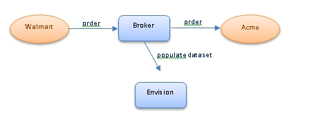
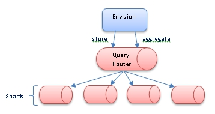
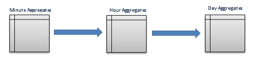

## Data Set Collection and Aggregation
Learn how Envision performs data collection and data aggregation.

<a href="env_toc.html" class="button secondary">Envision Reference (Main Topic)</a>  <a href="../envision_install/installing_envision.htm" class="button secondary">Installing Envision 1.0</a>
<h5 class="stamp">Supported Platforms: 8.0</h5>  <h5 class="stamp">Supported Envision Versions: 1.0</h5> 

<h3 name="top" style="color: grey;">Table of Contents</h3>

1. [Introduction](#introduction)
2. [Data Collection Using a Broker](#data-collection-using-a-broker)
3. [Data Collection Using Individual Transactions or Raw Data](#data-collection-using-individual-transations-or-raw-data)
4. [Data Aggregation Using Time Intervals](#data-aggregation-using-time-intervals)

### Introduction

In the previous topic we introduced the concept of a data set, how metrics are defined, their aggregation, and collection intervals. In this topic we will describe how the data in a data set is actually collected and how the aggregation is performed.

### Data Collection Using a Broker

Envision on its own does not collect data. It only aggregates data based on the data set definition. It does, however, provide an API that other systems and products can use to report the data they have collected that belong to a data set. Envision also provides an API for defining the data set itself so a system or product can create a data set in Envision and then start reporting data that belongs to that data set.

Other Akana products, when integrated with Envision, will install their own data sets and will collect data and feed it to Envision. The Akana API Gateway product will allow users to define metrics collection policies that are configured to extract data from business transactions that are processed by the API Broker. The policy defines instructions to the broker on how to extract information from a transaction and map it to a metric or dimension of a data set in Envision.

<a href="#top">back to top</a>

### Data Collection Using Individual Transactions or Raw Data

The Envision API will accept data from individual transactions (“raw” data) or pre-aggregated data. The API will persist the data in a MongoDB document data store. From here Envision will instruct the data store to aggregate the stored data on intervals that match those defined in the data set. For example, if the data set is defined to provide daily and weekly metrics then Envision will instruct the data store to aggregate the metrics on a daily and weekly basis.

The calculations performed by the data store to aggregate the metrics are dictated by Envision. Envision will consult the data set definition and instruct the data store to perform the correct aggregation calculations. If the data store is clustered, or sharded, these calculations can span multiple instances providing the scalability that may be required for large volumes of data.

<a href="#top">back to top</a>

### Data Aggregation Using Time Intervals

Envision has predefined time intervals that it supports for aggregating data, minute, hour, day, week, month, and year. Any and all of these can be used for a particular data set. All smaller intervals are used in the aggregation of the larger intervals, so aggregation may be performed more often than what is defined in the data set. For example, let’s say the data set is defined to collect metrics on a daily basis. Envision will first aggregate the data on a minute basis. Then it will use the output of that aggregation over the course of an hour to create an hourly aggregation. It will then use the output of the hourly aggregations over the course of a day to create the daily aggregation.

When defining a data set you can specify how long the aggregate numbers should be kept in the data store. If a smaller aggregate interval is not part of the data set but needed for a larger aggregate interval all the smaller aggregate data will be deleted once it is used for the larger aggregate calculation. In the example above if only daily numbers are required, hourly aggregate data will be deleted as soon as the daily numbers are calculated. Minute aggregate data is deleted as soon as hourly aggregate data is calculated.

<a href="#top">back to top</a>