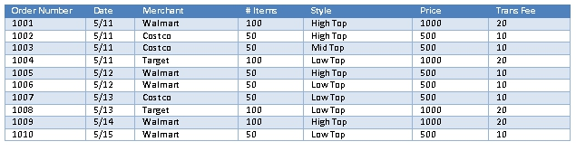
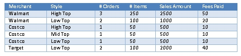
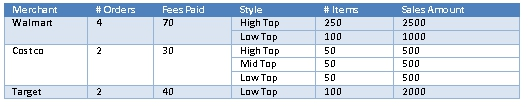

## Introduction to Data Sets
Learn about Envision data sets, metrics, and dimensions.

<a href="env_toc.html" class="button secondary">Envision Reference (Main Topic)</a>  <a href="../envision_install/installing_envision.htm" class="button secondary">Installing Envision 1.0</a>
<h5 class="stamp">Supported Platforms: 8.0</h5>  <h5 class="stamp">Supported Envision Versions: 1.0</h5> 

<h3 name="top" style="color: grey;">Table of Contents</h3>

1. [What is a Data Set?](#what-is-a-data-set)
2. [Metrics and Dimensions](#metrics-and-dimensions)
3. [Data Set Examples](#data-set-examples)

### What is a Data Set?

A data set is a group of metrics that are collected so that they can be analyzed through queries based on different criteria, or dimensions. It is the foundation on top of which all analysis can be performed. Take a company named Acme that manufactures shoes, for example. Acme provides an API for merchants to order shoes that are sold to the public. Acme wishes to collect metrics on those sales such as: 

* How many orders by each merchant
* Number of items ordered by style
* Number of items ordered total
* Total sales by each merchant
* Total sales by each style
* Total sale of all orders
* Fees collected by each merchant
* Total fees collected

### Metrics and Dimensions

Acme wants this information reported on a weekly and monthly basis. This group of metrics becomes the basis for a data set. 

* The data set consists of *metrics* and *dimensions*. The metrics themselves are simply numeric values, such as a price or quantity. 
* The metrics are collected over one or more time *intervals* ( i.e., one minute, one hour, and one day). 
* Because multiple values for a metric will likely be gathered over a time interval, a calculation must be defined for combining the multiple values to a single value. This is called *aggregation*. Some examples are calculating an average, a sum, or recording the minimum or maximum values. 
* The metrics are then partitioned, or grouped, by organization properties of the transactions called *dimensions*, such as merchant or style. 

In Acme’s case we have a data set named “Shoe Sales.” The metrics in the data set are:

* Number of Orders (sum)
* Number Of Items Sold (sum)
* Sales Amount (sum)
* Fees Paid (sum)

For both metrics, they will be summed over the collection interval. The dimensions in the data set are:

* Merchant
* Style
* Order Date

Note there is no dimension for Order. This is because collecting metrics per order or by transaction is the *empty dimension*. It is the single grouping of metrics without a dimension and is always collected. The collection intervals in the data set are:

* Week
* Month

<a href="#top">back to top</a>

### Data Set Examples

By defining the data set in this way each week the number of orders made, number of items sold, sales amount, and fees paid, will be calculated. The numbers will be calculated by creating their sum. There will be a separate sum for each combination of merchant and style, and a sum independent of any dimension. The following table lists a set of orders that will be used to illustrate Shoe Sales Data Set.

For the week of 5/11 the data set will collect the following sums.

With the metrics and with these combinations of dimension the original requested queries can be performed:

* **Orders Made by Merchant** – Sum the # Orders column for each unique Merchant: Walmart 5, Costco 3, Target 2
* **Items Sold by Merchant** – Sum the # Items column for each unique Merchant: Walmart 350, Costco 150, Target 100
* **Items Sold by Style** – Sum the # Items column for each unique Style: High Top 300, Mid Top 50, Low Top 250
* **Total Items Sold** – Sum the # Items column: 600
* **Total Sales by Merchant** – Sum the Total Sale column for each unique Merchant: Walmart 3500, Costco 1500, Target 2000
* **Total Sales by Style** – Sum the Total Sale column for each unique Style: High Top 4, Mid Top 1, Low Top 2500
* **Total Sales of all Orders** – Sum the Total Sale column: 6000
* **Fees Collected by Merchant** – Sum the Trans Fee column for each unique Merchant: Walmart 70, Costco 30, Target, 40
* **Total Fees of all Orders** – Sum the Trans Fee column: 140

Now let’s say that Acme changes their ordering system so that multiple styles of shoes can be ordered at the same time by a Merchant and each order has only one transaction fee. The orders would then look like:

The system can no longer simply create rows of data from unique combinations of the dimensions because if that were to be done the metrics for Number of Orders and Transaction Fee would be summed incorrectly. For example orders 1002 and 1004 would be counted twice for calculating the number of orders made and the transaction fees would be counted twice as well. To accommodate the differences between metrics general to a single transaction and metrics for multiple line items of a transaction a hierarchy of grouping is performed. The table below shows how the sums would be calculated for this new ordering system.

The queries that can be performed against the sums for the new ordering system are all the same as the old ordering system. The data set is defined the same way. The system just performs a different level of grouping. The columns can still be summed the same way to perform the queries, there just may be less rows for the transaction level metrics to sum.

<a href="#top">back to top</a>
