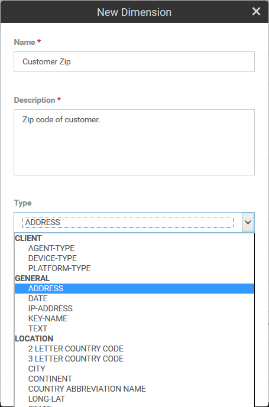
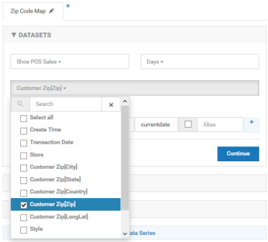
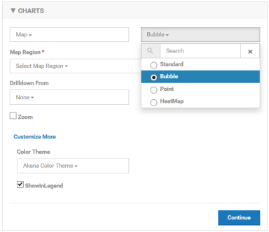
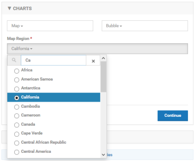
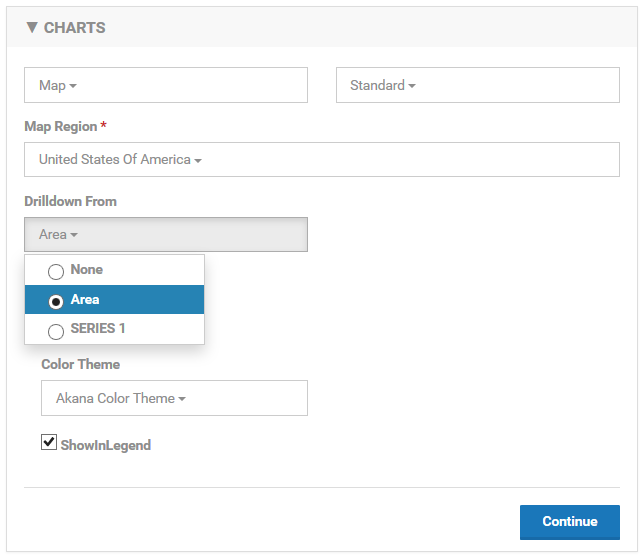
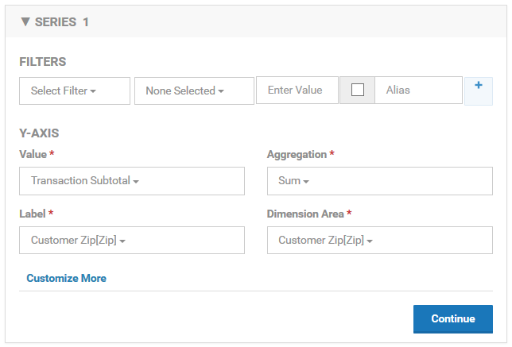
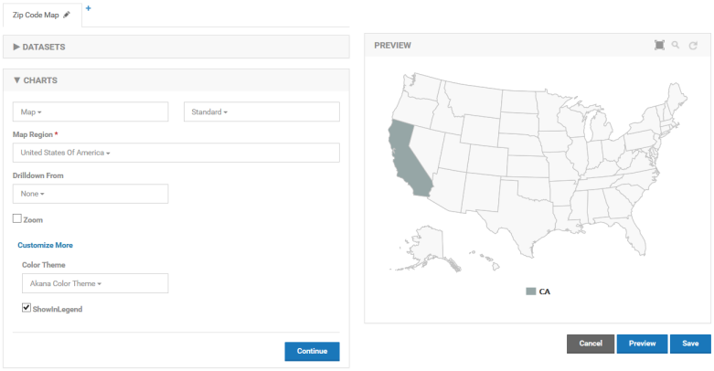
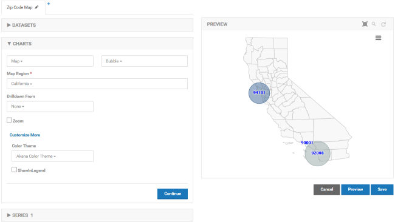
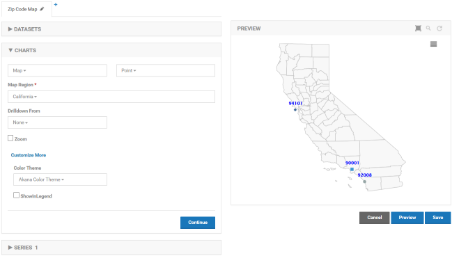
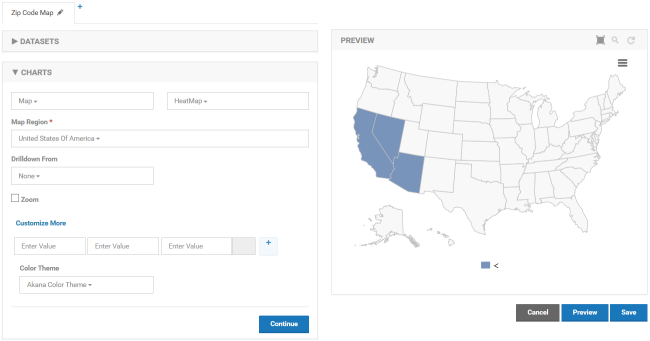

## Creating a Map
Learn how to create a map in Envision.

<a href="env_toc.html" class="button secondary">Envision Reference (Main Topic)</a>  <a href="../envision_install/installing_envision.htm" class="button secondary">Installing Envision 1.0</a>
<h5 class="stamp">Supported Envision Versions: 1.1</h5>

### Table of Contents

* [Creating a Map](#create-map)
* [Standard Map](#map-standard)
* [Bubble Map](#map-bubble)
* [Point Map](#map-point)
* [Heat Map](#map-heat)

## Creating a Map
A map is a special kind of chart that plots data in a geographical fashion. A map image is selected as a background and then the aggregated data is overlaid on the image in different ways depending on what kind of map you choose. For example a Bubble Map will overlay circles on the map image in sizes proportional to each other based on the metric being plotted.
In order to create a map a geographical dimension must be defined as part of the data set. When defining a dimension use the Address type.

The Address type is a structure that can hold zip code, city, state, country, and latitude/longitude information. It is this information that is used to overlay in the right position on a map. If any of these fields are not available to the map it may not overlay the data.
Creating the actual map is very similar to creating a chart as described in the previous section. The key is to use the Address dimension properly. When filling in the DATASETS section be sure to use the Address dimension as one of the fields to group by.

Note that when working with Address dimensions each of the fields within that dimension are available to be selected. In the image above the grouping will be done based on zip code so there will be a different data point per zip code. If Customer Zip[City] were selected there would be one data point for each city.
When selecting the chart type in the CHARTS section select the Map option.

There are four types of charts from which to choose from, Standard, Bubble, Point, and HeatMap. An example of each type of map can be seen at the end of this section.
Next select the map background, or region. There are several choices. A search can be performed.

Depending on the region chosen the map may be divided into different smaller regions, the United States is divided into states and the World is divided into countries for example. If a region is chosen that has sub-regions the drill-down option of Area.

When drilling down using the Area option you can select a data point in a sub-region and the map for that sub-region will be drawn. Drilling down by series works the same as other charts. You can link a different chart by selecting a data point. It does not have to be on the same map or a map at all.
The next step is to define the data series. There is no X-Axis for maps. They do not show a trend of data over time.

The SERIES section is the same as other charts except for the additional Dimension Area field. This field designates the dimension that will be used to identify the area on the map to plot the data. In this example the data will be drawn in the location of the zip code.

### Standard Map
The standard map is limited in that it only supports dimensions that correspond to the sub-regions on the selected map region. For example the dimension used for a United States map must be a state. For the world it must be a country. When there is data for a sub-region the entire sub-region is filled in.

<a href="#top">back to top</a>

### Bubble Map
The bubble map uses latitude and longitude for plotting data so there are no limitations as long as the latitude and longitude of an Address dimension has been filled in. Each data point is plotted as a circle. The circle size is larger or smaller based on the value of the metric being used.

<a href="#top">back to top</a>

### Point Map
The point map is almost identical to the bubble map but it does not draw different size circles for each data point. Instead similar sized diamonds are drawn.

<a href="#top">back to top</a>

### Heat Map
The heat map colors sub-regions of a map where data is present. In a world map for example if plotting data points using countries each country that has data will be filled in. The value of the data point is available by hovering over a sub-region. For the United States as seen below, plotting data points using states will fill in each state.

<a href="#top">back to top</a>
