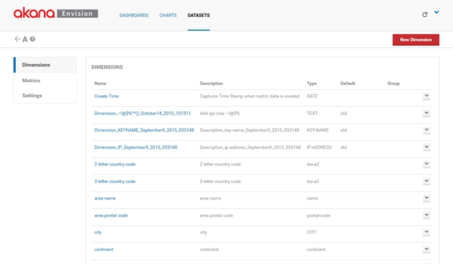
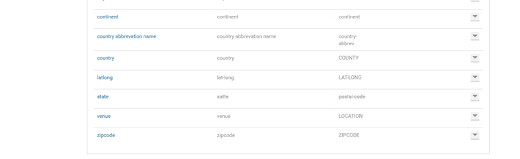
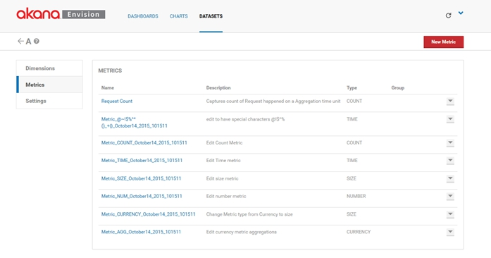
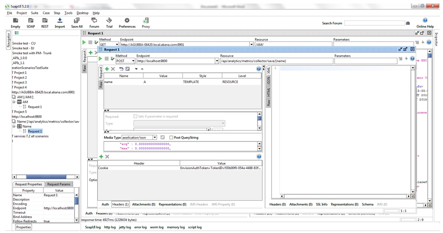
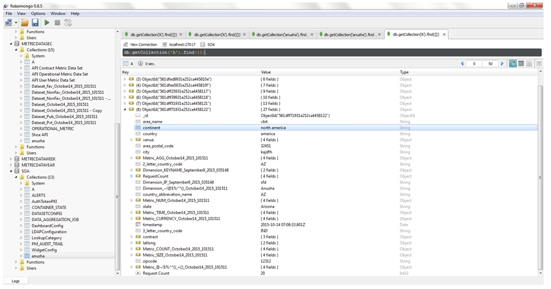

## How Do I Import Data Into An Envision Data Set Using A REST API?
Learn how to import data into an existing or multiple Envision data sets using a REST API. 

<a href="../envision_install/installing_envision_v11.html" class="button secondary">Installing Envision 1.1</a>

<a href="../envision_install/installing_pm_env_integration_v11.html" class="button secondary">Performing Policy Manager / Envision Integration Installation</a> <a href="../envision_reference/env_toc.html" class="button secondary">Envision Reference</a>

<h5 class="stamp">Supported Platforms: 8.0 and greater.</h5>

<div class = "divider1"></div>

### Table of Contents
<div id="toc-marker"></div>
* [Introduction](#introduction)
* [Use Case 1: Import Data Into Existing Data Set](#use-case-1-import-data-into-existing-data-set)
* [Use Case 2: Import Data Into Multiple Data Sets](#use-case-2-import-data-into-multiple-data-sets)

<div class = "divider1"></div>

### Introduction

The following use case illustrates how import data into an existing Envision data set using a REST API. 

<a href="#top">back to top</a> 

### Use Case 1: Import Data Into Existing Data Set

1. Log into the *Envision Console* and create a data set. In this use case following data set example is used: 

	

	

	

2. The Data Set configuration looks like: 

	```
	{
	  "id" : "561df462931e252ca4457da2",
	  "metrics" : [ {
	    "type" : "COUNT",
	    "aggregations" : [ "Total", "Average", "Minimum", "Maximum" ],
	    "name" : "Request Count",
	    "description" : "Captures count of Request happened on a Aggregation time unit",
	    "isActive" : true,
	    "isFavorite" : false,
	    "alias" : "RequestCount",
	    "favorites" : [ ]
	  }, {
	    "type" : "TIME",
	    "aggregations" : [ "Average", "Minimum", "Maximum", "Total" ],
	    "name" : "Metric_@~!$%^*()_+{}_October14_2015_101511",
	    "description" : "edit to have special characters @!$^%",
	    "isActive" : true,
	    "isFavorite" : false,
	    "alias" : "Metric_@~!$%^*()_+{}_October14_2015_101511",
	    "favorites" : [ ]
	  }, {
	    "type" : "COUNT",
	    "aggregations" : [ "Average", "Minimum", "Maximum", "Total" ],
	    "name" : "Metric_COUNT_October14_2015_101511",
	    "description" : "Edit Count Metric",
	    "isActive" : true,
	    "isFavorite" : false,
	    "alias" : "Metric_COUNT_October14_2015_101511",
	    "favorites" : [ ]
	  }, {
	    "type" : "TIME",
	    "aggregations" : [ "Average", "Minimum", "Maximum", "Total" ],
	    "name" : "Metric_TIME_October14_2015_101511",
	    "description" : "Edit Time metric",
	    "isActive" : true,
	    "isFavorite" : false,
	    "alias" : "Metric_TIME_October14_2015_101511",
	    "favorites" : [ ]
	  }, {
	    "type" : "SIZE",
	    "aggregations" : [ "Average", "Minimum", "Maximum", "Total" ],
	    "name" : "Metric_SIZE_October14_2015_101511",
	    "description" : "Edit size metric",
	    "isActive" : true,
	    "isFavorite" : false,
	    "alias" : "Metric_SIZE_October14_2015_101511",
	    "favorites" : [ ]
	  }, {
	    "type" : "NUMBER",
	    "aggregations" : [ "Average", "Minimum", "Maximum", "Total" ],
	    "name" : "Metric_NUM_October14_2015_101511",
	    "description" : "Edit number metric",
	    "isActive" : true,
	    "isFavorite" : false,
	    "alias" : "Metric_NUM_October14_2015_101511",
	    "favorites" : [ ]
	  }, {
	    "type" : "SIZE",
	    "aggregations" : [ "Average", "Minimum", "Maximum", "Total" ],
	    "name" : "Metric_CURRENCY_October14_2015_101511",
	    "description" : "Change Metric type from Currency to size",
	    "isActive" : true,
	    "isFavorite" : false,
	    "alias" : "Metric_CURRENCY_October14_2015_101511",
	    "favorites" : [ ]
	  }, {
	    "type" : "CURRENCY",
	    "aggregations" : [ "Maximum", "Total" ],
	    "name" : "Metric_AGG_October14_2015_101511",
	    "description" : "Edit currency metric aggregations",
	    "isActive" : true,
	    "isFavorite" : false,
	    "alias" : "Metric_AGG_October14_2015_101511",
	    "favorites" : [ ]
	  } ],
	  "dimensions" : [ {
	    "required" : false,
	    "type" : "DATE",
	    "aggregatorOperator" : true,
	    "isLocationType" : false,
	    "name" : "Create Time",
	    "description" : "Captures Time Stamp when metric data is created",
	    "isActive" : true,
	    "isFavorite" : false,
	    "alias" : "timestamp",
	    "favorites" : [ ]
	  }, {
	    "required" : true,
	    "type" : "TEXT",
	    "defaultValue" : "sfd",
	    "aggregatorOperator" : false,
	    "isLocationType" : false,
	    "name" : "Dimension_~!@$%^*()_October14_2015_101511",
	    "description" : "Add spl char ~!@$%",
	    "isActive" : true,
	    "isFavorite" : false,
	    "alias" : "Dimension_~!@$%^*()_October14_2015_101511",
	    "favorites" : [ ]
	  }, {
	    "required" : true,
	    "type" : "KEY-NAME",
	    "defaultValue" : "sfd",
	    "aggregatorOperator" : false,
	    "isLocationType" : false,
	    "name" : "Dimension_KEYNAME_September9_2015_035148",
	    "description" : "Description_key name_September9_2015_035148",
	    "isActive" : true,
	    "isFavorite" : false,
	    "alias" : "Dimension_KEYNAME_September9_2015_035148",
	    "favorites" : [ ]
	  }, {
	    "required" : true,
	    "type" : "IP-ADDRESS",
	    "defaultValue" : "sfd",
	    "aggregatorOperator" : false,
	    "isLocationType" : false,
	    "name" : "Dimension_IP_September9_2015_035148",
	    "description" : "Description_ip address_September9_2015_035148",
	    "isActive" : true,
	    "isFavorite" : false,
	    "alias" : "Dimension_IP_September9_2015_035148",
	    "favorites" : [ ]
	  }, {
	    "required" : false,
	    "type" : "iso-a2",
	    "group" : "",
	    "defaultValue" : "",
	    "aggregatorOperator" : false,
	    "isLocationType" : true,
	    "name" : "2 letter country code",
	    "description" : "2 letter country code",
	    "isActive" : true,
	    "isFavorite" : false,
	    "alias" : "2_letter_country_code",
	    "favorites" : [ ]
	  }, {
	    "required" : false,
	    "type" : "iso-a3",
	    "group" : "",
	    "defaultValue" : "",
	    "aggregatorOperator" : false,
	    "isLocationType" : true,
	    "name" : "3 letter country code",
	    "description" : "3 letter country code",
	    "isActive" : true,
	    "isFavorite" : false,
	    "alias" : "3_letter_country_code",
	    "favorites" : [ ]
	  }, {
	    "required" : false,
	    "type" : "name",
	    "group" : "",
	    "defaultValue" : "",
	    "aggregatorOperator" : false,
	    "isLocationType" : true,
	    "name" : "area name",
	    "description" : "area name",
	    "isActive" : true,
	    "isFavorite" : false,
	    "alias" : "area_name",
	    "favorites" : [ ]
	  }, {
	    "required" : false,
	    "type" : "postal-code",
	    "group" : "",
	    "defaultValue" : "",
	    "aggregatorOperator" : false,
	    "isLocationType" : true,
	    "name" : "area postal code",
	    "description" : "area postal code",
	    "isActive" : true,
	    "isFavorite" : false,
	    "alias" : "area_postal_code",
	    "favorites" : [ ]
	  }, {
	    "required" : false,
	    "type" : "CITY",
	    "group" : "",
	    "defaultValue" : "",
	    "aggregatorOperator" : false,
	    "isLocationType" : true,
	    "name" : "city",
	    "description" : "city",
	    "isActive" : true,
	    "isFavorite" : false,
	    "alias" : "city",
	    "favorites" : [ ]
	  }, {
	    "required" : false,
	    "type" : "continent",
	    "group" : "",
	    "defaultValue" : "",
	    "aggregatorOperator" : false,
	    "isLocationType" : true,
	    "name" : "continent",
	    "description" : "continent",
	    "isActive" : true,
	    "isFavorite" : false,
	    "alias" : "continent",
	    "favorites" : [ ]
	  }, {
	    "required" : false,
	    "type" : "country-abbrev",
	    "group" : "",
	    "defaultValue" : "",
	    "aggregatorOperator" : false,
	    "isLocationType" : true,
	    "name" : "country abbrevation name",
	    "description" : "country abbrevation name",
	    "isActive" : true,
	    "isFavorite" : false,
	    "alias" : "country_abbrevation_name",
	    "favorites" : [ ]
	  }, {
	    "required" : false,
	    "type" : "COUNTY",
	    "group" : "",
	    "defaultValue" : "",
	    "aggregatorOperator" : false,
	    "isLocationType" : true,
	    "name" : "country",
	    "description" : "country",
	    "isActive" : true,
	    "isFavorite" : false,
	    "alias" : "country",
	    "favorites" : [ ]
	  }, {
	    "required" : false,
	    "type" : "LAT-LONG",
	    "group" : "",
	    "defaultValue" : "",
	    "aggregatorOperator" : false,
	    "isLocationType" : true,
	    "name" : "latlong",
	    "description" : "lat-long",
	    "isActive" : true,
	    "isFavorite" : false,
	    "alias" : "latlong",
	    "favorites" : [ ]
	  }, {
	    "required" : false,
	    "type" : "postal-code",
	    "group" : "",
	    "defaultValue" : "",
	    "aggregatorOperator" : false,
	    "isLocationType" : true,
	    "name" : "state",
	    "description" : "satte",
	    "isActive" : true,
	    "isFavorite" : false,
	    "alias" : "state",
	    "favorites" : [ ]
	  }, {
	    "required" : false,
	    "type" : "LOCATION",
	    "group" : "",
	    "defaultValue" : "",
	    "aggregatorOperator" : false,
	    "isLocationType" : true,
	    "name" : "venue",
	    "description" : "venue",
	    "isActive" : true,
	    "isFavorite" : false,
	    "alias" : "venue",
	    "favorites" : [ ]
	  }, {
	    "required" : false,
	    "type" : "ZIPCODE",
	    "group" : "",
	    "defaultValue" : "",
	    "aggregatorOperator" : false,
	    "isLocationType" : true,
	    "name" : "zipcode",
	    "description" : "zipcode",
	    "isActive" : true,
	    "isFavorite" : false,
	    "alias" : "zipcode",
	    "favorites" : [ ]
	  } ],
	  "aggregations" : [ {
	    "name" : "METRIC_DATA_MINUTES",
	    "isActive" : true,
	    "isFavorite" : false,
	    "favorites" : [ ],
	    "source" : "METRICDATASEC",
	    "purgeTimeUnit" : {
	      "type" : "DAYS",
	      "interval" : 2
	    }
	  }, {
	    "name" : "METRIC_DATA_HOURS",
	    "isActive" : true,
	    "isFavorite" : false,
	    "favorites" : [ ],
	    "source" : "METRICDATAMIN",
	    "purgeTimeUnit" : {
	      "type" : "WEEK",
	      "interval" : 1
	    }
	  }, {
	    "name" : "METRIC_DATA_DAYS",
	    "isActive" : true,
	    "isFavorite" : false,
	    "favorites" : [ ],
	    "source" : "METRICDATAHOUR",
	    "purgeTimeUnit" : {
	      "type" : "MONTH",
	      "interval" : 1
	    }
	  }, {
	    "name" : "METRIC_DATA_WEEKS",
	    "isActive" : true,
	    "isFavorite" : false,
	    "favorites" : [ ],
	    "source" : "METRICDATADAY",
	    "purgeTimeUnit" : {
	      "type" : "MONTH",
	      "interval" : 6
	    }
	  }, {
	    "name" : "METRIC_DATA_MONTHS",
	    "isActive" : true,
	    "isFavorite" : false,
	    "favorites" : [ ],
	    "source" : "METRICDATAWEEK",
	    "purgeTimeUnit" : {
	      "type" : "YEAR",
	      "interval" : 2
	    }
	  }, {
	    "name" : "METRIC_DATA_YEARS",
	    "isActive" : true,
	    "isFavorite" : false,
	    "favorites" : [ ],
	    "source" : "METRICDATAMONTH",
	    "purgeTimeUnit" : {
	      "type" : "YEAR",
	      "interval" : 10
	    }
	  } ],
	  "order" : 0,
	  "name" : "A",
	  "description" : "A",
	  "createdDate" : 1444803682166,
	  "createdBy" : "Admin Console\\administrator",
	  "lastModifiedDate" : 1444803682166,
	  "isActive" : true,
	  "isFavorite" : true,
	  "sharingType" : "Public"
	}
	```

#### Hit the REST API

1. To insert data into this data set, send a request to the operation listed below with cookie for authentication. The cookie can be obtained from the Login API.  

	```
	    POST /collector/save/{name}
	    URL: http://localhost:9800/api/analytics/metrics/collector/save/{name}
	    name = A (dataset name)
```

2. The Request Payload looks like:

	```
	    {
	    "area_name" : "vbit",
	    "continent" : "north america",
	    "country" : "america",
	    "venue" :{
		"City":”ADF",
		"State":"AXDS"
		"Country":"skjdvn"
		"Zip":"83727"
		},
	    "area_postal_code" : "32451",
	    "city" : "",
	    "Metric_AGG_October14_2015_101511" : {
	        "min" : 0.0000000000000000,
	        "avg" : 0.0000000000000000,
	        "max" : 0.0000000000000000,
	        "sum" : 0.0000000000000000
	    },
	    "2_letter_country_code" : "AZ",
	    "Dimension_KEYNAME_September9_2015_035148" : {
	        "name" : "sfd",
	        "key" : "sfd"
	    },
	    "RequestCount" : {
	        "min" : 1228434.0000000000000000,
	        "avg" : 1228434.0000000000000000,
	        "max" : 1228434.0000000000000000,
	        "sum" : 1228434.0000000000000000
	    },
	    "Dimension_IP_September9_2015_035148" : "sfd",
	    "Dimension_~!@$%^*()_October14_2015_101511" : “Anusha”,
	    "country_abbrevation_name" : "AZ",
	    "Metric_NUM_October14_2015_101511" : {
	        "min" : 0.0000000000000000,
	        "avg" : 0.0000000000000000,
	        "max" : 0.0000000000000000,
	        "sum" : 0.0000000000000000
	    },
	    "state" : "Arizona",
	    "Metric_TIME_October14_2015_101511" : {
	        "min" : 0.0000000000000000,
	        "avg" : 0.0000000000000000,
	        "max" : 0.0000000000000000,
	        "sum" : 0.0000000000000000
	    },
	    "Metric_CURRENCY_October14_2015_101511" : {
	        "min" : 0.0000000000000000,
	        "avg" : 0.0000000000000000,
	        "max" : 0.0000000000000000,
	        "sum" : 0.0000000000000000
	    },
	    "timestamp" : 1444806623989,
	    "3_letter_country_code" : "IND",
	    "contract" : {
	        "name" : "AM",
	        "id" : 1012,
	        "key" : "064586e7-722e-11e5-830b-bd015f78ece6:1012"
	    },
	    "latlong" : {
		"lat":"17.123",
		"long":"15.324"
		},
	    "Metric_COUNT_October14_2015_101511" : {
	        "min" : 0.0000000000000000,
	        "avg" : 0.0000000000000000,
	        "max" : 0.0000000000000000,
	        "sum" : 0.0000000000000000
	    },
	    "Metric_SIZE_October14_2015_101511" : {
	        "min" : 0.0000000000000000,
	        "avg" : 0.0000000000000000,
	        "max" : 0.0000000000000000,
	        "sum" : 0.0000000000000000
	    },
	    "zipcode" : "12312",
	    "Metric_@~!$%^*()_+{}_October14_2015_101511" : {
	        "min" : 0.0000000000000000,
	        "avg" : 0.0000000000000000,
	        "max" : 0.0000000000000000,
	        "sum" : 0.0000000000000000
	    }
	}
	```
<a href="#top">back to top</a> 

##### Sample Request Using SOAPUI



#### Cross Verify the Imported Data

1. Verify the data in MongoDB by connecting to any DB viewer ( e.g., RoboMongo).



### Use Case 2: Import Data Into Multiple Data Sets

This use case illustrates how you can import multiple data sets and multiple payloads into the same data set.

1.  Log into the *Envision Console* and create a data set. 
2.  Send a request to the API.

	URL: http://localhost:9800/api/analytics/metrics/collector/saveall
	
	The Request Payload looks like: 
	
	```
	{“DataSetName”:[{payload},{payload}],“DataSetName”:[{payload},
	{payload}],“DataSetName”:[{payload},{payload}]}… 
	```

<a href="#top">back to top</a> 