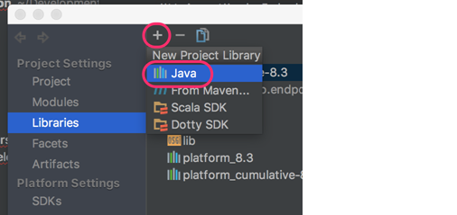

## OSGi Development with IntelliJ IDEA

<h3 style="color: grey;">Table of Contents</h3>
<ol class="table_of_contents">
	<li><a href="#createproject">Create Project</a></li>
	<li><a href="#debug">Running debug with IntelliJ IDEA</a></li>
	<li><a href="#test">Test</a></li>
</ol>

### Create Project

1. Select **Create New Project** (**File** > **New** > **Project**).

2. Select **Empty Project** and click **Next**.

  

3. Name the project, select the location to store it in, and then click **Finish**.

4. Add all required modules to the newly created project. Open the **Module** settings and then, in the left column, select **Libraries**.

  

5. Click the **+** icon.

  

6. Select the **Java** option.

7. Go to the folder of the installation and select the required library ({install_dir}/lib/api/8.3.0). Click **Open**.

8. Repeat for all required libraries.

9. When done, click **OK**.

After indexing, the projects should be compiled.

<a href="#top">Back to top</a>

### Running debug with IntelliJ IDEA

1. From the **Run** option, select **Edit Configurations**.

2. Select the **+** option and select **Remote**.

  

3. Name the **Run** configuration and select the debug port that the server will be running on, as shown below.

  

<a href="#top">Back to top</a>

### Test

Click in the border of the code to add a breakpoint.

<a href="#top">Back to top</a>
