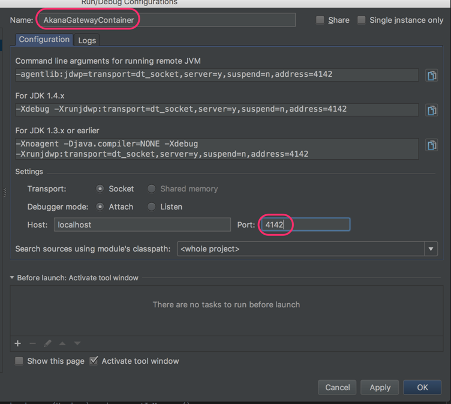

## OSGi Development with IntelliJ IDEA

### Create Project

Select **Create New Project** (**File** -> **New** -> **Project**)

Select **Empty Projec**t and click **Next**.

Name the project, select the location to store it in, and then click **Finish**.

Add all required modules to the newly created project. Open the **Module** settings and then, in the left column, select **Libraries**.

Click the '+' icon.

Select the **Java** option.

Go to the folder of the installation and select the required library (<install_dir>/lib/api/8.3.0). Click **Open**.

Repeat for all required libraries.

When done, click **OK**.

After indexing, the projects should be compiled.

### Running debug with IntelliJ IDEA

From the **Run optio**n, select **Edit Configurations**.
Select the **+** option and select **Remote**.

Name the **Run** configuration and select the debug port that the server will be running on:

Test. Click in the border of the code to add a breakpoint.
