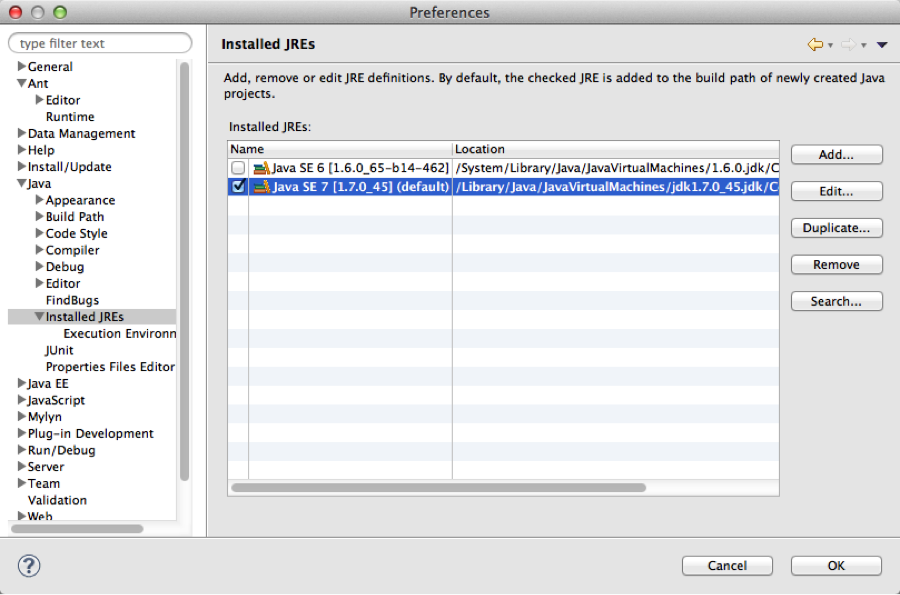
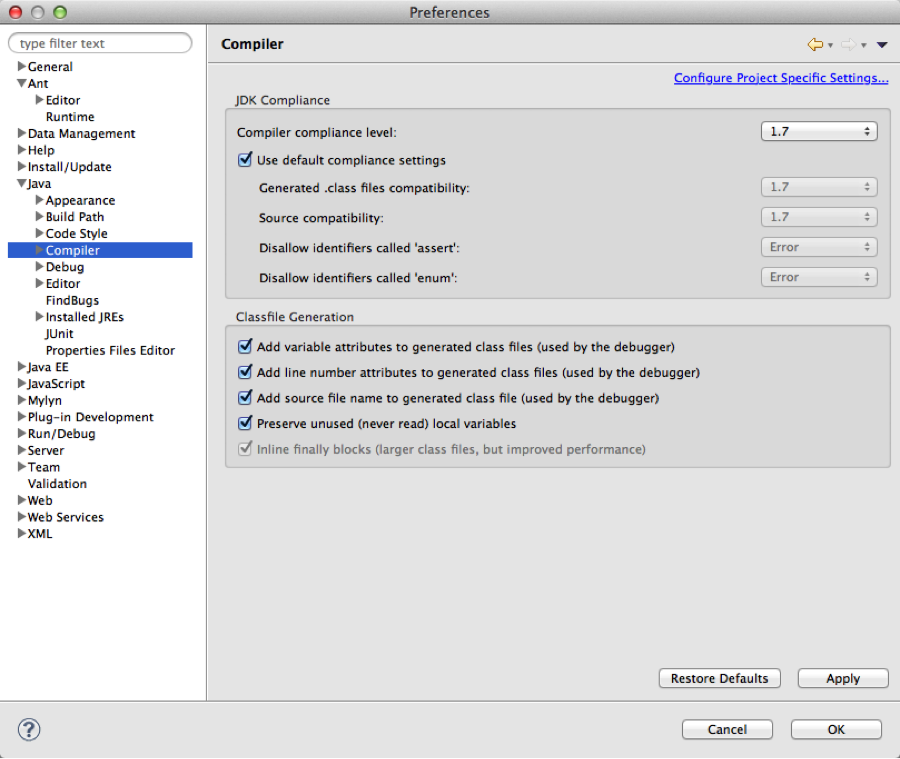
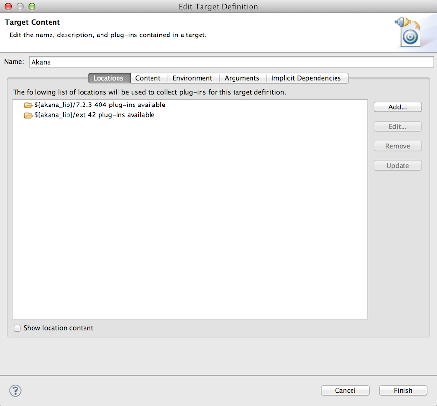

Eclipse Workspace Setup
-------------------------------------

<h3 style="color: grey;">Table of Contents</h3>
<ol class="table_of_contents">
	<li><a href="#introduction">Overview</a></li>
	<li><a href="#java">Configure the default JRE</a></li>
	<li><a href="#osgi">Configure the OSGi Target Platform</a></li>
</ol>

### Overview

This document describes how to set up an Eclipse workspace for platform development. This includes custom policies and activities for the API Gateway.

#### Prerequisites

* This configuration guide assumes that you’ve already installed the platform. If you need help installing the platform, please see the [install guide](http://docs.akana.com/sp/assets/SOA_Software_Platform_Install_Guide_v70.pdf). 
* Install the **Eclipse IDE for Java EE Developers**. At the time of writing, Luna is the latest version, available at [http://www.eclipse.org/downloads/packages/eclipse-ide-java-ee-developers/lunasr2](http://www.eclipse.org/downloads/packages/eclipse-ide-java-ee-developers/lunasr2)

### Configure the default JRE

1. Download and install a Java JDK v1.7 or greater. Set it as the default in Eclipse by selecting **Preferences -> Java -> Installed JREs**. Add the installed JDK and select the checkbox, making it the default.

	

2. Configure the compiler compliance level for 1.7 by selecting **Preferences -> Java -> Compiler**. Choose 1.7 from the dropdown as follows:

	
	
### Configure the OSGi Target Platform

The Akana Platform is based on OSGi, and any custom development is therefore built as a plug-in. To facilitate this, a Target Platform must be configured.

1. Create a new Target Platform by selecting **Preferences -> Plug-in Development -> Target Platform**. Click **Add..**.
2. Initialize the target definition with **Nothing**. Click **Next >**.
3. Specify a name, such as 'Akana'. Click **Add..**.
4. Select **Directory** as the source of plugins. Click **Next >**.
5. At this point, its advisable to create a reusable variable that points to the /lib directory of your platform installation. To do this, add a variable by clicking **Variables...**.
6. Add a new variable by clicking **Edit Variables...**. Click **New...**.
7. Fill in the name of your variable (e.g. akana_lib) and browse to the /lib directory of your platform installation. Click **OK**. Click **OK** again.
8. Select your new variable from the list and specify the appropriate suffix for your version of the container. e.g. {akana_lib}/7.2.3. Click **Finish**.
9. Repeat the process to add {akana_lib}/ext to the Target Definition. Click **Finish**.

Your Target Definition will look something like:

