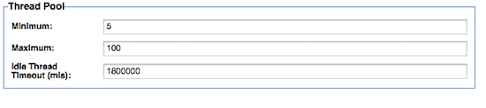

Akana Performance Tuning Guide
-------------------------------------

<h3 style="color: grey;">Table of Contents</h3>
<ol class="table_of_contents">
	<li><a href="#introduction">Introduction</a></li>
	<li><a href="#deployment-architecture">Deployment Architecture</a></li>
	<ol>
		<li><a href="#install-features-on-separate-containers">Installing features on separate containers</a></li>
		<li><a href="#separating-policy-manager-features">Splitting features into smaller, subordinate features</a></li>
		<li><a href="#data-archiving">Data archiving</a></li>
	</ol>
	<li><a href="#config-setting">Configuration Settings</a></li>
	<ol>
		<li><a href="#os-file-handles">Configuring OS File Handles</a></li>
		<li><a href="#jre-memory">Configuring the JVM memory settings</a></li>
		<li><a href="#listener-connection-pool">Configuring the container listeners</a></li>
		<li><a href="#client-connection-pool">Configuring the client connection pool</a></li>
	</ol>
	<li><a href="#less-important-settings">Less Important Settings</a></li>
	<ol>
		<li><a href="#gif-metrics">Calculating GIF metrics</a></li>
		<li><a href="#auto-search">Disabling auto-search</a></li>
		<li><a href="#require-metrics-policy">Internal service metrics calculations</a></li>
		<li><a href="#usage-writer">Configuring the Usage Writer</a></li>
	</ol>
</ol>

### <a name="introduction"></a>Introduction

Akana is a recognized leader in API Management and SOA Governance Automation solutions.  Our platform-independent solution set includes the API Gateway, which is further broken down into Policy Manager, the centralized administration console, and Network Director, an intermediary that integrates with Policy Manager to provide high-performance, scalable API security and management capabilities. The solution also includes Community Manager, which provides a branded developer portal for the consumption of API by the developer.

This document describes the performance tuning parameters for Akana’s API Gateway and Community Manager products. 

### <a name="deployment-architecture"></a>Deployment Architecture
There are several optional deployment choices that can improve the performance of the product.

#### <a name="install-features-on-separate-containers"></a>Installing features on separate containers
API traffic and Internal and External Web traffic should be handled on separate containers to facilitate the independent scaling of these capabilities. To this end, the 'SOA Software Network Director', 'SOA Software Community Manager' and 'SOA Software Policy Manager Console' features should be installed on different containers. 

You may also want to dedicate containers for the 'SOA Software Policy Manager Services' feature. This feature provides the backend APIs to support the Network Directors and is often installed in the same containers as the 'SOA Software Policy Manager Console' and/or 'SOA Software Community Manager' features. The decision to install it on its own container can be driven by security requirements (e.g. network topology) or the minimization of load on the Web traffic containers. 


#### <a name="separating-policy-manager-features"></a>Splitting features into smaller, subordinate features

Akana has further provided the ability to split certain features that would typically be installed on a single container into sub-ordinate features that can be installed on separate containers.

There are currently two features that can be split up this way:

* The 'SOA Software Policy Manager Services' feature is comprised of three separate sub-ordinate features:
  * SOA Software Managed Services - Installs the Policy Manager system services
  * SOA Software Security Services - Installs Policy Manager security-related services
  * SOA Software Scheduled Jobs - Installs a series of system background jobs that are executed by the Policy Manager job scheduler
* The 'SOA Software Community Manager' feature is comprised of two separate sub-ordinate features:
  * SOA Software Community Manager Scheduled Jobs - This feature enables Community Manager scheduled jobs on the container
  * SOA Software Community Manager APIs - This feature deploys Community Manager APIs in the container

**Notes:**

1. All Schedule jobs features should be in the same container. This means that 'SOA Software Scheduled Jobs' and 'SOA Software Community Manager Scheduled Jobs' must be installed together into containers. Installing any one scheduled job feature will start the Quartz scheduler and could cause it to run all schedule jobs resulting in failures.
2. The Community Manager theme features (e.g. 'SOA Software Community Manager Simple Developer Theme' and 'SOA Software Community Manager Default Theme') must be installed together with the 'SOA Software Community Manager APIs' feature into containers. 


### <a name="config-setting"></a>Configuration Settings

This section covers settings in the product related to performance tuning.

#### <a name="os-file-handles"></a>Configuring OS File Handles

On *nix operating systems, every inbound and outbound connection is assigned a file handle. By default, some systems have a small number of file handles assigned (e.g. 1024) which is insufficient. We recommend setting the number of file handles to a minimum of 100000. Configuring this differs between operating systems so you should consult with your SysAdmin. The following steps are for RedHat systems:

To get the maximum open files count allowed:

```
cat /proc/sys/fs/file-max
```

To set the maximum open files count allowed:

```
echo 100000 > /proc/sys/fs/file-max
```

To make the change permanent, add or change the following line in the file /etc/sysctl.conf. This file is used during the boot process.

```
echo "fs.file-max= 100000" >> /etc/sysctl.conf
```

**Scope**: All Containers

#### <a name="jre-memory"></a>Configuring the JVM memory settings

Generally we do not advise changing the JVM memory settings. A better approach is to install more containers and load-balance across them. This is due to the overhead incurred in managing the increased memory. The container ships with the following defaults:

* For 32 bit machines: -Xmx1024M -XX:MaxPermSize=192M
* For 64 bit machines: -Xmx2048M -XX:MaxPermSize=256M

These settings are defined in the startup batch or shell scripts in the /bin directory.

If you decide to increase the JVM memory settings anyway, always increase the MaxPermSize in proportion to the memory allocated and do not exceed 4096M. e.g. -Xmx4096M -XX:MaxPermSize=512M

**Scope**: All Containers

#### <a name="listener-connection-pool"></a>Configuring the container listeners

The listener thread pool size dictates the number of concurrent inbound connections that the container can handle.

**Scope**: All Containers

In the Policy Manager Console, navigate to the appropriate container and select 'Modify Container Listener' from within the 'Inbound Listeners' section. You will be presented with configure the following:



The only parameter that is typically modified is 'Maximum' It should be set to a value high enough to support the number of concurrent connections. This is different depending on the features installed in each container:

* SOA Software Network Director - this value is typically the same as the maxTotal value set in the client connection pool. This is because the Network Director is a proxy and the ratio of inbound to outbound connections is typically 1:1.
* SOA Software Community Manager (specifically the 'SOA Software Community Manager APIs' feature) - this value should be set based on the number of hits per second. If the 'SOA Software Community Manager OAuth Provider' feature is installed, the number of hits to the OAuth server should also be accounted for. **A general rule of thumb is to assume a minimum of 1 thread for every 10 concurrent users.**
* SOA Software Policy Manager Console - this value should be set to the number of concurrent active users of the Policy Manager user interface.
* SOA Software Policy Manager Services (specifically the 'SOA Software Managed Services' feature) - this value should only be changed on rare occasions where there are a very large number of Network Directors in the environment. **A good rule of thumb is 10 threads per Network Director.**

#### <a name="client-connection-pool"></a>Configuring the client connection pool

The client connection pool controls the number of simultaneous outbound connections from the container. It typically only requires tuning in the Network Director.

The maximum number of connections required in the pool is determined by two factors:

* Latency of the downstream API/Service
* Number of transactions per second

For example, if you are expecting 200tps for a single API/Service that has a downstream latency of 3 seconds, you will need to increase maxConnectionsPerHost to 600 to handle the load. Adding up all the traffic across all routes will determine the maxTotal value.

**Scope**: Network Director Containers

In the admin console, configure the following (values shown as an example):

```
com.soa.http.client.core -> 
http.connection.manager.maxTotal = 2000

com.soa.http.client.core -> 
http.connection.manager.defaultMaxPerRoute = 1500
```

### <a name="less-important-settings"></a>Less important settings

This section covers tuning parameters that are used less often. The default settings will work in the majority of environments.

#### <a name="gif-metrics"></a>GIF metrics

GIF (Governance Interoperability Framework) is a legacy UDDI standard for publishing metrics. By default this value is set to 'false' and the Policy Manager does not calculate these metrics, but this can be configured:

**Scope**: Containers running the 'SOA Software Managed Services' feature, which is subordinate to the 'SOA Software Policy Manager Services' feature.

In the admin console, configure the following:

```
com.soa.service.category -> 
service.category.manager.transactional.loadGifMetrics = false
```

#### <a name="auto-search"></a>Disabling auto-search

This property controls the behavior of the Policy Manager Console (Workbench Tab) when its loaded. By default this value is set to true and a search is executed to display all the APIs/Services in the system. If there are a large number of services this default search can take a while and should be disabled.

**Scope**: Containers running the 'SOA Software Policy Manager Console' feature.

In the admin console, configure the following:

```
com.soa.console -> 
workbench.search.PerformAutoSearch=true
```

#### <a name="require-metrics-policy"></a>Internal service metrics calculations

By default, the Policy Manager records performance metrics for its own internal services. This will add volumes of data to the database if not cleaned out regularly. If these metrics are not important, you can disable the default metrics collection (thereby requiring the explicit assignment of the metric policy) by setting the config parameter to 'true'. This setting is slightly counter-intuitive.

**Scope**: Containers running the 'SOA Software Managed Services' feature, which is subordinate to the 'SOA Software Policy Manager Services' feature.

In the admin console, configure the following:

```
com.soa.metrics -> 
metrics.rollup.reporter.requireMetricsPolicy=true
```

#### <a name="usage-writer"></a>Configuring the Usage Writer

The Usage Writer is an in-memory queue and batch writing mechanism to store usage data, recorded messages and metrics in the database. 

**Scope**: 

1. Network Director Containers that are writing usage to the database. (```com.soa.monitor.usage -> usage.database.writer.enabled=true```)
2. In the case that the Remote Usage Writer is used by the Network Director (```com.soa.monitor.usage -> usage.remote.writer.enabled=true```), you would configure the Usage Writer on containers running the 'SOA Software Managed Services' feature, which is subordinate to the 'SOA Software Policy Manager Services' feature.

The most important parameters controlling the Usage Writer are:

```
com.soa.monitor.usage ->
usage.queue.capacity=10000

com.soa.monitor.usage ->
usage.batch.writer.usageBatchSize=50

com.soa.monitor.usage ->
usage.batch.writer.writeInterval
``` 

The 'com.soa.monitor.usage' property is the one that in most cases causes issues with high volumes of traffic. If the Usage Writer cannot write to the database quickly enough, the usage queue will fill up over time. If each record has two recorded messages of 5kB each, the queue will occupy 100MB of memory. To avoid the queue from filling up the following actions can be taken:

1. Improving database write performance
2. Adding additional Network Directors (if the Network Director is connecting to the database directly (default)) or additional Policy Manager instances (if the remote usage writer is being used).
2. Increasing the usageBatchSize by small increments 
3. Decreasing the writeInterval by small decrements

