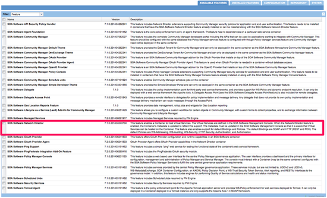

SOA Software Platform Hardening Guide
-------------------------------------

<h3 style="color: grey;">Table of Contents</h3>
<ol class="table_of_contents">
	<li><a href="#introduction">Introduction</a></li>
	<li><a href="#deployment-architecture">Deployment Architecture</a></li>
	<ol>
		<li><a href="#install-network-director-on-a-separate-container">Install Network Director on a separate container</a></li>
		<li><a href="#install-internet-facing-and-administration-applications-on-separate-containers">Install Internet-facing and administration applications on separate containers</a></li>
		<li><a href="#configure-all-listeners-internal-and-external-as-htts-only">Configure all listeners, internal and external as HTTPS only</a></li>
		<li><a href="#config-admin-sep-port">Configure the Admin console (/admin) on a separate port</a></li>
	</ol>
	<li><a href="#config-setting">Configuration Settings</a></li>
	<ol>
		<li><a href="#jre-unlimited-strength">Add the unlimited strength policy to the JDK</a></li>
		<li><a href="#ignore-cookies">Configure the product to ignore downstream cookies</a></li>
		<li><a href="#secure-cookies">Configure secure cookies</a></li>
		<li><a href="#restrict-cipher-suites">Restrict the cipher suites used/a></li>
		<li><a href="#nd-header-propagation">Header Propagation in Network Director</a></li>
		<li><a href="#cm-header-propagation">Header Propagation in Community Manager Subsystem</a></li>
		<li><a href="#credential-cache">Tune the API Security Credential Cache</a></li>
	</ol>
</ol>

### <a name="introduction"></a>Introduction

SOA Software is a recognized leader in API Management and SOA Governance Automation solutions.  Our platform-independent solution set includes the API Gateway, which is further broken down into Policy Manager, the centralized administration console, and Network Director, an intermediary that integrates with Policy Manager to provide high-performance, scalable API security and management capabilities. The solution also includes Community Manager, which provides a branded developer portal for the consumption of API by the developer.

This document describes the best practices and configuration settings to harden SOA Software’s API Gateway and Community Manager products. This document is a supplement to SOA Software’s existing “Product Architecture” document showing recommendations for a typical large enterprise.

### <a name="deployment-architecture"></a>Deployment Architecture
There are several best practices that cover the deployment of the product in a hardened environment.

#### <a name="install-network-director-on-a-separate-container"></a>Install Network Director on a separate container
API traffic processing should be handled separately from Web traffic and Admin traffic. To this end, the Network Director should not be installed on the same container as Community Manager, or Policy Manager features:



#### <a name="install-internet-facing-and-administration-applications-on-separate-containers"></a>Install Internet-facing and administration applications on separate containers

There are two components to this:
1.	The Community Manager should not be installed on the same container as Policy Manager Console
2.	The Community Manager User Interface and APIs provide both consumer-facing and administrative functions. If needed by your security constraints, the administrative functions can be disabled in Community Manager. This will allow you to install different instances of Community Manager on different containers – and disable the administration functionality in the Internet-facing instance. 

To disable the administrative functionality in the Community Manager:

In the admin console, configure the following:

```
com.soa.atmosphere ->
atmosphere.config.denyUserRoles=SiteAdmin,BusinessAdmin,ApiAdmin,System Administrator,Security Administrator,Site Administrator
```

#### <a name="configure-all-listeners-internal-and-external-as-htts-only"></a>Configure all listeners, internal and external as HTTPS only

This is accomplished in two places in the product. Firstly, the listeners for the applications in the container are configured from within Policy Manager at Containers->[container_name]->Details->Inbound Listeners. Options for configuring port and PKI are available. Settings for two-way SSL mutual authentication are also available. It is recommended that either the “Accept client certificates” or “Require client certificates” be selected based on customer security requirements

Secondly, when the container starts up, it supports an Admin application (/admin). The port and associated transport settings for the Admin application are configurable in the /instances/[container_name]/system.properties file for each container. To avoid any confusion with keys and certificates, it is recommended that the Admin application’s SSL settings be changed only after the main container listeners have been configured for SSL.

**Scope**: All Containers

```
#Config for pm
#Thu Jul 10 23:47:51 PDT 2014
product.home=file\:/Users/example/soa/sm70/
org.eclipse.jetty.server.Request.maxFormContentSize=500000
felix.cm.dir=${felix.cache.rootdir}/cm
org.osgi.service.http.port.secure=9900
com.soa.provision.file.dir=${felix.cache.rootdir}/deploy
product.home.dir=/Users/alistairfarquharson/soa/b962/sm70
com.soa.snapshot.directory=${felix.cache.rootdir}/snapshot
com.soa.provision.noInitialDelay=true
com.soa.http.host=127.0.0.1
com.soa.http.bind.all=false
com.soa.provision.bundles.start=true
com.soa.provision.poll=2000
org.eclipse.jetty.servlet.SessionCookie=JSESSIONID_pm
felix.shutdown.hook=false
container.name=[container_name]
```

Note above the *.secure syntax used for the settings.

Once all of these SSL listener configurations have been validated, the container’s original HTTP listeners can be deleted using the Policy Manager Console. Note that when deleting HTTP listeners for a container running the Policy Manager Services feature, it is necessary to add that container listener’s X.509 certificate to the “bootstrap keystore” of all Network Director containers. More information on this configuration task can be found in the Support Knowledgebase.

#### <a name="config-admin-sep-port"></a>Configure the Admin console (/admin) on a separate port

As shown above, this is configurable in the /instances/[container_name]/system.properties file for each container. The Admin console (/admin) and the other features installed in the container should ideally not be configured on the same port. This will allow you to isolate the Admin console from the Internet.

The system.properties file is updated with the following highlighted properties and also requires a configuration file placed in the container’s deploy directory (i.e /sm70/instances/[container]/deploy) to ensure the Admin console is only accessed from the defined port and host. 

**Scope**: All Containers

```
#Config for pm
#Thu Jul 10 23:47:51 PDT 2014
product.home=file\:/Users/example/soa/sm70/
org.eclipse.jetty.server.Request.maxFormContentSize=500000
felix.cm.dir=${felix.cache.rootdir}/cm
org.osgi.service.http.port.secure=14443
com.soa.provision.file.dir=${felix.cache.rootdir}/deploy
product.home.dir=/Users/alistairfarquharson/soa/b962/sm70
com.soa.snapshot.directory=${felix.cache.rootdir}/snapshot
com.soa.provision.noInitialDelay=true
com.soa.http.host=10.1.1.2
com.soa.http.bind.all.secure=false
com.soa.provision.bundles.start=true
com.soa.provision.poll=2000
org.eclipse.jetty.servlet.SessionCookie=JSESSIONID_pm
felix.shutdown.hook=false
container.name=[container_name]
```

In this configuration, the Admin console (/admin) would only be accessible via SSL on IP address 10.1.1.2, port 14443.
It is further possible to eliminate exposing the Admin console (/admin) to the network at all. The Admin console can be configured so that it is only bound to the “localhost” address and not exposed outside the local system. To enable this configuration, modify the above properties to include these values:

```
com.soa.http.host.secure=127.0.0.1
```

The configuration file to restrict the Admin console access must be named:  *com.soa.admin.console.cfg*.  The contents of this file is as shown below.  The *admin.console.access.restricted* property must be set to *true* to restrict the Admin Console access.  The other two properties are optional depending on the specific security requirements.

```
# Set access to the Admin Console on the localhost interface only
admin.console.localhost.only=false

# Restrict the Admin Console access to the port and interface
# defined in the system.properties
admin.console.access.restricted=true

# Hides the Admin domain from the Admin Console login
admin.console.domain.enabled=true
```

The most common way of accessing the Admin console in this configuration is using SSH port tunneling.

### <a name="config-setting"></a>Configuration Settings

This section covers settings and tuning parameters in the product related to hardening.

#### <a name="jre-unlimited-strength"></a>Add the unlimited strength policy to the JDK

To support long passwords when importing PKI from Java Keystores, you will need to install the Java Cryptography Extension (JCE) Unlimited Strength Jurisdiction Policy Files. This is dependent on the JRE version being used and is available from Oracle. To install, copy the US_export_policy.jar and local_policy.jar files to the /lib/security directory for the JRE. 

**Scope**: All Containers

#### <a name="ignore-cookies"></a>Configure the product to ignore downstream cookies

This prevents the product from automatically storing and forwarding any cookies retrieved from the downstream APIs and Services.

**Scope**: All Containers

In the admin console, configure the following:

```
com.soa.http.client.core ->
http.client.params.cookiePolicy=ignoreCookies
```

#### <a name="secure-cookies"></a>Configure secure cookies

This sets the product to only use secure cookies. 

**Scope**: All Containers

In the admin console, configure the following:

```
com.soa.transport.jetty ->
session.manager.factory.secureCookies=true
```

#### <a name="restrict-cipher-suites"></a>Restrict the cipher suites used

Use only stronger cipher suites for SSL

**Scope**: All Containers

In the admin console, configure the following:

```
com.soa.transport.jetty ->
http.incoming.transport.config.cipherSuites=SSL_RSA_WITH_RC4_128_MD5,SSL_RSA_WITH_RC4_128_SHA,TLS_RSA_WITH_AES_128_CBC_SHA,TLS_DHE_DSS_WITH_AES_128_CBC_SHA,SSL_RSA_WITH_3DES_EDE_CBC_SHA,SSL_DHE_DSS_WITH_3DES_EDE_CBC_SHA
```

#### <a name="nd-header-propagation"></a>Header Propagation in Network Director

Prevent the automatic propagation of certain HTTP headers through the Network Director and also configure a translation of the X-Forwarded-Host header. 

**Scope**: Network Director Containers

In the admin console, configure the following:

```
com.soa.http.client.core ->
block.headers.interceptor.blocked=content-type,content-length,content-range,content-md5,host,expect,keep-alive,connection,transfer-encoding,atmo-forward-to,atmo-forwarded-from

header.formatter.interceptor.templates=replace=X-Forwarded-Host:{host}
```

#### <a name="cm-header-propagation"></a>Header Propagation in Community Manager Subsystem

Prevent the automatic propagation of certain HTTP headers through the Network Director and also configure a NULL (none) translation of the X-Forwarded-Host header. 

**Scope**: Community Manager Containers

In the admin console, configure the following:

```
com.soa.http.client.core ->
block.headers.interceptor.blocked=content-type,content-length,content-range,content-md5,host,expect,keep-alive,connection,transfer-encoding

header.formatter.interceptor.templates=
```

#### <a name="credential-cache"></a>Tune the API Security Credential Cache

You can configure the expiration period and refresh time for the security cache for API calls.

**Scope**: Network Director Containers

In the admin console, optionally configure the following:

```
com.soa.api.security ->
com.soa.api.security.cache.expirationPeriod=3600000
com.soa.api.security.cache.refreshTime=300000
```