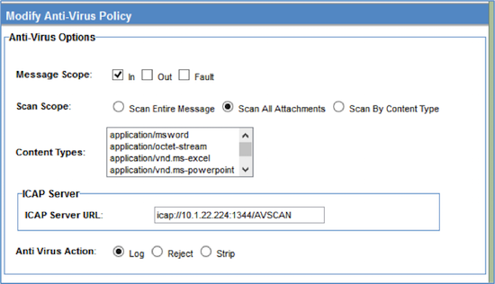
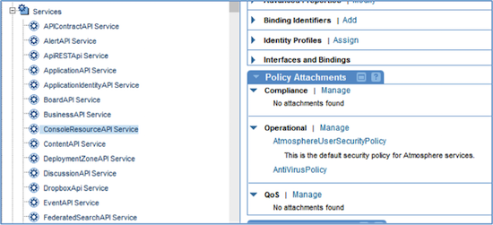

SOA Software Platform Hardening Guide
-------------------------------------

<h3 style="color: grey;">Table of Contents</h3>
<ol class="table_of_contents">
	<li><a href="#introduction">Introduction</a></li>
	<li><a href="#deployment-architecture">Deployment Architecture</a></li>
	<ol>
		<li><a href="#install-internet-facing-and-administration-application-on-separate-containers">Install Internet-facing and Administration Applications on Separate Containers</a></li>
		<li><a href="#install-network-director-on-a-separate-container">Install Network Director on a separate container</a></li>
		<li><a href="#install-internet-facing-and-administration-applications-on-separate-containers">Install Internet-facing and administration applications on separate containers</a></li>
		<li><a href="#configure-all-listeners-internal-and-external-as-htts-only">Configure all listeners, internal and external as HTTPS only</a></li>
		<li><a href="#config-admin-sep-port">Configure the Admin console (/admin) on a separate port</a></li>
	</ol>
	<li><a href="#config-setting">Configuration Settings</a></li>
	<ol>
		<li><a href="#jre-unlimited-strength">Add the unlimited strength policy to the JDK</a></li>
		<li><a href="#ignore-cookies">Configure the product to ignore downstream cookies</a></li>
		<li><a href="#secure-cookies">Configure secure cookies</a></li>
		<li><a href="#disabling-sslv3">Disabling SSLv3</a></li>
		<li><a href="#restrict-cipher-suites">Restrict the cipher suites used/a></li>
		<li><a href="#prevent-forward-proxying">Prevent Forward Proxying/a></li>
		<li><a href="#nd-header-propagation">Header Propagation in Network Director</a></li>
		<li><a href="#cm-header-propagation">Header Propagation in Community Manager Subsystem</a></li>
		<li><a href="#credential-cache">Tune the API Security Credential Cache</a></li>
		<li><a href="#configure-the-anti-virus-policy-to-scan-for-uploaded-files">Configure the Anti-virus Policy to scan for uploaded files</a></li>
		<li><a href="#enabling-csrf-protection">Enabling CSRF protection</a></li>
		<li><a href="#adding-xss-exclusions">Adding XSS exclusions</a></li>
		<li><a href="#turning-off-user-account-enumeration">Turning off User Account Enumeration</a></li>
		<li><a href="#configuring-challenge-questions-and-answers">Configuring Challenge Questions and Answers</a></li>
		<li><a href="#disallowing-user-profile-modification">Disallowing User Profile Modification</a></li>
		<li><a href="#configuring-account-login-rules">Configuring Account Login Rules</a></li>
		<li><a href="#configuring-password-complexity-rules">Configuring Password Complexity Rules</a></li>
		<li><a href="#configuring-x-frame-options-header">Configuring X-FRAME-OPTIONS Header</a></li>
	</ol>
</ol>

### <a name="introduction"></a>Introduction

SOA Software is a recognized leader in API Management and SOA Governance Automation solutions.  Our platform-independent solution set includes the API Gateway, which is further broken down into Policy Manager, the centralized administration console, and Network Director, an intermediary that integrates with Policy Manager to provide high-performance, scalable API security and management capabilities. The solution also includes Community Manager, which provides a branded developer portal for the consumption of API by the developer.

This document describes the best practices and configuration settings to harden SOA Software’s API Gateway and Community Manager products. This document is a supplement to SOA Software’s existing “Product Architecture” document showing recommendations for a typical large enterprise.

### <a name="deployment-architecture"></a>Deployment Architecture
There are several best practices that cover the deployment of the product in a hardened environment.

An external HSM keystore can be used in place of the out of the box Policy Manager keystore (database).  The configuration of Policy Manager with HSM is described in a separate document.

#### <a name="install-network-director-on-a-separate-container"></a>Install Network Director on a Separate Container
API traffic processing should be handled separately from Web traffic and Admin traffic. To this end, the Network Director should not be installed on the same container as Community Manager, or Policy Manager features:


#### <a name="install-internet-facing-and-administration-applications-on-separate-containers"></a>Install Internet-facing and administration applications on separate containers

There are two components to this:
1.	The Community Manager should not be installed on the same container as Policy Manager Console
2.	The Community Manager User Interface and APIs provide both consumer-facing and administrative functions. If needed by your security constraints, the administrative functions can be disabled in Community Manager. This will allow you to install different instances of Community Manager on different containers – and disable the administration functionality in the Internet-facing instance. 

To disable the administrative functionality in the Community Manager:

In the admin console, configure the following:

```
com.soa.atmosphere ->
atmosphere.config.denyUserRoles=SiteAdmin,BusinessAdmin,ApiAdmin,System Administrator,Security Administrator,Site Administrator
```

#### <a name="configure-all-listeners-internal-and-external-as-htts-only"></a>Configure all listeners, internal and external as HTTPS only

This is accomplished in two places in the product. Firstly, the listeners for the applications in the container are configured from within Policy Manager at Containers->[container_name]->Details->Inbound Listeners. Options for configuring port and PKI are available. Settings for two-way SSL mutual authentication are also available. It is recommended that either the “Accept client certificates” or “Require client certificates” be selected based on customer security requirements

**Scope**: All Containers

```
#Config for pm
#Thu Jul 10 23:47:51 PDT 2014
product.home=file\:/Users/example/soa/sm70/
org.eclipse.jetty.server.Request.maxFormContentSize=500000
felix.cm.dir=${felix.cache.rootdir}/cm
org.osgi.service.http.port.secure=9900
com.soa.provision.file.dir=${felix.cache.rootdir}/deploy
product.home.dir=/Users/alistairfarquharson/soa/b962/sm70
com.soa.snapshot.directory=${felix.cache.rootdir}/snapshot
com.soa.provision.noInitialDelay=true
com.soa.http.host=127.0.0.1
com.soa.http.bind.all=false
com.soa.provision.bundles.start=true
com.soa.provision.poll=2000
org.eclipse.jetty.servlet.SessionCookie=JSESSIONID_pm
felix.shutdown.hook=false
container.name=[container_name]
```

Note above the *.secure syntax used for the settings.

Secondly, the listeners for the applications in the container are configured from within Policy Manager at Containers->[container_name]->Details->Inbound Listeners. Options for configuring port and PKI are available.

#### <a name="config-admin-sep-port"></a>Configure the Admin console (/admin) on a separate port

As shown above, this is configurable in the /instances/[container_name]/system.properties file for each container. The Admin console (/admin) and the other features installed in the container should ideally not be configured on the same port. This will allow you to isolate the Admin console from the Internet.

The system.properties file is updated with the following highlighted properties and also requires a configuration file placed in the container’s deploy directory (i.e /sm70/instances/[container]/deploy) to ensure the Admin console is only accessed from the defined port and host. 

**Scope**: All Containers

```
#Config for pm
#Thu Jul 10 23:47:51 PDT 2014
product.home=file\:/Users/example/soa/sm70/
org.eclipse.jetty.server.Request.maxFormContentSize=500000
felix.cm.dir=${felix.cache.rootdir}/cm
org.osgi.service.http.port.secure=14443
com.soa.provision.file.dir=${felix.cache.rootdir}/deploy
product.home.dir=/Users/alistairfarquharson/soa/b962/sm70
com.soa.snapshot.directory=${felix.cache.rootdir}/snapshot
com.soa.provision.noInitialDelay=true
com.soa.http.host=10.1.1.2
com.soa.http.bind.all.secure=false
com.soa.provision.bundles.start=true
com.soa.provision.poll=2000
org.eclipse.jetty.servlet.SessionCookie=JSESSIONID_pm
felix.shutdown.hook=false
container.name=[container_name]
```

### <a name="config-setting"></a>Configuration Settings

This section covers settings and tuning parameters in the product related to hardening.

#### <a name="jre-unlimited-strength"></a>Add the unlimited strength policy to the JDK

To support long passwords when importing PKI from Java Keystores, you will need to install the Java Cryptography Extension (JCE) Unlimited Strength Jurisdiction Policy Files. This is dependent on the JRE version being used and is available from Oracle. To install, copy the US_export_policy.jar and local_policy.jar files to the /lib/security directory for the JRE. 

**Scope**: All Containers

#### <a name="ignore-cookies"></a>Configure the product to ignore downstream cookies

This prevents the product from automatically storing and forwarding any cookies retrieved from the downstream APIs and Services.

**Scope**: All Containers

In the admin console, configure the following:

```
com.soa.http.client.core ->
http.client.params.cookiePolicy=ignoreCookies
```

#### <a name="secure-cookies"></a>Configure secure cookies

This sets the product to only use secure cookies. 

**Scope**: All Containers

In the admin console, configure the following:

```
com.soa.transport.jetty ->
session.manager.factory.secureCookies=true
```

#### <a name="disabling-sslv3"></a>Disabling SSLv3

This configures the product to disable SSLv3.

**Scope**: All Containers

In the admin console, configure the following:

```
com.soa.transport.jetty ->
http.incoming.transport.config.enabledProtocols=SSLv2HELLO,TLSv1,TLSv1.1, TLSv1.2
```
#### <a name="restrict-cipher-suites"></a>Restrict the cipher suites used

Use only stronger cipher suites for SSL

**Scope**: All Containers

In the admin console, configure the following:

```
com.soa.transport.jetty ->
http.incoming.transport.config.cipherSuites=SSL_RSA_WITH_RC4_128_MD5,SSL_RSA_WITH_RC4_128_SHA,TLS_RSA_WITH_AES_128_CBC_SHA,TLS_DHE_DSS_WITH_AES_128_CBC_SHA,SSL_RSA_WITH_3DES_EDE_CBC_SHA,SSL_DHE_DSS_WITH_3DES_EDE_CBC_SHA
```

#### <a name="prevent-forward-proxying"></a>Prevent Forward Proxying

Prevent unauthenticated users from initiating arbitrary internal connections from the Community Manager portal.

**Scope**: Community Manager Containers

In the admin console, configure the following:

```
com.soa.atmosphere.forwardproxy ->
forward.proxy.allowedHosts=<Network Director Host(s) and/or Load Balancer host>
```

Values are comma separated.

#### <a name="nd-header-propagation"></a>Header Propagation in Network Director

Prevent the automatic propagation of certain HTTP headers through the Network Director and also configure a translation of the X-Forwarded-Host header. 

**Scope**: Network Director Containers

In the admin console, configure the following:

```
com.soa.http.client.core ->
block.headers.interceptor.blocked=content-type,content-length,content-range,content-md5,host,expect,keep-alive,connection,transfer-encoding,atmo-forward-to,atmo-forwarded-from

header.formatter.interceptor.templates=replace=X-Forwarded-Host:{host}
```

#### <a name="cm-header-propagation"></a>Header Propagation in Community Manager Subsystem

Prevent the automatic propagation of certain HTTP headers through the Network Director and also configure a NULL (none) translation of the X-Forwarded-Host header. 

**Scope**: Community Manager Containers

In the admin console, configure the following:

```
com.soa.http.client.core ->
block.headers.interceptor.blocked=content-type,content-length,content-range,content-md5,host,expect,keep-alive,connection,transfer-encoding

header.formatter.interceptor.templates=
```

#### <a name="credential-cache"></a>Tune the API Security Credential Cache

You can configure the expiration period and refresh time for the security cache for API calls.

**Scope**: Network Director Containers

In the admin console, optionally configure the following:

```
com.soa.api.security ->
com.soa.api.security.cache.expirationPeriod=3600000
com.soa.api.security.cache.refreshTime=300000
```

#### <a name="configure-the-anti-virus-policy-to-scan-for-uploaded-files"></a>Configure the Anti-virus Policy to scan for uploaded files

The Anti-virus policy scans for files that are uploaded from the Community Manager Portal.

**Scope**: All Community Manager Containers

In the Policy Manager Console, create an Anti-Virus Operational Policy and configure the policy.



Attach this policy to the ConsoleResourceAPIService and the ContentAPIService in the SOA Software Policy Manager -> SOA Software Community Manager node in the Policy Manager Console Organization tree.  



#### <a name="enabling-csrf-protection"></a>Enabling CSRF Protection

You can enable and disable CSRF protection in the Policy Manager and Community Manager User Interfaces.

***Scope***:  All Community Manager and Policy Manager Containers

Due to the fact that Policy Manager is not Internet-facing, it is disabled by default. You can enable the CSRF protection in the Policy Manager in the admin console:

```
com.soa.console.csrf ->
org.owasp.csrfguard.Enabled=true
```

In Community Manager, CSRF configuration can be found under Administration -> Config -> Security Settings:


#### <a name="adding-xss-exclusions"></a>Adding XSS exclusions

Cross-site-scripting (XSS) is an way to inject client-side script into Web pages viewed by other users. 

***Scope***:  All Community Manager and Policy Manager Containers

To configure any exceptions to the exclusion policy:

```
com.soa.console.xss ->
exceptionURLs=[COMMA DELIMITED LIST]
```

To configure any new keywords that should be excluded:

```
com.soa.console.xss ->
keywords=[COMMA DELIMITED LIST]
```

To turn XSS validation on/off:

```
com.soa.console.xss ->
validate=[true|false]
```

#### <a name="turning-off-user-account-enumeration"></a>Turning off User Account Enumeration

User Account Enumeration occurs when the Community Manager user interface provides direct feedback to a user during the signup and registration processes to the effect that a user account already exists or is already registered. If this is turned off, no useful feedback is provided to the user, minimizing the security risk, but decreasing usability.

***Scope***:  All Community Manager Containers

In Community Manager, User Account Enumeration configuration can be found under Administration -> Config -> Security Settings:


#### <a name="configuring-challenge-questions-and-answers"></a>Configuring Challenge Questions and Answers

Challenge Questions/Answers are often required to increase security around password reset. When signing up to the platform, the user must provide the answer to one or more security questions, if the platform is set up to require them. The user's answers are stored in the database, and the user must answer one or more security questions on demand to perform certain functions such as resetting a password or changing the user profile.

***Scope***:  All Community Manager Containers

In Community Manager, the Challenge Questions/Answers configuration can be found under Administration -> Config -> Users:

>Enforce Challenge Questions on Login -> Enabled

Additional settings can be found under Administration -> Config -> Security Settings:


Configuration of the actual questions available can be done via an [API call](http://docs.akana.com/cm/api/businesses/m_businesses_saveChallenges.htm) into the system.

#### <a name="disallowing-user-profile-modification"></a>Disallowing User Profile Modification

User Profile Modification permits a user access to their own profile for modification. In some circumstances, you may wish to prevent this (e.g. when user accounts are pre-provisioned).

***Scope***:  All Community Manager Containers

In Community Manager, User Profile Modification configuration can be found under Administration -> Config -> Security Settings:



#### <a name="configuring-account-login-rules"></a>Configuring Account Login Rules

The account login rules may include many options regarding failure attempts allowed, account suspension times, auto-login, etc.

***Scope***: Community Manager

These login policies may be set via an [API call](http://docs.soa.com/cm/api/businesses/m_businesses_updateLoginPolicy.htm) into the system or a direct DB query. 

If using a DB query, the syntax will be something like:

```
-- Login Rules
update LOGIN_RULES set MAXATTEMPTS=3, ATTEMPTSPERIOD=1, SUSPENSIONTIME=30, AUTO_LOGIN_EXT_DOMAIN=’com.soa.feature.enabled’ where TENANTID = (select TENANTID from TENANTS where FEDMEMBERID='[YOUR TENANT ID]');
```

#### <a name="configuring-password-complexity-rules"></a>Configuring Password Complexity Rules

Password requirements (rules) may include many options regarding length, special characters, etc.

***Scope***: Community Manager

These password rules may be set via an [API call](http://docs.soa.com/cm/api/businesses/m_businesses_updatePasswordPolicy.htm) into the system or a direct DB query.

If using a DB query, the syntax will be something like:

```
-- Password Rules
update PASSWORD_RULES set MINLENGTH=8, MAXLENGTH=20, MINLETTERS=1, MINNUMBERS=1, ALLOWEDSPECCHARS='%&_?#=-', CANCONTAINSPACES='N', ISCASESENSITIVE='N' where TENANTID = (select TENANTID from TENANTS where FEDMEMBERID='[YOUR TENANT ID]');
```

#### <a name="configuring-x-frame-options-header"></a>Configuring X-FRAME-OPTIONS Header

The X-FRAME-OPTIONS header plays a role in determining if and how the user interface can be embedded within an iFrame in a 3rd party site. 

***Scope***:  All Community Manager and Policy Manager Containers

To configure Community Manager:

```
com.soa.atmosphere.console ->
atmosphere.console.config.xFrameOptions=[DESIRED HEADER]
```

To configure Policy Manager:

```
com.soa.console.xss ->
xFrameOptions=[DESIRED HEADER]
```
