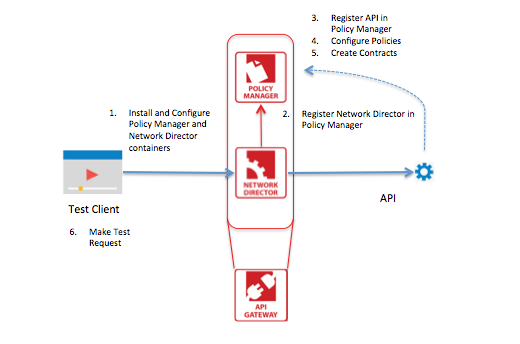

Getting started: Managing a Simple API 
-------------------------------------

<h3 style="color: grey;">Table of Contents</h3>
<ol class="table_of_contents">
	<li><a href="#Installing">Install and configure the Policy Manager and Network Director containers</a></li>
	<li><a href="#register-nd">Register Network Director in Policy Manager</a></li>
	<li><a href="#register-api">Register the API in Policy Manager</a></li>
	<li><a href="#Configure Policies">Configure Policies</a></li>
	<li><a href="#Create Contracts">Create Contracts</a></li>
	<li><a href="#Send a test request">Send a test request</a></li>
	
</ol>


### <a name="Overview"></a>Overview

This document will walk you through the steps to configure containers and then configure the Policy Manager to the Network Director. You will then register the API(s), create a contract, and then send a test request to check that the set up is complete and correct. 



#### <a name="Prerequisites"></a>Prerequisites

This configuration guide assumes that you’ve already installed the platform. If you need help installing the platform, please see the detailed steps in Chapter 1 of our [install guide](http://docs.akana.com/sp/assets/SOA_Software_Platform_Install_Guide_v70.pdf).

## <a name="Installing"></a>Step: 1: Installing the Policy Manager and Network Director containers, and configuring them


You will create and configure a Policy Manager (PM) and Network Directory (ND) container. For detailed steps on how to create the containers, [see pages 34 & 35 of the Platform install guide v70.](http://docs.akana.com/sp/assets/SOA_Software_Platform_Install_Guide_v70.pdf) 

#### <a name="Policy Manager Container"></a>Policy Manager Container

1. Name your container something that makes sense for your environment. Enter the structure for PM properties. It is:

	```
	container.instance.name=pm
	credential.username=administrator
	credential.password=password
	default.host=127.0.0.1
	default.port=9900
	```

2. Run the following command: 

	```
	./startup.sh configurator -Dsilent=true -Dproperties=/[property file directory location]/pm.properties
	```
 
3.	Edit the sm70/instances/pm/system.properties file by adding the following line:

	```
	com.soa.http.bind.all=true
	```
	
##### Copying database driver (optional)

This step is only necessary if using Oracle or MySQL.

1. Download the driver
	* For MySQL 5.1, we recommend using the "MyAQL AB's JDBC Driver for MySQL 5.1.6” from SpringSource. 
	* For Oracle, download the appropriate thin driver from the Oracle website.
2. Copy the JAR file to the sm70/instances/pm/deploy directory for the PM container.

You may also want to dedicate containers for the "SOA Software Policy Manager Services" feature. This feature provides the backend APIs to support the Network Directors and is often installed in the same containers as the "SOA Software Policy Manager Console" and/or "SOA Software Community Manager" features. The decision to install it on its own container can be driven by security requirements (e.g. network topology) or the minimization of load on the Web traffic containers. 

#### <a name="Network Director Container"></a>Network Director Container

1. Enter the structure for the ND properties. It is:

	```
	container.instance.name=nd
	credential.username=administrator
	credential.password=password
	default.host=127.0.0.1
	default.port=9901
	```
	
2. Run the following command: 

	```
	./startup.sh configurator -Dsilent=true -Dproperties=/[property file directory location]/nd.properties
	```
3.	Edit the sm70/instances/nd/system.properties file by adding the following line:

	```
	com.soa.http.bind.all=true
	```
	
##### Copying database driver (optional)

This step is only necessary if using Oracle or MySQL.

1. Download the driver
	* For MySQL 5.1 we recommend using the "MyAQL AB's JDBC Driver for MySQL 5.1.6” from SpringSource. 
	* For Oracle, download the appropriate thin driver from the Oracle website.
2. Copy the JAR file to the sm70/instances/pm/deploy directory for the PM container.

### Starting the containers

For each of the containers go to **SM70/bin/startup.sh*[container instance name]* -bg**

To ensure that the containers have started, open a browser, and enter:
**http://[hostname]:[default port/admin**

###<a name="config-pm"></a>Configuring the Policy Manager
Once you've created the Policy Manager container, it needs to be configured. Configuration consists of installing features, configuring database options, managing schemas, and setting administrator credentials. 
####Installing Policy Manager Features
1. Log into the SOA Administration Console.
2. From the "Available Features" tab, check the boxes for the:
	* SOA Software Policy Manager Console
	* SOA Software Policy Manager Services
3. In the bottom-right corner, click **Install Features**. The Install Wizard will run through the installation steps.
4. When the installation is complete, you will see a pop-up window. Click **Configure** to complete the deployment.
5. On the "Manage PKI Keys Wizard" window, keep the defaulted options and click **Next**, then click **Finish**. Click **Go to Next Task**. 

####Configuring Database options
1. In the "Database Options," choose **Create New Database**. Click **Next**.
2. Enter your database parameters. Click **Finish**, then **Go To Next Task**.

####Managing Schemas
On the "Manage Schemas Wizard," you'll see a list of schemas that are available to install, as well as schemas that you've already installed. 

####<span style="color: red">Note: Do not check the box for installed schemas unless you want to uninstall it. Checking an installed schema and clicking Finish can cause the schema to uninstall, and could cause data loss.  </span>

After installing the schemas, click **Go to Next Task**.

####Set Administrator Credentials
After setting the Administrator credentials, click **Finish**.
You'll get a pop-up advising you that the container must be restarted in order for the changes to be applied. Click **OK**.

When the configuration is complete, you can then click **Close**. You will be logged out of the Administration Console. 

###<a name="config-nd"></a>Configuring the Network Director
1. Log into the SOA Software Administration Console.
2. From the "Available Features" tab, check the **SOA Software Network Director**. In the bottom right corner, click **Install Feature**.
3. You'll see the Installation Wizard screen. Click **Install Feature**. 
4. Click **Configure** to complete the deployment. 
5. **Connecting the Network Director and the Policy Manager**. The connection between the ND and the PM is an important step of the Network Director configuration. In the "WS-MetaDataExhange Options" window, you need to supply the URL for the Policy Manager's Metadata Exchange service. To find the URL:
	1. Log into the Policy Manager.
	2. Click the **Workbench** tab.
	3. On the Left Pane (Called the "Organization Tree") click **SOA Software Policy Manager - Services - Metedata Exchange Service - Access Points.** 
	4. The URL will appear in the windows in the middle of the screen. 

	Back in the "Network Director Install Wizard," enter the URL you found in the Policy Manager. Then click **Finish**.
6. Click **Go to next Task**.
7. On the "Manage PKI Keys Wizard" window, leave the defaults and click **Finish**.
8. You may be prompted to restart the Console. Do so for your changes to take effect. 
9. After installation, we recommend that you click the **Installed Features** tab, and check the "Pending Installation Tasks" to ensure all features were properly installed. You can use the **Configuration** tab to re-configure any features that were missed. 

## <a name="register-nd"></a>Step 2: Register Network Director in Policy Manager


You'll need to tell the Policy Manager where to find the containers you created, so that the Network Director can successfully connect to Policy Manager. 

1. From the Policy Manager Organization tree, click **Containers**.
2. Click **Add Container**. 
3. Select **SOA Container**, click **Next**.
4. In the "Metadata URL:" field, enter the URL for the ND container as follows: http://host:port/metadata. Click **Next**.
5.	Tell the Policy Manager to trust the Network Director by clicking **Yes**. Then click **Next**. 
6. Enter the **Instance Name** and name the **Network Director**. Then click **Finish, Close**.
7. Check that the Container started. You can do this from the Organization Tree - click **Containers**- ***Container Name.*** In the "Container Overview," the State should say: "Started." ***Note: you may need to refresh or wait a few seconds before checking the State.***

##<a name="register-api"></a>Step 3: Register the API in Policy Manager


In this step we will use the Akana Demo REST API, available at [http://demo.akana-dev.net:3005](http://demo.akana-dev.net:3005). To keep it simple, we will just register the GET operation at [http://demo.akana-dev.net:3005/posts.](http://demo.akana-dev.net:3005/posts)

###Adding an Organization
1. From the Organization Tree, click **Registry**.
2. On the right side of the screen, under "Actions," Click **Add Organization**. 
3. Indicate where you'd like to place the organization on the Organization Tree. Click **Next**.
4. Give your organization a name, Click **Finish**, then **Close**.

###Registering an API
1. From the Organization Tree, click on the organization you created. 
2. Under the "Service Summary", click **Create Physical Service**.
3. Click the radio button for **Create Without Using Service Descriptor Document**. Click **Next**.
4. In the "Service Details," enter the:
	
	* Name: Enter the name of the API
	* QName: Give a unique Namespace and Localpart. This is used by the system internally to uniquely route to a service or API. 
	
	Click **Next**.
5. In the "Schema Import Options" choose to **Use Existing Schemas**. Click **Next**.
6. Click **Add Operation**. Give it a name and a description if you'd like. Click **Next**.
7. The "Operation Details" screen  gives you the opportunity to specify Schema elements/types for your operation. For simplicity's sake, under "Schemas," assign the **anyType** to the "input"and the "Output" by clicking the >>. You can leave "Fault" blank. Click **Next**.
8. In the "Binding Properties" screen, choose your:

	* Method (in our example, we used the GET operation.)
	* URI Syntax: This is the path for your operation. Regular expressions can be used. Use the left-side panel to get more information. 

	Click **Next**.

9. Next you'll choose how you'd like to manage the Service (API). Select **Manage through a Virtual Service**. This will create a proxy service that is hosted in the Container. Click **Next**. 
10. In the "Virtual Service Provider Organization," ensure that it chose your correct organization. Click **Next**.
11. Select the Container that you created when registering the Network Director. Click **Next**.
12. Select the first Access point in the list. Give it a name. (You can name it anything you'd like.) Click **Next**.
13. In the “HTTP Details” enter a **Location** such as “/posts”. Click **Finish**, then **Close**. 

When you've finished, you'll have two services: a physical and a virtual service. 

###Adding an Access Point to a physical service
1. From the Organization Tree in the Policy Manager, click ***your organization*** - Services - ***the physical API you're registering***.
2. Select the **Access Points**tab. 
3. Click **Add Access Point**.
4. YOu can leave all defaults for the "Service Details" and "Binding Details." Add a **WSDL Port Name**. Click **Next**.
5. Under the "HTTP Details" Section, enter the API web address For our example: [http://demo.akana-dev.net:3005/posts](http://demo.akana-dev.net:3005/posts) in the **Location** field. Click **Finish**.


##<a name="Configure Policies"></a>Step 4: Configure Policies


Now you'll configure your API’s with the policies you want Akana to enforce. 

1. From the Organization Tree, select the organization you’d like to apply the policies to.
2. Click **Policies**. In the "Operational" section of the Policy Attachments click **Manage**. While for our example we will set up an operation policy, the choices are:
	* Compliance checks that the service is compliant with your set of standards.
	* Operations does security and monitoring for the service. 
	* QoS (Quality of Service) does things like ensure availability, speed, etc. 
3. From the "Manage Operation Attachments" window, click **Policies - Operational Policies**.
4. Choose **DetailedAuditing** then click **Apply**.

You can find all descriptions of the policies in the Organization Tree. 

##<a name="Create Contracts"></a>Step 5: Create Contracts


A contract gives someone (typcially another application,) authorization to access an API. 

1. From the Policy Manager Console, select your organization in the Organization Tree. 
2. On the right side of your screen, in the "Action" pane, click **Offer Contract**. The "Add Contract Wizard" opens.
3. Enter the contract details.
4. In the "Access Controls," choose the 2nd option, which creates an anonymous contract. Click **Next**.
5. Choose the provider organization and click **Finish**. 

Your contract is now in draft mode. It needs to be activated by:

1. Find your contract by clicking on your organization in the tree.
2. Scroll down to the "Consumers" section of the window. You'll see your contract in "Draft."
3. Click on the Contract - in this example it shows as "Anonymous."
4. Review the contract, then on the right side click **Activate Contract**. Then click **OK**.

##<a name="Send a test request"></a>Step 6: Send a test request


To send a test request you will need the end point. You can find this in the Policy Manager Organization Tree, under your organization's name - Services - API. Click on the **Access Points** tab. 

Find the URL, then copy the URL and paste into a browser window. You should get a successful response. 

Then you can verify the the requests are coming through by checking the audit logs. You can see the logs by clicking on the organization, then the API. From the API page, click **Monitoring - Logs**. You'll see request details. 
